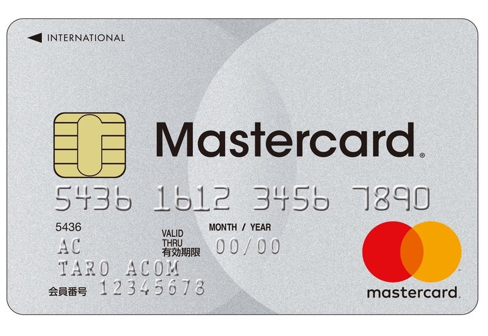

## 現地通貨の取得方法と手数料
1. 銀行や両替商で円と両替（事務手数料 4 %～10 %）
2. 海外ATMでクレジットカードを使用（海外利用料 0 % ～ 4 % + 利息 0.49 % × 支払いまでの日数）
3. 海外ATMでデビットカードを使用（海外利用料 4 ～ 5 %）

このほかにプリペイドカードやFX両替を利用する方法があります。カードのみで決済する方法もあります。

## 手数料をできるだけ抑える方法
この記事ではATMから現地通貨を引き出した際の手数料を紹介します。アコムACマスターカードを使用しました。手数料を 1 %以下に抑えることを目的としました。
<div align="center">

</div>

この方法ではカードのキャッシング機能を使用します。ATMから引き出すときの操作は他のクレジットカードと同じです。

次の二つの点からこのカードを選びました。

1. 海外ATMの利用手数料が <b>0 %</b>
2.  借入額がインターネット上ですぐに反映され、Pay-easy（ペイジー）を利用して<b>即時返済が可能</b>

1はATMの利用手数料を抑えるための条件です。2は借入期間を短くするための条件です。規定の支払日に返済する場合はその日までの利息が生じます。借入後に即時返済できれば利息を抑えられます。

以下では一日あたりの利息を約0.5%として手数料を計算しています。
```
（手数料）＝　0 （ATM利用料）＋ 元金 × 0.0049（一日以内に返済した場合）
　　　　　＝　元金 × 0.0049
```
例えば1万円分の現地通貨を引き出した場合を計算します。
```
（手数料） = 10000 * 0.0049 = 49（円）
```
この計算では手数料が50円以内になります。

## 実践
エジプトでこの方法を数回試しました。いずれも借入と返済を行えました。引き出し額・返済額・手数料の一部を下の表に示します。
```
引き出し額(egp)	引き出し額(jpy)	返済額(jpy)	手数料(jpy)	手数料(%)
        1000	 6,992.45	    7028	    35.55	    0.51
        500	     3519.47	    3512	    -7.47	   -0.21
        500	     3533.83	    3528	    -5.83	   -0.16
        300	     2151.67	    2161	     9.33	    0.43
```
引き出し額（jpy）は返済時のレートを参考にして計算しています。その影響によって手数料がマイナスになっている可能性があります。

## まとめ
アコムACマスターカードとPay-easyを用いた利用記録を示しました。今回の記録では手数料が 0.5 %程度となりました。Pay-easyによる即時返済にはインターネットバンキングなどの事前準備が必要です。準備の手順は本記事では省略しています。現地ではスマートフォンから返済しました。