<figure>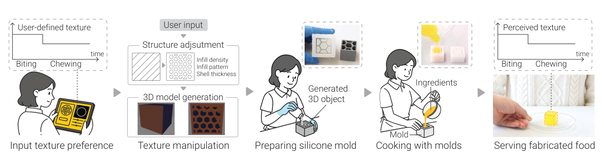<figcaption>図1．ChewTectでは最初のひと噛みとその後の咀嚼について希望する食感を指定します。内部の充填率と充填パターンと壁厚を調整して3Dモデルを生成します。シリコーン型を作って通常の調理工程で食品を成形します。構造の設計によって目標とする食感の時間変化を作ります。</figcaption></figure>

## 概要

食感は食べる楽しさと食品の機能の両方に重要です。最初のひと噛みから最後の咀嚼まで動的に変わります。従来は調理条件を変えて食感を調整してきました。この方法では外観や栄養などにも影響が及びやすくなります。既存の計算的手法でも食感を静的で一体的な特性として扱うことが多くあります。

そこで本論文では食品の内部構造を変えて食感の時間変化を設計する方法を提案します。希望する食感に基づいてシリコーン型を生成します。食感を外観や材料量から切り離して口腔処理の段階ごとに調整します。内部構造と食感知覚の関係を調べました。充填パターンは最初に噛む段階の硬さに関係します。壁厚はその後の咀嚼時の硬さに関係します。目標とする食感の時間変化に合わせて食品を作る対話的な設計インタフェースを示します。

## 1．はじめに

食感は食べる楽しさに加えて健康や食べやすさに関わります。例えば嚥下障害のある高齢者では食感が安全な食事に関わります。栄養を摂取できることや食事への満足にも影響します［1, 60］。味や風味と同様に食感も口腔内の処理に伴って変化します。最初のひと噛みで硬さなどの印象を得ます。その後の咀嚼を通じて知覚が変わります［61］。最初に噛んでから飲み込むまでの段階を設計することが安全性と満足できる感覚体験につながります。

従来は加熱時間や材料の組合せなどで食感を調整してきました［6, 44, 63, 65］。しかし二つの制約があります。第一に食感を変えると外観や栄養組成も変わりやすく独立した制御が難しくなります。例えばグミの砂糖量を変えると硬さだけでなくカロリー・味・見た目も変わります［62］。第二に試行錯誤と調理の熟練に依存するため再現性が不足しがちです。

食品の構造と力学特性や官能特性の関係も研究されています［10, 12, 19, 25, 28, 32］。しかし噛み始めと咀嚼中の知覚を十分には理解できていません。食感の時間変化を独立に制御できる設計要素として扱う計算的手法は体系的に検討されていません。

ChewTectでは最初のひと噛みとその後の咀嚼の目標食感を指定します。システムが充填パターン・充填率・壁厚を計算して型を生成します。外観やカロリーなどの特性を保ちながら食感を調整します。本論文のshell thicknessは各充填パターンを構成する材料の厚さを指します。以下では壁厚と訳します。型を使う調理は通常の調理慣行に適合します［74］。食品専用のプリンタを必要とせず一度に複数個を作れます。

システム設計に向けて食品の形と材料をそろえた知覚実験を行いました。食知覚と錯覚に関する先行研究［27］を参考にしました。最初のひと噛みから咀嚼終了までの変化を詳しく調べました。27名が試料を食べました。質問紙で知覚した食感を評価しました。筋電図で顎の動作を測定しました。充填率によって全体の硬さと弾力感を調整できました。充填パターンと壁厚は最初のひと噛みと咀嚼の硬さを別々に調整する手掛かりとなりました。この知見に基づいて計算モデルと対話的なインタフェースを構築しました。

本研究は二つの口腔処理段階に合わせて食品を設計する計算的手法を示します（3節）。官能実験で内部構造と食感の時間変化の関係を調べます（4節）。その結果を用いて目標食感から内部構造を自動調整する設計・作製インタフェースを示します（5節）。

## 2．関連研究

### 2.1．計算による食感設計

食感は楽しさ・安全性・飲み込みやすさに関わる特徴です［51］。デジタル加工の発展によってプログラム可能な設計要素として扱われ始めました［21, 66］。食品3Dプリントでは充填率・パターン・積層高さ・ノズル径・造形速度などによって力学特性と食感を変えられます［9, 10, 24, 28, 32, 73］。例えばChen et al.［5］はカボチャを用いたスナックの充填率を高めるとサクサク感が低下することを示しました。

これらの研究は全体の硬さなど単一の属性を構造から制御します。一方で食べる過程の時間変化は十分に扱っていません。食品科学では食感知覚が変化する過程であると指摘されています。最初の破断と咀嚼中の食塊形成では力学が異なります［61］。

食品3Dプリントの検証には圧縮試験などの力学分析が多く使われます［50］。初期破断には有効ですが咀嚼中の構造変化や硬さを十分に捉えられません。官能評価を取り入れた研究もあります［3, 25］。例えばチョコレートの内部構造と食感を対応付けます。ただし主として全体的な評価の最適化を扱います。

以上から最初のひと噛みと咀嚼を個別に設計する余地があります。ChewTectでは各段階の食感を調整します。これにより食感の時間的な変化を設計することを目指します。

### 2.2．HCIにおける食インタラクションの拡張

食事は日々の個人的・対人的体験としてHCIで注目されています［16, 43］。研究は食事の外部環境の拡張と食品の物理特性の作製に大別できます。

食品を変えずに環境や感覚器官へ働きかける方法があります。プロジェクションマッピングで食卓上の食品の見た目を変えます［30, 53］。ヘッドマウントディスプレイで視覚的な質感を重ねて風味知覚を変えます［46, 47］。複数感覚の相互作用も利用します［2, 47, 58］。電気刺激で味を提示する方法［35, 45, 57］や音でサクサク感を変える方法［72］があります。食感には電気的筋刺激による咀嚼抵抗の模擬［48］や皮膚変形による嚥下感覚の模擬［42］が用いられます。仮想体験には有効ですが専用機器が必要なため日常の食事では制約があります。

食品そのものを設計する研究もあります。形状［20, 23, 43, 68, 71］や色［14］や加熱・脱水に伴う形状変化［64, 68, 69］を調整できます。計算に基づく型成形［74］や液体の混合［7, 8, 33, 34, 59］によって味も配置できます。一方で食感の計算的設計には検討の余地があります。

近い研究にFoodFab［27］と気泡を埋め込むIshiiの手法［19］があります。FoodFabは外観とカロリーを保ちながらビスケットの内部構造で咀嚼時間を変えます。主な目的は満腹感の調整です。Ishiiの方法では気泡が食感と同時に反射率も変えて外観に影響します。ChewTectは最初のひと噛みと咀嚼を切り分けた時間的な食感を設計要素とします。型成形によって外部機器を装着せず見た目を保つ制御を目指します。

### 2.3．食品加工の方法

デジタル食品加工は付加加工・除去加工・型成形に大別できます。付加加工では積層造形を使います。ペースト押出でクッキー・チョコレート・ゼリー・ケーキなどが作られています［19, 20, 27, 36, 40, 49, 69］。ロボットアームによる精密な加工もあります［37］。課題には食品用装置の価格と対応材料の制約があります。多くは適切な流動特性を持つペーストに限られます。

除去加工ではCO₂レーザによる調理やレーザの高いエネルギーによる温度制御が研究されています［13, 17］。CNC加工で食品を削って形を作る方法もあります［43, 70］。

型成形は専用型の準備と材料の注入に手作業を要します。一方で高価な装置を必要としません。一つの型から繰り返し食品を作れます。材料を変えて試すこともできます。これらの利点から型成形［23, 25, 54, 74］や専用スタンプ［23, 38, 64］が用いられています。Digital Konditorei［74］はモジュール式シリコーン型で味の構造と材料の組合せを作りました。Lee et al.［25］は型で作った模様付きのチョコレート板を重ねて食感を変えました。

低コストと柔軟性から本論文の作製例には型成形を用います。システムは食品の3Dモデルも生成するため直接の食品3Dプリントにも拡張できます。

## 3．ChewTectのシステム概要

ChewTectは希望する食体験に基づいて食品を設計するシステムです。最初のひと噛みと咀嚼中の硬さ・弾力感を調整します。見た目と栄養の目標に対応しながら内部構造を変えます。構造に合うシリコーン型を生成して通常の調理で食品を作ります。新たな食体験や特定の口腔処理に適した食品への応用を想定します。

例えば介護施設の高齢者向けのグミが考えられます。最初は硬めにして顎の筋肉の活動を促し［52］その後は軟らかくして咀嚼や嚥下を助ける設計を想定します［55］。レストランでは似た見た目で異なる食感のデザートを作れます。軟らかいものや硬いものに加えて噛み始めから食感が変わるものを組み合わせられます。映画『フォレスト・ガンプ』のチョコレート箱の比喩のように食べるまで分からない体験を作れます。

計算で設計した型を使うため既存の調理法に組み込めます。レストランや標準化された介護食など一定の食感の再現が必要な場面を想定します。システムは三つの要素で構成します。目標食感を指定するインタフェースと構造パラメータの計算部と3Dモデル生成部です。その後に型の作製と調理を行います。

<figure>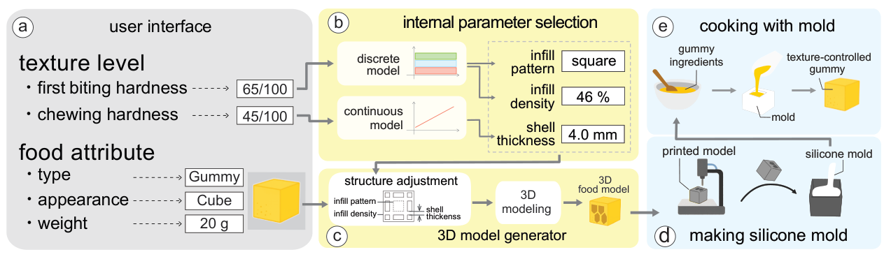<figcaption>図2．aでは食品の種類と外観と量に加えて最初のひと噛みと咀嚼の硬さを指定します。bの計算モデルが充填パターン・充填率・壁厚を求めます。cで内部構造と型用の反転モデルを生成します。dでシリコーン型を作ります。eで調理に使います。</figcaption></figure>

### 3.1．設計から作製までの流れ

図2と補足動画に手順を示します。

1. **食感と食品特性を選びます。** インタフェースで例えば最初のひと噛みの硬さを65%に設定します。咀嚼の硬さを45%に設定します。食品の種類と形と量も指定します。
2. **構造へ対応付けます。** 4節と5節の知覚実験に基づく計算部が充填パターン・充填率・壁厚を決めます。軟らかい咀嚼感が目標なら壁を薄くするか充填率を下げます。
3. **3Dモデルを生成します。** 構造と外形から造形用モデルを作ります。主な工程では注型用の反転型を生成します。同じ形状を食品3Dプリンタで直接造形することもできます。
4. **シリコーン型で調理します。** 加熱や冷却などの通常の調理法を使えます。型成形は食品3Dプリントより速く作れることが多いため優先しました。型を再利用して同じ構造で異なる材料も試せます。
5. **食品を提供します。** 設計した最初の噛み応えとその後の咀嚼感を持つ食品を食べてもらいます（図3）。

<figure>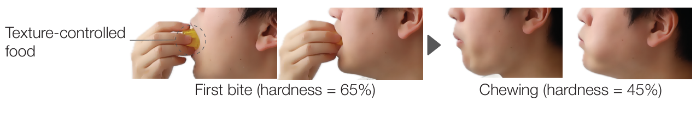<figcaption>図3．食感を調整した食品を食べる様子を示します。最初のひと噛みの硬さを65%に設定しています。その後の咀嚼の硬さを45%に設定しています。</figcaption></figure>

### 3.2．内部構造のパラメータ

三つのパラメータを用います（図4）。

- **充填パターン**は空隙の形を決めます。ハニカム・三角形・正方形を使います。
- **充填率**は構造中の材料がある部分と空隙の割合を決めます。
- **壁厚**は構造を作る材料の厚さを決めます。

選定には三つの理由があります。第一に充填パターンと充填率が食感に影響すると報告されています［10, 32］。第二に内部構造の変更は外観への影響が小さく視覚的な手掛かりと食感を切り分けられます［27, 40］。第三に付加加工ではパターンの厚さが硬さ知覚に影響することが示されています［41］。食品にも適用できると考えました。さらに電気的筋刺激などの外部装置を必要としません［48］。

実験結果から充填パターンを最初のひと噛みの硬さの制御に用います。壁厚を咀嚼中の硬さの制御に用います。充填率で両段階の硬さと弾力感を調整します。

<figure>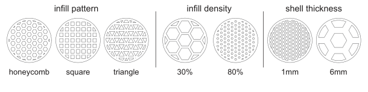<figcaption>図4．左はハニカム・正方形・三角形の充填パターンです。中央は充填率30%と80%です。右は壁厚1 mmと6 mmです。</figcaption></figure>

### 3.3．作製例

30×30×30 mmの立方体グミを例に示します。インタフェースで寸法を指定して型用のモデルを生成しました。

**シリコーン型を準備します。** 市販の3Dプリンタ（Ultimaker 3）で反転型を作りました。食品用シリコーン（Engraving Japan HTV-4000）を流し込みました（図5a）。23°Cで約3時間硬化させました（図5b）。真空チャンバで気泡を除いて耐久性と離型性を高めました。

**グミを調理します。** 水・砂糖・ゼラチンを混ぜて電子レンジで完全に液化しました。必要に応じて食用色素・香料・クエン酸を加えました。型へ流し込んで冷蔵庫で少なくとも20分冷やしました（図5c）。型成形では片面が開いて内部が見えます。同じ食品の薄い層の上に置いて塞ぎました。シロップや卵白など食用の接着材料も使えます。低い充填率でも内部を隠せます。食品3Dプリントで生じる張り出し部分の問題も避けられます［22, 40］。特別な機器を使わず通常の調理手順で提供できます（図5d）。他の材料と形状は6節で示します。

<figure>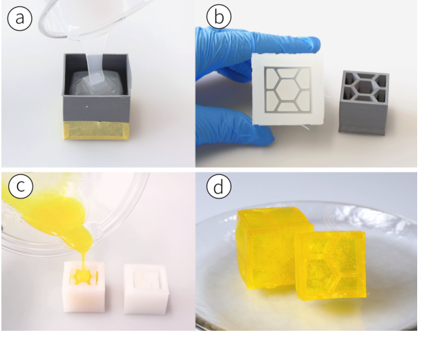<figcaption>図5．aでは3Dプリントした反転型へ食品用シリコーンを注ぎます。bでは完成したシリコーン型と元の反転型を示します。cではグミ液を注ぎます。dでは離型後の食品を示します。</figcaption></figure>

## 4．官能知覚実験

内部構造と知覚食感を対応付ける計算モデルを構築するために実験しました。グミの充填パターン・充填率・壁厚を変えました。最初のひと噛みと咀嚼中の硬さ・弾力感を測定しました。甘さと咀嚼時間への影響も調べました。所属機関の倫理審査委員会の承認（R6-E-51）を受けました。全参加者から同意を得ました。

### 4.1．実験環境

参加者は机に座りました（図6）。室温を24°Cに保ちました。

**食品を準備しました。** 3.3節と同じ30×30×30 mmのグミを用いました。水・砂糖・ゼラチン・クエン酸を1:1:0.2:0.05で混ぜました。少量の黄色色素とオレンジ香料油を加えました。原文ではこれらは食べる過程に影響しないとしています。注型前に精密はかり（KINGJIM Latuna）で目標質量の±0.1 g以内にそろえました。実験前日に作製して一晩冷蔵しました。実験まで冷蔵で保管しました。

**質問紙で評価しました。** 最初のひと噛みの硬さと弾力感を尋ねました。咀嚼中の硬さ・弾力感・努力感に加えて甘さも尋ねました。二段階の口腔処理の評価は既存手法［61］に従いました。最初の硬さ・弾力感・咀嚼努力感の評価は既存プロトコル［15］を参考にしました。甘さを加えて幅広い感覚を捉えました。各項目を7段階リッカート尺度で評価しました。試料ごとにノートパソコンで回答しました。

**筋電図を測定しました。** 咬筋にEMGセンサ（東京デバイセズ IWS940-DEV）を取り付けました。信号の活動から咀嚼開始と終了を切り出して時間を求めました。実験前に咀嚼動作とリアルタイム表示の対応を確認しました。実測中は表示を隠しました。試行間で咀嚼をそろえるために1.4 Hzのビープ音に合わせてもらいました。ノイズキャンセリングヘッドホン（Anker Soundcore Life Q30）を用いました。周波数は一般的な咀嚼速度から経験的に選びました。

<figure>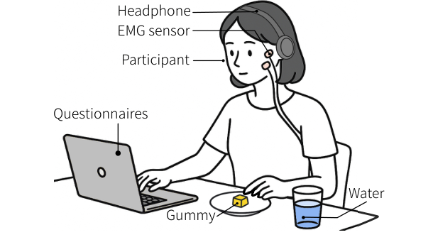<figcaption>図6．参加者の前にグミと水を置きました。咬筋のEMGで咀嚼を記録しました。食べた後にパソコンで知覚食感を回答しました。</figcaption></figure>

### 4.2．参加者と方法

5か国の27名が自発的に参加しました。男性20名と女性7名で18〜34歳でした。事前に詳しく説明して同意を得ました。官能評価の基準をそろえるために同じ味のHARIBO Goldbearsを噛んでもらいました。硬さと弾力感の基準にしました。甘さには10%砂糖水を用いました。

充填率5水準（0%・25%・50%・75%・100%）とパターン3種類（ハニカム・三角形・正方形）と壁厚3水準（2・3・6 mm）から11条件を設定しました（表1）。一度に一つのパラメータを変えて他を固定しました。例えば壁厚の条件では充填率50%とハニカムを使いました。I〜Kでは空隙寸法を調整して総質量を保ちながら壁厚を変えました。充填率0%と100%には内部パターンがないためパターンと壁厚に依存しません。重複条件を除くと参加者1名あたり9種類になりました。提示順を無作為化しました。

試料の奥側を持って口に入れてもらいました。前歯で3分の1を噛み切る段階を最初のひと噛みとしました。続いてその部分を咀嚼しました。残りは廃棄しました。各試行の直後に回答しました。味の持越しを防ぐために試料間で水を飲んで口をすすぎました。

**表1．実験条件を示します。外形はすべて30×30×30 mmです。**

| 条件 | 充填率（%） | パターン | 壁厚（mm） | 総質量（g） |
|---|---|---|---|---|
| A | 0 | 該当なし | 3 | 10 |
| B | 25 | ハニカム | 3 | 15 |
| C | 50 | ハニカム | 3 | 20 |
| D | 75 | ハニカム | 3 | 25 |
| E | 100 | 該当なし | 3 | 30 |
| F | 50 | ハニカム | 3 | 20 |
| G | 50 | 三角形 | 3 | 20 |
| H | 50 | 正方形 | 3 | 20 |
| I | 50 | ハニカム | 2 | 20 |
| J | 50 | ハニカム | 3 | 20 |
| K | 50 | ハニカム | 6 | 20 |

### 4.3．結果

一要因の反復測定分散分析を用いました。主効果が有意な場合（p&lt;.05）は推定周辺平均に対する対応のあるt検定で対比較しました。多重比較にはHolm補正を用いました。Mauchly検定で球面性違反が示された場合はGreenhouse–Geisser補正を行いました。補正によって統計的結論は変わりませんでした。以下の統計量は翻訳元の記載値を保持しています。

#### 4.3.1．充填率

最初のひと噛みの硬さに有意な主効果がありました（F(4,104)=81.93・p&lt;.01・偏η²=.77）。最初の弾力感でも有意でした（F(4,104)=26.86・p&lt;.01・偏η²=.52）。咀嚼の硬さでも有意でした（F(4,104)=47.08・p&lt;.01・偏η²=.65）。咀嚼の弾力感でも有意でした（F(4,104)=17.43・p&lt;.01・偏η²=.41）。咀嚼努力感でも有意でした（F(4,104)=34.23・p&lt;.01・偏η²=.58）。甘さには有意な効果がありませんでした。

対比較を表2に示します。図7aと図8aは硬さの箱ひげ図です。弾力感と咀嚼努力感にも硬さと同様の増加傾向が見られました。甘さにはこの傾向がありませんでした。原文本文では多くの条件対に差があると述べています。個別の有意差は表2のとおりです。

#### 4.3.2．充填パターン

最初のひと噛みの硬さに有意な効果がありました（F(2,75)=20.25・p&lt;.01・偏η²=.48）。咀嚼の硬さや他の従属変数には有意な効果がありませんでした。最初の硬さの対比較では三角形とハニカム（p&lt;.01）に差がありました。ハニカムと正方形（p&lt;.05）にも差がありました。三角形と正方形（p&lt;.01）にも差がありました（図7b）。

#### 4.3.3．壁厚

咀嚼の硬さに有意な効果がありました（F(2,75)=10.26・p&lt;.01・偏η²=.29）。最初の硬さと他の従属変数には有意な効果がありませんでした。2 mmと3 mm（p&lt;.01）および2 mmと6 mm（p&lt;.01）に差がありました（図8b）。有意差を図中のアスタリスクで示します。

#### 4.3.4．筋電図

噛み始めと咀嚼中の筋活動を分析しました。生信号を整流しました。各参加者の全試行の最大値と最小値を用いて0〜1に正規化しました。噛み始めの信号を積分して活動量を求めました。

積分筋電図には充填率の効果がありました（F(4,125)=12.73・p&lt;.01・偏η²=.33）。充填パターンにも効果がありました（F(2,75)=7.06・p&lt;.01・偏η²=.24）。壁厚には有意な効果がありませんでした（F(2,75)=0.32・p&gt;.05）。低い充填率（0%と25%）と高い充填率（75%と100%）などの間に差がありました。三角形と正方形（p&lt;.01）および三角形とハニカム（p&lt;.01）にも差がありました（図7cとd）。最初の硬さの主観評価と似た傾向でした。

咀嚼時間には充填率の効果がありました（F(4,125)=7.29・p&lt;.01・偏η²=.41）。壁厚にも効果がありました（F(2,75)=3.85・p&lt;.05・偏η²=.26）。充填パターンには有意な効果がありませんでした（F(2,75)=0.11・p&gt;.05）。低充填率（0%と25%）では高充填率（75%と100%）より咀嚼時間が有意に短くなりました。壁厚6 mmでは3 mmと2 mmより有意に長くなりました（いずれもp&lt;.01）。咀嚼硬さの主観評価と似た傾向でした（図8cとd）。

<figure>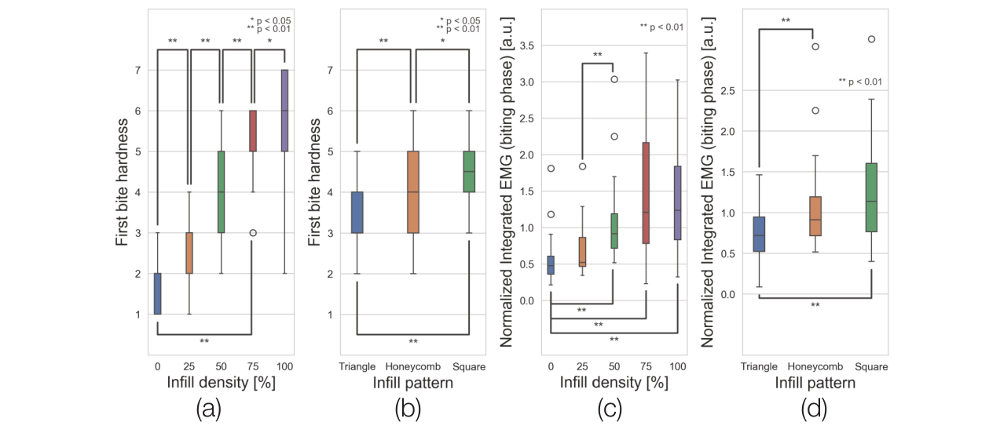<figcaption>図7．充填率とパターンによる知覚と行動の変化を示します。aは充填率と最初の硬さです。bはパターンと最初の硬さです。cとdは対応する噛み始めの正規化積分筋電図です。重なりを減らすため有意差の印は隣接条件や一つおきの条件など一部だけに示します。</figcaption></figure>

<figure>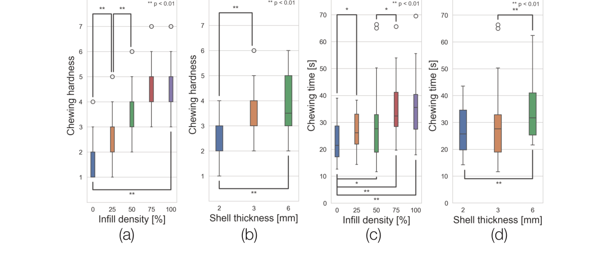<figcaption>図8．充填率と壁厚による知覚と行動の変化を示します。aは充填率と咀嚼の硬さです。bは壁厚と咀嚼の硬さです。cとdは対応する咀嚼時間です。見やすさのため有意差の印は一部だけに示します。</figcaption></figure>

**表2．充填率のHolm補正済み対比較を示します。n.s.はp≥.05です。**

| 比較 | 最初の硬さ | 咀嚼の硬さ | 最初の弾力感 | 咀嚼の弾力感 | 咀嚼努力感 |
|---|---|---|---|---|---|
| 0%対25% | &lt;.05 | &lt;.05 | &lt;.01 | &lt;.05 | n.s. |
| 0%対50% | &lt;.01 | &lt;.01 | &lt;.01 | &lt;.01 | &lt;.01 |
| 0%対75% | &lt;.01 | &lt;.01 | &lt;.01 | &lt;.01 | &lt;.01 |
| 0%対100% | &lt;.01 | &lt;.01 | &lt;.01 | &lt;.01 | &lt;.01 |
| 25%対50% | &lt;.01 | &lt;.01 | &lt;.01 | &lt;.01 | &lt;.01 |
| 25%対75% | &lt;.01 | &lt;.01 | &lt;.01 | &lt;.05 | &lt;.01 |
| 25%対100% | &lt;.01 | &lt;.01 | &lt;.01 | &lt;.01 | &lt;.01 |
| 50%対75% | &lt;.01 | n.s. | &lt;.05 | n.s. | n.s. |
| 50%対100% | &lt;.01 | n.s. | &lt;.01 | n.s. | n.s. |
| 75%対100% | &lt;.05 | n.s. | n.s. | n.s. | n.s. |

### 4.4．結果の整理

充填率が上がると最初のひと噛みと咀嚼中の両方で硬さ・弾力感が増しました。咀嚼努力感も増しました。先行研究［28］と整合します。口腔処理の各段階で硬さと弾力感を同時に調整できることを示唆します。

充填パターンと壁厚は段階に応じた調整に使える可能性があります。最初の硬さは正方形で最も高くハニカムが続き三角形で最も低くなりました。各形状の力学的な抵抗の違いによると考えます。咀嚼では6 mmの厚い支持構造が2 mmより硬く感じられました。

構造と甘さの関連を報告した研究［3］と異なり本実験では甘さへの効果がありませんでした。冷えたグミが甘さの違いを感じにくくした可能性があります。温度を変えた検討が必要です。

組成の異なる食品では噛む力や咀嚼回数が増えると全体の硬さ評価も高まると報告されています［56］。本研究のEMGもこの結果と整合します。最初の硬さと必要な噛む力が対応します。咀嚼の硬さと咀嚼時間も対応します。本実験では音で速度をそろえたため時間は咀嚼回数にも関係します。生理的な測定値は主観評価を裏付ける定量的な情報となります。これらの結果を食感の予測と生成モデルの構築に用います。栄養・材料・外観から独立した食感の制御を目指します。

## 5．計算モデルとインタフェース

### 5.1．計算モデル

実験結果から最初のひと噛みと咀嚼の硬さの二つのモデルを作りました。充填率・パターン・壁厚を制御変数にします。7段階の評価を線形に0〜1へ変換しました。評点1を0に対応させます。評点7を1に対応させます。モデルをインタフェースへ組み込んで目標食感に合う型を生成します。

**充填パターンを離散的に選びます。** 最初の硬さは充填率とパターンで調整します。ハニカムの25%と50%と75%に0%と100%の境界条件を加えて線形回帰しました。0%と100%はすべてのパターンに共通とします。共通端点を用いて三角形と正方形の二次補間式を作りました。

ハニカム：Hfirst bite = 0.681Dinfill + 0.137

三角形：Hfirst bite = 0.384Dinfill2 + 0.269Dinfill + 0.141

正方形：Hfirst bite = −0.512Dinfill2 + 1.166Dinfill + 0.141

Hfirst biteは最初の硬さです。Dinfillは充填率です。いずれも0〜1で表します。ハニカムモデルのR²は0.98です（図9a）。指定した一食分の量から充填率を求めて各パターンの硬さを予測します。

**壁厚を連続的に調整します。** 咀嚼の硬さは壁厚を連続的に変えて調整します。線形回帰式は次のとおりです。

Hchewing = 0.0216Lshell thickness + 0.584Dinfill + 0.093

Hchewingは咀嚼の硬さです。Lshell thicknessはmm単位の壁厚です。R²は0.94です（図9b）。

**未知の参加者への予測を評価します。** 27名のデータで参加者単位の交差検証（LOPOCV）を行いました。各回で1名の全データを評価用に分けました。残る26名で学習して評価対象の食感を予測しました。全員が一度ずつ評価対象になるよう繰り返して性能を平均しました。

最初の硬さでは7段階尺度上のRMSEが1.01でした。R²は0.70でSpearmanのρは0.67でした。咀嚼の硬さではRMSEが1.09でした。R²は0.43でρは0.62でした。個人差による制約はありますが構造と知覚の系統的な関係を捉えました。未知の参加者でも食感の相対的な順序をおおむね保ちます。迅速な初期予測に利用できます。6節の適応的な最適化の基盤にもなります。

**設計例を示します。** 食品Aでは最初の硬さを55/100に設定しました。咀嚼の硬さを60/100に設定しました。計算結果は充填率70%と三角形と壁厚4.4 mmでした。食品Bでは45/100と40/100に設定しました。結果は43%と三角形と2.5 mmでした。

充填率は両モデルに共通する変数です。このため図9の範囲外の食感は現状では実現できません。例えば非常に硬い噛み始めと非常に軟らかい咀嚼を組み合わせる設計が該当します。

<figure>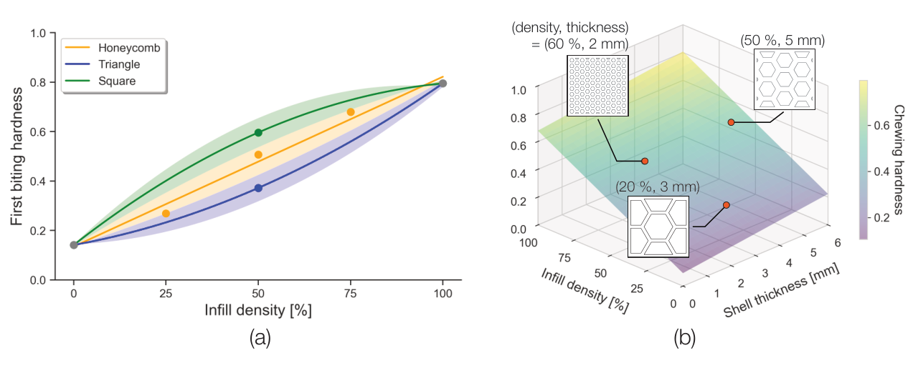<figcaption>図9．aは各パターンの充填率と最初の硬さのモデルです。陰影は補間領域を示します。境界は近い回帰曲線に基づきます。bは充填率と壁厚と咀嚼の硬さのモデルです。</figcaption></figure>

#### 5.1.1．ユーザインタフェース

図10にモデルを統合した画面を示します。Load SVG Fileで平面形状を読み込みます。上部に平面プレビューを表示します。Typeで食品を選びます。Weightで質量を指定します。First Bite HardnessとChewing Hardnessで目標の硬さを指定します。Generate 3D Modelを押すと内部構造を計算します。指定した外形を組み合わせた3Dモデルを生成します。Saveで保存して市販の加工機で作製できます。異なる形と食感の例を図5と図11と図12に示します。

<figure>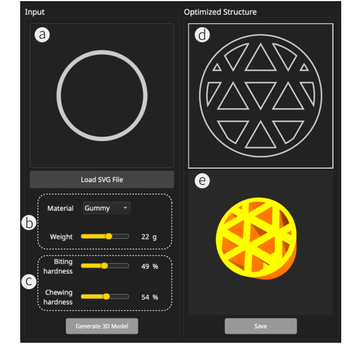<figcaption>図10．aではSVGなどの2D形状を読み込みます。bでは材料と質量を選びます。cでは最初のひと噛みと咀嚼の硬さを指定します。dでは入力条件を満たす内部構造を求めます。eでは出力用3Dモデルを確認します。</figcaption></figure>

## 6．考察・制約・今後の展望

### 食品材料の多様性

実証実験は立方体グミに限られます。型を用いて羊羹・チョコレート・グミとチョコレートの複合材料も作れます（図11）。これらの知覚曲線は未検証です。食品科学の知見［11］では弾性的な材料に類似した知覚傾向があります。基準の校正後に特に粘弾性的な食品へ適用できる可能性があります。

チョコレートやビスケットのような脆い材料ではゼラチンの流動とは異なる破断が生じます。全体変形に加えて亀裂の伝播を制御する単位構造が必要となる可能性があります。また現状では型から外せる材料に限られます。非常に多孔質な構造などは離型が難しくなります。対応材料の範囲を今後検証します。

<figure>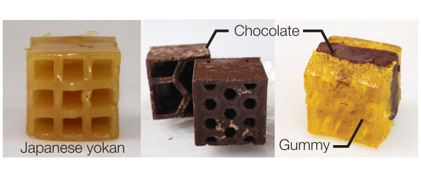<figcaption>図11．羊羹・チョコレート・グミとチョコレートの複合試料を示します。</figcaption></figure>

### 複雑な三次元形状

円・ハート・花などの2.5D形状に対応します（図12a）。スタンフォードバニーなども単純な部品へ分割して連続する内部構造を作れます（図12b）。複雑な形を作製できますがその内部での食感の詳細な制御は今後の課題です。

<figure>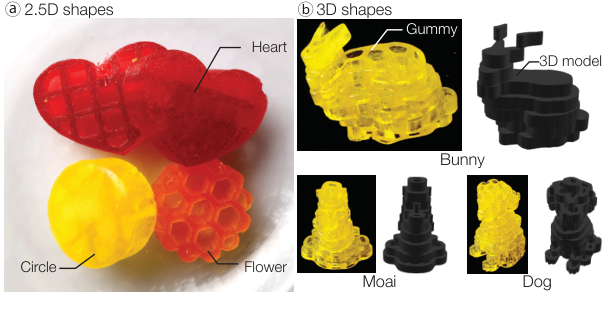<figcaption>図12．aは円・ハート・花などの2.5D形状です。bはウサギ・モアイ・犬などの3D形状です。</figcaption></figure>

### シリコーン型と食品3Dプリント

押出式の食品3Dプリント［39］に比べると型成形の加工解像度には制約があります。一方で速い作製と量産に向きます。3Dプリントでは自動化と離型作業の削減が可能です。しかし新たな材料への対応には検討の余地があります。型は粘度の低い材料などにも使えます。本研究では食感を調整しやすく作業時間を短くできるため型を採用しました。直接プリントへの展開は今後検討します。

### 調整範囲の拡大

最初の硬さと咀嚼の硬さは三つの構造パラメータに応じて変わりました。一方で弾力感の知覚差は充填率だけで確認されました。そこでメタマテリアルに着想を得た構造も試しました［18, 29］。図13では方向に依存する変形とオーセティック挙動などの非線形応答を示します。知覚できる食感の幅を広げる可能性があります。

<figure>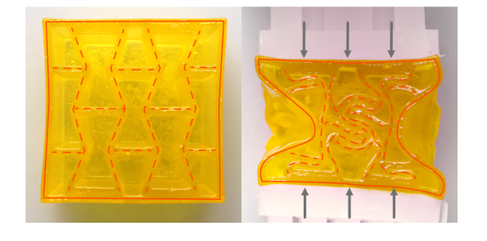<figcaption>図13．リエントラント型ハニカムによる方向性のある変形を示します。左は無変形の状態です。右では縦方向の圧縮に対して横方向にも収縮します。負のポアソン比を示します。</figcaption></figure>

### 食感の多次元性

現モデルはゼラチン系食品で主要な硬さと弾力感を扱います。実際の食感には崩れやすさ・付着性・溶ける速さなどもあります。脆い食品を砕けやすくする構造などを形状のライブラリへ加える必要があります。

### 噛む方向

実験では立方体を2本の指で水平に持って口へ入れるよう指示しました。日常場面では形が噛む方向を促せます。棒状食品やTobleroneのような三角柱チョコレートが例です。咀嚼中の向きの厳密な制御は難しいものの充填率と壁厚は口内の回転に比較的影響されにくい特徴です。人は最初に大きな部分を噛んで次第に食塊を作ります［4］。形の設計と咀嚼習慣によって一定の食感を保てると考えます。

### 衛生と再利用

複雑で密な内部形状は使用間の洗浄や殺菌が難しくなります。残留物による風味移りや細菌増殖が起こり得ます。今後は食品用の可溶性支持材など使い切りの型を検討できます。

### 型の準備時間

シリコーンの硬化には寸法に応じて数時間かかります。短時間で個別化したい場合には制約となります。そこで硬化済みの再利用可能な部品を組み合わせる型を試しました（図14）。まだ探索段階ですが準備時間を短くできる可能性があります。より効率的な方法も検討します［31, 67］。

<figure>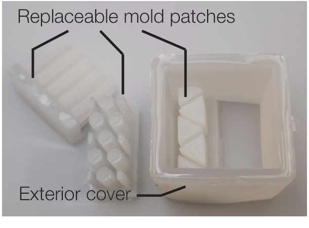<figcaption>図14．外側のカバーと交換可能な型部品を組み合わせます。部品の交換で食品の構造と形を変えます。</figcaption></figure>

### 参加者の多様性

参加者集団は比較的小規模で均質でした。年齢・性別・文化的背景を広げた評価が必要です。結果の頑健性と知覚モデルの精度を高めて適用範囲を検証します。

### 個人に合わせたモデル

現モデルは構造から知覚へ迅速に対応付けます。しかし未知の参加者へのR²は最初の硬さで0.70でした。咀嚼では0.43でした。個人差を反映するために個別化が必要です。転移学習を利用するベイズ最適化により3〜4回の試食から利用者に合わせる枠組みを検討しました［26］。今後はこの校正の反復を組み込めます。設計者や食べ手の口腔特性を学習して予測を改善することを目指します。物語性のある料理から食感を調整した食事まで応用範囲を広げられる可能性があります。

## 7．結論

食品の内部構造を制御して食感の時間変化を設計するChewTectを提案しました。計算に基づく型成形によって外観やカロリーから食感を切り離して硬さや弾力感を調整します。内部形状と口腔知覚の関係を調べて構造差を知覚差につなぐ設計空間を示しました。インタフェースと作製例を通じて機能性食品や物語性のあるデザートへの応用を示しました。食感を動的でプログラム可能な設計要素として扱うことでデジタルガストロノミーを拡張します。

## 謝辞

本研究はJSPS科研費（23K11198・22H01447）とJST ACT-X（JPMJAX24CQ）の支援を一部受けました。

原文の謝辞には英語原稿の流れと明瞭さを改善するためにChatGPT（OpenAI）とGemini（Google）を使用したと記載されています。この記述は原文の作成に関するものです。本ページの日本語自動翻訳については冒頭の注記をご確認ください。

## 参考文献

書誌情報は原文の言語で掲載しています。

[1] Malcolm Bourne. 2002. Food texture and viscosity: Concept and measurement (2 ed.). Academic Press.

[2] Jas Brooks, Noor Amin, and Pedro Lopes. 2023. Taste Retargeting via Chemical Taste Modulators. In Proceedings of the 36th Annual ACM Symposium on User Interface Software and Technology (San Francisco, CA, USA) (UIST ’23). Association for Computing Machinery, New York, NY, USA, Article 106, 15 pages. https://doi.org/10.1145/3586183.3606818

[3] Rossella Caporizzi, Antonio Derossi, Sakamon Devahastin, and Carla Severini. 2025. Boosting the role of complex food structure on oral breakdown and sweetness perception by digitally designed and 3D printed biscuits. J. Food Eng. 393, 112499 (1 June 2025), 112499. https://doi.org/10.1016/j.jfoodeng.2025.112499

[4] Jianshe Chen. 2009. Food oral processing—A review. Food Hydrocoll. 23, 1 (2009), 1–25. https://doi.org/10.1016/j.foodhyd.2007.11.013

[5] Xiao-Huan Chen, Min Zhang, Xiu-Xiu Teng, and Arun S Mujumdar. 2022. Internal structure design for improved shape fidelity and crispness of 3D printed pumpkinbased snacks after freeze-drying. Food Res. Int. 157, 111220 (2022), 111220. https://doi.org/10.1016/j.foodres.2022.111220

[6] P Delgado and S Bañón. 2015. Determining the minimum drying time of gummy confections based on their mechanical properties. CyTA - J. Food 13, 3 (3 July 2015), 329–335. https://doi.org/10.1080/19476337.2014.974676

[7] Jialin Deng, Patrick Olivier, Josh Andres, Kirsten Ellis, Ryan Wee, and Florian Floyd Mueller. 2022. Logic bonbon: Exploring food as computational artifact. In CHI Conference on Human Factors in Computing Systems (CHI ’22, Vol. 2). ACM, New York, NY, USA, 1–21. https://doi.org/10.1145/3491102.3501926

[8] Jialin Deng, Humphrey Yang, Aryan Saini, Urs Dominic Gaudenz, Lining Yao, Patrick Olivier, and Florian ‘floyd’ Mueller. 2023. Dancing delicacies: Designing computational food for dynamic dining trajectories. In Proceedings of the 2023 ACM Designing Interactive Systems Conference. ACM, New York, NY, USA, 244– 262. https://doi.org/10.1145/3563657.3596021

[9] A Derossi, R Caporizzi, M O Oral, and C Severini. 2020. Analyzing the effects of 3D printing process per se on the microstructure and mechanical properties of cereal food products. Innov. Food Sci. Emerg. Technol. 66, 102531 (2020), 102531. https://doi.org/10.1016/j.ifset.2020.102531

[10] A Derossi, R Caporizzi, M Paolillo, and C Severini. 2021. Programmable texture properties of cereal-based snack mediated by 3D printing technology. J. Food Eng. 289, 110160 (2021), 110160. https://doi.org/10.1016/j.jfoodeng.2020.110160

[11] K D Foster, A Woda, and M A Peyron. 2006. Effect of texture of plastic and elastic model foods on the parameters of mastication. J. Neurophysiol. 95, 6 (2006), 3469–3479. https://doi.org/10.1152/jn.01003.2005

[12] Robert Fribus, Jana Kant, Ahmed Raouf Fahmy, and Mario Jekle. 2024. Texture modulation of starch-based materials using microfoaming-assisted 3D printing. Future Foods 9, 100311 (2024), 100311. https://doi.org/10.1016/j.fufo.2024.100311

[13] Kentaro Fukuchi, Kazuhiro Jo, Akifumi Tomiyama, and Shunsuke Takao. 2012. Laser Cooking: A Novel Culinary Technique for Dry Heating Using a Laser Cutter and Vision Technology. In Proceedings of the ACM Multimedia 2012 Workshop on Multimedia for Cooking and Eating Activities (Nara, Japan) (CEA ’12). Association for Computing Machinery, New York, NY, USA, 55–58. https://doi.org/10.1145/2390776.2390788

[14] Ahmed Fathy Ghazal, Min Zhang, Bhesh Bhandari, and Huizhi Chen. 2021. Investigation on spontaneous 4D changes in color and flavor of healthy 3D printed food materials over time in response to external or internal pH stimulus. Food Res. Int. 142, 110215 (April 2021), 110215. https://doi.org/10.1016/j.foodres.2021.110215

[15] S M Goh, M N Charalambides, and J G Williams. 2003. Mechanical properties and sensory texture assessment of cheeses. J. Texture Stud. 34, 2 (June 2003), 181–201. https://doi.org/10.1111/j.1745-4603.2003.tb01374.x

[16] Andrea Grimes and Richard Harper. 2008. Celebratory technology: new directions for food research in HCI. In Proceedings of the SIGCHI Conference on Human Factors in Computing Systems (Florence, Italy) (CHI ’08). Association for Computing Machinery, New York, NY, USA, 467–476. https://doi.org/10.1145/1357054.1357130

[17] Niels Henze, Thomas Olsson, Stefan Schneegass, Alireza Sahami Shirazi, and Kaisa Väänänen-Vainio-Mattila. 2015. Augmenting food with information. In Proceedings of the 14th International Conference on Mobile and Ubiquitous Multimedia. ACM, New York, NY, USA. https://doi.org/10.1145/2836041.2836068

[18] Alexandra Ion, Johannes Frohnhofen, Ludwig Wall, Robert Kovacs, Mirela Alistar, Jack Lindsay, Pedro Lopes, Hsiang-Ting Chen, and Patrick Baudisch. 2016. Metamaterial Mechanisms. In Proceedings of the 29th Annual Symposium on User Interface Software and Technology (Tokyo, Japan) (UIST ’16). Association for Computing Machinery, New York, NY, USA, 529–539. https://doi.org/10.1145/2984511.2984540

[19] Ayaka Ishii. 2024. Food Printing with Electrolysis Bubbles for Texture Control. In Extended Abstracts of the CHI Conference on Human Factors in Computing Systems (Honolulu, HI, USA) (CHI EA ’24). Association for Computing Machinery, New York, NY, USA, Article 165, 7 pages. https://doi.org/10.1145/3613905.3650917

[20] Rohit Ashok Khot, Deepti Aggarwal, Ryan Pennings, Larissa Hjorth, and Florian ’Floyd’ Mueller. 2017. EdiPulse: Investigating a Playful Approach to Self- Monitoring through 3D Printed Chocolate Treats. In Proceedings of the 2017 CHI Conference on Human Factors in Computing Systems (Denver, Colorado, USA) (CHI ’17). Association for Computing Machinery, New York, NY, USA, 6593–6607. https://doi.org/10.1145/3025453.3025980

[21] Jeeeun Kim, Qingnan Zhou, Amanda Ghassaei, and Xiang ’Anthony’ Chen. 2021. OmniSoft: A Design Tool for Soft Objects by Example. In Proceedings of the Fifteenth International Conference on Tangible, Embedded, and Embodied Interaction (Salzburg, Austria) (TEI ’21). Association for Computing Machinery, New York, NY, USA, Article 15, 13 pages. https://doi.org/10.1145/3430524.3440634

[22] Matthew Lanaro, David P Forrestal, Stefan Scheurer, Damien J Slinger, Sam Liao, Sean K Powell, and Maria A Woodruff. 2017. 3D printing complex chocolate objects: Platform design, optimization and evaluation. J. Food Eng. 215 (1 2017), 13–22. https://doi.org/10.1016/j.jfoodeng.2017.06.029

[23] Bokyung Lee, Jiwoo Hong, Jaeheung Surh, and Daniel Saakes. 2017. Ori-Mandu: Korean Dumpling into Whatever Shape You Want. In Proceedings of the 2017 Conference on Designing Interactive Systems (Edinburgh, United Kingdom) (DIS ’17). Association for Computing Machinery, New York, NY, USA, 929–941. https://doi.org/10.1145/3064663.3064790

[24] Cheng Pau Lee and Michinao Hashimoto. 2024. Prediction of textural properties of 3D-printed food using response surface methodology. Heliyon 10, 7 (2024), e27658. https://doi.org/10.1016/j.heliyon.2024.e27658

[25] Yujin Lee, Jee Bin Yim, Daye Kang, HyeonBeom Yi, and Daniel Saakes. 2019. Designing Internal Structure of Chocolate and Its Effect on Food Texture. In Companion Publication of the 2019 on Designing Interactive Systems Conference 2019 Companion (San Diego, CA, USA) (DIS ’19 Companion). Association for Computing Machinery, New York, NY, USA, 231–235. https://doi.org/10.1145/3301019.3323896

[26] Yi-Chi Liao, Paul Streli, Zhipeng Li, Christoph Gebhardt, and Christian Holz. 2025. Continual human-in-the-loop optimization. In Proceedings of the 2025 CHI Conference on Human Factors in Computing Systems (CHI ’25). ACM, New York, NY, USA, 1–26. https://doi.org/10.1145/3706598.3713603

[27] Ying-Ju Lin, Parinya Punpongsanon, Xin Wen, Daisuke Iwai, Kosuke Sato, Marianna Obrist, and Stefanie Mueller. 2020. FoodFab: Creating Food Perception Illusions Using Food 3D Printing. In Proceedings of the 2020 CHI Conference on Human Factors in Computing Systems (Honolulu, HI, USA) (CHI ’20). Association for Computing Machinery, New York, NY, USA, 1–13. https://doi.org/10.1145/3313831.3376421

[28] Zhenbin Liu, Bhesh Bhandari, Sangeeta Prakash, and Min Zhang. 2018. Creation of internal structure of mashed potato construct by 3D printing and its textural properties. Food Res. Int. 111 (1 2018), 534–543.

[29] Liane Makatura, Bohan Wang, Yi-Lu Chen, Bolei Deng, Chris Wojtan, Bernd Bickel, and Wojciech Matusik. 2023. Procedural Metamaterials: A Unified Procedural Graph for Metamaterial Design. ACM Trans. Graph. 42, 5, Article 168 (July 2023), 19 pages. https://doi.org/10.1145/3605389

[30] Atsushi Maki, Parinya Punpongsanon, Daisuke Iwai, and Kosuke Sato. 2024. Visually Manipulating Perceived Food Texture in Projection Mapping. Transactions of the Virtual Reality Society of Japan 29, 2 (2024), 81–84. https://doi.org/10.18974/tvrsj.29.2_81

[31] Luigi Malomo, Nico Pietroni, Bernd Bickel, and Paolo Cignoni. 2016. FlexMolds: automatic design of flexible shells for molding. ACM Trans. Graph. 35, 6, Article 223 (Dec. 2016), 12 pages. https://doi.org/10.1145/2980179.2982397

[32] Sylvester Mantihal, Sangeeta Prakash, and Bhesh Bhandari. 2019. Textural modification of 3D printed dark chocolate by varying internal infill structure. Food Res. Int. 121 (2019), 648–657. https://doi.org/10.1016/j.foodres.2018.12.034

[33] Homei Miyashita. 2021. TTTV (taste the TV): Taste presentation display for “licking the screen” using a rolling transparent sheet and a mixture of liquid sprays. In The Adjunct Publication of the 34th Annual ACM Symposium on User Interface Software and Technology (UIST ’21 Adjunct). ACM, New York, NY, USA, 37–40. https://doi.org/10.1145/3474349.3480223

[34] Homei Miyashita. 2022. TTTV2 (Transform the Taste and Visual Appearance):Tele-eat virtually with a seasoning home appliance that changes the taste and appearance of food or beverages. In Proceedings of the 28th ACM Symposium on Virtual Reality Software and Technology (VRST ’22, Article 78). ACM, New York, NY, USA, 1–2. https://doi.org/10.1145/3562939.3565663

[35] Homei Miyashita, Yoshinobu Kaji, and Ai Sato. 2023. Electric salt: Tableware design for enhancing taste of low-salt foods. In Adjunct Proceedings of the 36th Annual ACM Symposium on User Interface Software and Technology. ACM, New York, NY, USA. https://doi.org/10.1145/3586182.3616626

[36] Mako Miyatake, Koya Narumi, Yuji Sekiya, and Yoshihiro Kawahara. 2021. Flower Jelly Printer: Slit Injection Printing for Parametrically Designed Flower Jelly. Association for Computing Machinery, New York, NY, USA.

[37] Mako Miyatake, Aoi Watanabe, and Yoshihiro Kawahara. 2020. Interactive cake decoration with whipped cream. In Proceedings of the 12th Workshop on Multimedia for Cooking and Eating Activities. ACM, New York, NY, USA. https://doi.org/10.1145/3379175.3391711

[38] Yamato Miyatake and Parinya Punpongsanon. 2024. An Exploratory Study on Fabricating of Unobtrusive Edible Tags. In SIGGRAPH Asia 2024 Posters (SA ’24). Association for Computing Machinery, New York, NY, USA, Article 51, 2 pages. https://doi.org/10.1145/3681756.3697910

[39] Yamato Miyatake and Parinya Punpongsanon. 2025. EateryTag: investigating unobtrusive edible tags using digital food fabrication. Frontiers in Nutrition Volume 12 - 2025 (2025). https://doi.org/10.3389/fnut.2025.1641849

[40] Yamato Miyatake, Parinya Punpongsanon, Daisuke Iwai, and Kosuke Sato. 2022. interiqr: Unobtrusive Edible Tags using Food 3D Printing. In Proceedings of the 35th Annual ACM Symposium on User Interface Software and Technology. ACM, New York, NY, USA, 1–11. https://doi.org/10.1145/3526113.3545669

[41] Motoki Miyoshi, Parinya Punpongsanon, Daisuke Iwai, and Kosuke Sato. 2021. SoftPrint: Investigating Haptic Softness Perception of 3D Printed Soft Object in FDM 3D Printers. Journal of Imaging Science and Technology (7 2021), 040406:1– 040406:8. https://doi.org/10.2352/J.ImagingSci.Technol.2021.65.4.040406

[42] Izumi Mizoguchi, Sho Sakurai, Koichi Hirota, and Takuya Nojima. 2021. Grutio: System for reproducing swallowing sensation using neck-skin movement. IEEE Access 9 (2021), 105297–105307. https://doi.org/10.1109/access.2021.3098228

[43] Moran Mizrahi, Amos Golan, Ariel Bezaleli Mizrahi, Rotem Gruber, Alexander Zoonder Lachnise, and Amit Zoran. 2016. Digital gastronomy: Methods &amp; recipes for hybrid cooking. In Proceedings of the 29th Annual Symposium on User Interface Software and Technology. ACM, New York, NY, USA. https://doi.org/10.1145/2984511.2984528

[44] Herbert Mucha and Horst Deckmann. 2022. Gummy Bears – Colorful, Temperamental and Demanding in Their Dynamic-Mechanical Properties. https://analyzing-testing.netzsch.com/en/application-literature/gummy-bears-colorful-temperamental-and-demanding-in-their-dynamic-mechanical-properties. Accessed: 2025-3-24.

[45] Hiromi Nakamura and Homei Miyashita. 2011. Augmented gustation using electricity. In Proceedings of the 2nd Augmented Human International Conference. ACM, New York, NY, USA. https://doi.org/10.1145/1959826.1959860

[46] Kizashi Nakano, Daichi Horita, Naoya Isoyama, Hideaki Uchiyama, and Kiyoshi Kiyokawa. 2022. Ukemochi: A Video See-through Food Overlay System for Eating Experience in the Metaverse. In Extended Abstracts of the 2022 CHI Conference on Human Factors in Computing Systems (New Orleans, LA, USA) (CHI EA ’22). Association for Computing Machinery, New York, NY, USA, Article 380, 8 pages. https://doi.org/10.1145/3491101.3519779

[47] Takuji Narumi, Takashi Kajinami, Tomohiro Tanikawa, and Michitaka Hirose. 2010. Meta Cookie. In ACM SIGGRAPH 2010 Emerging Technologies (Los Angeles, California) (SIGGRAPH ’10). Association for Computing Machinery, New York, NY, USA, Article 18, 1 pages. https://doi.org/10.1145/1836821.1836839

[48] Arinobu Niijima and Takefumi Ogawa. 2016. Study on control method of virtual food texture by electrical muscle stimulation. In Proceedings of the 29th Annual Symposium on User Interface Software and Technology. ACM, New York, NY, USA. https://doi.org/10.1145/2984751.2984768

[49] Yumi Nishihara and Yasuaki Kakehi. 2021. Magashi: Fabrication of Shape- Changing Edible Structures by Extrusion-Based Printing and Baking. In Creativity and Cognition (Virtual Event, Italy) (C&amp;C ’21). Association for Computing Machinery, New York, NY, USA, Article 44, 1 pages. https://doi.org/10.1145/3450741.3465388

[50] Katsuyoshi Nishinari and Yapeng Fang. 2018. Perception and measurement of food texture: Solid foods. J. Texture Stud. 49, 2 (April 2018), 160–201. https://doi.org/10.1111/jtxs.12327

[51] Katsuyoshi Nishinari, Marie-Agnes Peyron, Nan Yang, Zhiming Gao, Ke Zhang, Yapeng Fang, Meng Zhao, Xiaolin Yao, Bing Hu, Lingyu Han, Stanisław Mleko, Marta Tomczyńska-Mleko, Takao Nagano, Yoko Nitta, Yin Zhang, Narpinder Singh, Aaron Goh Suk Meng, Rungnaphar Pongsawatmanit, Chaiwut Gamonpilas, Hatsue Moritaka, Kaoru Kohyama, Miki Yoshimura, Madoka Hirashima, Makoto Takemasa, Kazumi Tsutsui, and Lei Su. 2024. The role of texture in the palatability and food oral processing. Food Hydrocoll. 147, 109095 (1 Feb. 2024), 109095. https://doi.org/10.1016/j.foodhyd.2023.109095

[52] Hitomi Nishizaki, Takatoshi Iida, Yohei Tanaka, Yoshinari Morimoto, Megumi Hayashi, Lou Mikuzuki, Yuki Yao, and Yuichi Tatsuno. 2022. Effect of masticatory training using confectioneries on oral function in elderly patients - A randomized controlled trial. J. Dent. Sci. 17, 4 (1 Oct. 2022), 1480–1486. https://doi.org/10.1016/j.jds.2022.04.030

[53] Masahiro Nishizawa, Wanting Jiang, and Katsunori Okajima. 2016. Projective-AR system for customizing the appearance and taste of food. In Proceedings of the 2016 workshop on Multimodal Virtual and Augmented Reality. ACM, New York, NY, USA. https://doi.org/10.1145/3001959.3001966

[54] Miyu Nomura and Hiromasa Oku. 2020. Edible lens made of agar. Opt. Rev. 27, 1 (Feb. 2020), 9–13. https://doi.org/10.1007/s10043-019-00557-9

[55] Soojin Park, Don-Kyu Kim, Hyoungsu Park, Dasom Yoon, and Sevjid Byambaa. 2022. Improvement of chewing and swallowing risks in community-dwelling older adults using texture-modified food. Nutr. Res. Pract. 16, 3 (June 2022), 354–365. https://doi.org/10.4162/nrp.2022.16.3.354

[56] M A Peyron, C Lassauzay, and A Woda. 2002. Effects of increased hardness on jaw movement and muscle activity during chewing of visco-elastic model foods. Exp. Brain Res. 142, 1 (2002), 41–51. https://doi.org/10.1007/s00221-001-0916-5

[57] Nimesha Ranasinghe and Ellen Yi-Luen Do. 2017. Digital Lollipop: Studying electrical stimulation on the human tongue to simulate taste sensations. ACM Trans. Multimed. Comput. Commun. Appl. 13, 1 (28 Feb. 2017), 1–22. https://doi.org/10.1145/2996462

[58] Nimesha Ranasinghe, Thi Ngoc Tram Nguyen, Yan Liangkun, Lien-Ya Lin, David Tolley, and Ellen Yi-Luen Do. 2017. Vocktail: A virtual cocktail for pairing digital taste, smell, and color sensations. In Proceedings of the 25th ACM international conference on Multimedia. ACM, New York, NY, USA. https://doi.org/10.1145/3123266.3123440

[59] Katherine W Song, Szu Ting Tung, Alexis Kim, and Eric Paulos. 2024. Füpop: “real food” flavor delivery via focused ultrasound. In Proceedings of the CHI Conference on Human Factors in Computing Systems, Vol. 9. ACM, New York, NY, USA, 1–14. https://doi.org/10.1145/3613904.3642709

[60] Catriona M Steele, Woroud Abdulrahman Alsanei, Sona Ayanikalath, Carly E A Barbon, Jianshe Chen, Julie A Y Cichero, Kim Coutts, Roberto O Dantas, Janice Duivestein, Lidia Giosa, Ben Hanson, Peter Lam, Caroline Lecko, Chelsea Leigh, Ahmed Nagy, Ashwini M Namasivayam, Weslania V Nascimento, Inge Odendaal, Christina H Smith, and Helen Wang. 2015. The influence of food texture and liquid consistency modification on swallowing physiology and function: a systematic review. Dysphagia 30, 1 (Feb. 2015), 2–26. https://doi.org/10.1007/s00455-014-9578-x

[61] Jason R Stokes, Michael W Boehm, and Stefan K Baier. 2013. Oral processing, texture and mouthfeel: From rheology to tribology and beyond. Curr. Opin. Colloid Interface Sci. 18, 4 (1 2013), 349–359. https://doi.org/10.1016/j.cocis.2013.04.010

[62] Qingjie Sun, Yan Xing, Chao Qiu, and Liu Xiong. 2014. The pasting and gel textural properties of corn starch in glucose, fructose and maltose syrup. PLoS One 9, 4 (22 April 2014), e95862. https://doi.org/10.1371/journal.pone.0095862

[63] Rita Székelyhidi, Zsolt Giczi, Roberta Pallag, Erika Lakatos, and Beatrix Sik. 2024. Physicochemical and textural properties of gummy candies prepared with fruit vinegar. Applied Food Research 4, 2 (1 Dec. 2024), 100473. https://doi.org/10.1016/j.afres.2024.100473

[64] Ye Tao, Youngwook Do, Humphrey Yang, Yi-Chin Lee, Guanyun Wang, Catherine Mondoa, Jianxun Cui, Wen Wang, and Lining Yao. 2019. Morphlour: Personalized Flour-Based Morphing Food Induced by Dehydration or Hydration Method. In Proceedings of the 32nd Annual ACM Symposium on User Interface Software and Technology (New Orleans, LA, USA) (UIST ’19). Association for Computing Machinery, New York, NY, USA, 329–340. https://doi.org/10.1145/3332165.3347949

[65] Suzan Tireki, Gulum Sumnu, and Serpil Sahin. 2021. Correlation between physical and sensorial properties of gummy confections with different formulations during storage. J. Food Sci. Technol. 58, 9 (2 Sept. 2021), 3397–3408. https://doi.org/10.1007/s13197-020-04923-3

[66] Cesar Torres, Tim Campbell, Neil Kumar, and Eric Paulos. 2015. HapticPrint: Designing Feel Aesthetics for Digital Fabrication. In Proceedings of the 28th Annual ACM Symposium on User Interface Software &amp; Technology (Charlotte, NC, USA) (UIST ’15). Association for Computing Machinery, New York, NY, USA, 583–591. https://doi.org/10.1145/2807442.2807492

[67] Tom Valkeneers, Danny Leen, Daniel Ashbrook, and Raf Ramakers. 2019. Stack- Mold: Rapid Prototyping of Functional Multi-Material Objects with Selective Levels of Surface Details. In Proceedings of the 32nd Annual ACM Symposium on User Interface Software and Technology (New Orleans, LA, USA) (UIST ’19). Association for Computing Machinery, New York, NY, USA, 687–699. https://doi.org/10.1145/3332165.3347915

[68] Elzelinde van Doleweerd, Ferran Altarriba Bertran, and Miguel Bruns. 2022. Incorporating shape-changing food materials into everyday culinary practices: Guidelines informed by participatory sessions with chefs involving edible pHresponsive origami structures. In Sixteenth International Conference on Tangible, Embedded, and Embodied Interaction (TEI ’22). ACM, New York, NY, USA, 9:1–9:14. https://doi.org/10.1145/3490149.3501315

[69] Wen Wang, Lining Yao, Teng Zhang, Chin-Yi Cheng, Daniel Levine, and Hiroshi Ishii. 2017. Transformative Appetite: Shape-Changing Food Transforms from 2D to 3D by Water Interaction through Cooking (CHI ’17). Association for Computing Machinery, New York, NY, USA, 6123–6132. https://doi.org/10.1145/3025453.3026019

[70] Takumi Yamamoto, Takashi Amesaka, Anusha Withana, and Yuta Sugiura. 2025. ShadoCookies: Creating user viewpoint-dependent information displays on edible cookies. Comput. Graph. 127, 104158 (1 April 2025), 104158. https://doi.org/10.1016/j.cag.2024.104158

[71] Takegi Yoshimoto, Yoshiki Minato, and Homei Miyashita. 2024. Edible Lens Array: Dishes with lens-shaped jellies that change their appearance depending on the viewpoint. In Adjunct Proceedings of the 37th Annual ACM Symposium on User Interface Software and Technology (Pittsburgh, PA, USA) (UIST Adjunct ’24). Association for Computing Machinery, New York, NY, USA, Article 45, 3 pages. https://doi.org/10.1145/3672539.3686745

[72] MASSIMILIANO ZAMPINI and CHARLES SPENCE. 2004. THE ROLE OF AUDITORY CUES IN MODULATING THE PERCEIVED CRISPNESS AND STALENESS OF POTATO CHIPS. Journal of Sensory Studies 19, 5 (2004), 347–363. https://doi.org/10.1111/j.1745-459x.2004.080403.x arXiv:https://onlinelibrary.wiley.com/doi/pdf/10.1111/j.1745-459x.2004.080403.x

[73] Sicong Zhu, Irene Vazquez Ruiz de Azua, Sientje Feijen, Atze Jan van der Goot, Maarten Schutyser, and Markus Stieger. 2021. How macroscopic structure of 3D printed protein bars filled with chocolate influences instrumental and sensory texture. Lebenson. Wiss. Technol. 151, 112155 (1 Nov. 2021), 112155. https://doi.org/10.1016/j.lwt.2021.112155

[74] Amit Zoran and Dror Cohen. 2018. Digital Konditorei: Programmable Taste Structures Using a Modular Mold. Association for Computing Machinery, New York, NY, USA, 1–9.

