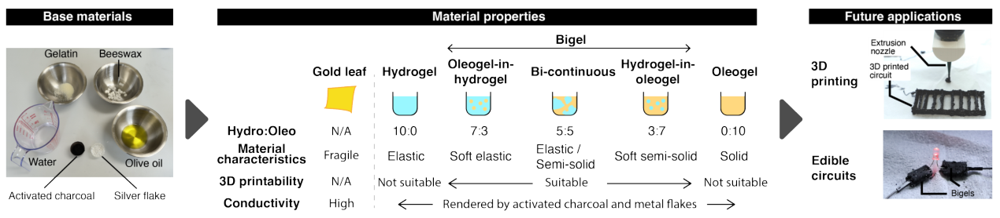
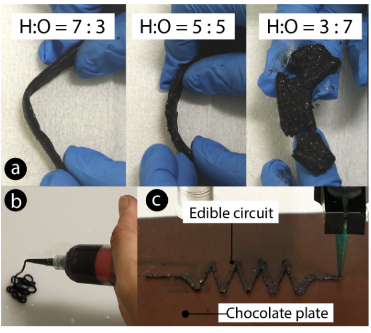

<figure><figcaption>図1．提案手法の概要を示します。左ではハイドロゲルとオレオゲルに導電性フィラーを加えます。中央では両者の配合比によって食感や水・油への親和性を調整します。右ではバイゲルを食品3Dプリントに用いて回路を埋め込みます。親油性によって油脂の多い食品にもなじみます。</figcaption></figure>

## 概要

本研究では食べられる導電性バイゲルを検討します。油系のオレオゲルと水系のハイドロゲルを組み合わせて作製します。配合比を調整すると食感を変えられます。水分の多い料理から油脂の多い料理まで対応できる3Dプリント用ゲルになります。食べられる導電性フィラーを加えたゲルを押出式の食品3Dプリントに用います。実験では食感を調整できることを示しました。センシングに利用できる導電性も得られました。チョコレートなどの実際の食品への組込みも示しました。本研究は食品に合わせて特性を調整できる食用インタフェースの基盤を提示します。

## 1．はじめに

食べられる導電性材料によって食用センサの作製や食品への電子機能の組込みが可能になりつつあります。食品そのものを対話的なインタフェースとして利用できます。既存研究では金箔などの食べられる金属から導電路を作製しています［1, 3, 6］。これらの材料は導電性に優れています。しかし壊れやすく手作業を要します。3Dプリントなどの自動製造には適していません。

より柔軟な材料として活性炭を加えたゼラチン系ハイドロゲルなどが研究されています［4］。ハイドロゲルは軟らかく型成形や切断で加工できます。一方で押し出した形状を自立させる強度が不足します。このため食品3Dプリントへの適用が難しくなります。また親水性の材料をチョコレートなどの油脂を主体とする食品に隠すことも難しくなります。

本研究では多様な食品と自動製造に適合する食用導電性材料としてオレオゲルとバイゲルを提案します。オレオゲルは油とゲル化剤から作る半固体で油への親和性を持ちます。これをゼラチン系ハイドロゲルと組み合わせてバイゲルを作ります。油と水の比率を調整することで流動性のある状態から形状を保持する状態まで変えられます。水系と油系の両方の食品に対応できます。

これらのゲルに食べられる導電性フィラーを加えます。3Dプリントへの適性と食品に組み込めることを示します。組成を調整したゲルをプリントすることで多様な食品にセンシング要素を埋め込めます。対話的な食事や個別化された栄養管理などへの応用を目指します。

## 2．作製方法

幅広い食品に適合する食用導電性材料の作製を目指しました。プリントに利用できる材料として食品用の成分からオレオゲルとバイゲルを調製しました。油と水の比率で材料特性を調整しました。導電性フィラーの添加によって電気を通すようにしました。

### 材料の組成と混合

オリーブ油に蜜蝋を7 wt%加えたオレオゲルを用いました。ハイドロゲルには水にゼラチンを7 wt%加えたものを用いました。それぞれを80°Cで事前に混合しました。食感と加工性への影響を調べるためにオレオゲルとハイドロゲルの質量比を3:7と5:5と7:3に設定しました。この順にオレオゲルがハイドロゲル中に分散する構造・共連続構造・ハイドロゲルがオレオゲル中に分散する構造に対応します。ハンドブレンダーで5分間混合して均一にしました。

### 導電性フィラーの添加

導電性を与えるために活性炭を30 wt%加えました。食べられる導電性フィラーとして用いた活性炭の濃度はパーコレーション閾値を上回ります。さらに食用銀フレークを0.04 wt%加えました。粒子間の接続を改善して抵抗を下げるためです［2］。型成形やプリントの前にマグネチックスターラーで十分に分散させました。

## 3．実験

### 配合比による食感の変化

オレオゲルとハイドロゲルの比率によってバイゲルの食感を調整できます。質量比が3:7と5:5と7:3の導電性バイゲルを作製しました。弾性と剛性を定性的に評価しました。3:7では弾性の高い軟らかなゲルになりました。オレオゲルの割合が増すと硬めのペースト状になりました。図2aに外観を示します。図1にもこの傾向を示します。その後の3Dプリントには5:5の配合を用いました。

### 導電性の測定

前述の手順で調製したオレオゲルとバイゲルを市販のLCRメータ（Sanwa）で測定しました。すべての試料で20,000〜30,000 Ω·cmの値が得られました。原文ではこの値を「抵抗」と記載しています。タッチセンシングや簡単なLED点灯などの低消費電力用途に十分な導電性が得られたと報告しています。食用銀フレークを0.04 wt%加えると5,000〜10,000 Ω·cmに低下しました。食べられる配線や回路を用いた食品インタフェースへの可能性を示します。

<figure><figcaption>図2．aは配合比を変えたバイゲルの外観です。bは3Dプリント用のバイゲルです。cはチョコレート板に描いた食べられる回路です。</figcaption></figure>

## 4．応用

食品3Dプリントと油脂の多い食品への組込みという二つの場面で応用可能性を調べました。

### 4.1．食品3Dプリント

オレオゲルとハイドロゲルが5:5のバイゲルでは弾性と粘性のバランスが良好でした。押出式の食品3Dプリントに適していました（図2b）。押し出した後の形状を保ちつつ安定した押出に必要な流動性もありました。

ゲルをプリントすることで導電領域を組み込んだ食用部品を設計できます。食べられる回路や触れると反応する食品表面などが考えられます。センシング領域の位置も制御できます。計算に基づく設計と自動製造による対話的な食体験の可能性が広がります。

### 4.2．油脂を主体とする食品の食感との適合

配合を調整すると油脂を主体とする食品の食感に近づけられました（図2c）。特にオレオゲルの割合が高い配合ではチョコレートやチーズに似た滑らかさと口当たりが得られました。水を主体とするハイドロゲルとは知覚される食感が異なります。この類似性によって食体験を損なわずに対話的な要素を組み込める可能性があります。食用インタフェースの設計では重要な点です。適切な配合を選ぶことで機能面に加えて知覚や味覚の面でも実際の食品になじむ電子機能を作れます。

## 5．考察

提案した導電性ゲルを用いて通常の食品に機能要素を組み込めます。配合比を調整することで感覚的な魅力を保てます。3Dプリントを用いると外観を損なわずに回路構造を埋め込めます［5］。現段階では初期的な検討にとどまります。今後は利用者の受容性と設計ツールを検討する必要があります。味を放出する一口サイズの食品や触れると反応するデザートなどへの応用が考えられます。

## 謝辞

本研究はJST ACT-X（JPMJAX24CQ）およびJSPS科研費（23K11198）の支援を受けました。

## 参考文献

書誌情報は原文の言語で掲載しています。

[1] Jialin Deng, Yinyi Li, Hongyue Wang, Ziqi Fang, and Florian ‘floyd’ Mueller. 2025. Sonic delights: Exploring the design of food as an auditory-gustatory interface. In Proceedings of the 2025 CHI Conference on Human Factors in Computing Systems. ACM, New York, NY, USA, 1–19. https://doi.org/10.1145/3706598.3713892

[2] Kenta Fukada, Takuro Tajima, and Katsuyoshi Hayashi. 2022. Thermally healable food-based conductive oleogel ink with added edible gold-leaf powder. ACS Appl. Electron. Mater. 4, 12 (27 Dec. 2022), 6087–6093. https://doi.org/10.1021/acsaelm.2c01209

[3] Kunihiro Kato, Kaori Ikematsu, Hiromi Nakamura, Hinako Suzaki, and Yuki Igarashi. 2024. FoodSkin: Fabricating Edible Gold Leaf Circuits on Food Surfaces. In Proceedings of the CHI Conference on Human Factors in Computing Systems (CHI ’24). Association for Computing Machinery, New York, NY, USA, Article 358, 17 pages. https://doi.org/10.1145/3613904.3642372

[4] Marion Koelle, Madalina Nicolae, Aditya Shekhar Nittala, Marc Teyssier, and Jürgen Steimle. 2022. Prototyping soft devices with interactive bioplastics. In Proceedings of the 35th Annual ACM Symposium on User Interface Software and Technology (UIST ’22, Article 19). ACM, New York, NY, USA, 1–16. https://doi.org/10.1145/3526113.3545623

[5] Yamato Miyatake, Parinya Punpongsanon, Daisuke Iwai, and Kosuke Sato. 2022. interiqr: Unobtrusive Edible Tags using Food 3D Printing. In Proceedings of the 35th Annual ACM Symposium on User Interface Software and Technology (UIST ’22). Association for Computing Machinery, New York, NY, USA, Article 84, 11 pages. https://doi.org/10.1145/3526113.3545669

[6] Parinya Punpongsanon and Hiroki Ishizuka. 2021. EdiSensor: Facilitating Food Electricity for Eating Habits Analysis. In 2021 IEEE 3rd Global Conference on Life Sciences and Technologies (LifeTech). 104–105. https://doi.org/10.1109/LifeTech52111.2021.9391948

