## 概要

Human-Food Interaction（HFI）はデジタル技術によって食体験を拡張する方法を探究します。食品タグは食事とデジタル情報を結び付けます。しかし食品の表面や側面に光学タグを付けると外観を損なう場合があります。味の感じ方や食体験にも影響します。そこで本研究では食品内部にタグを埋め込む手法を提案します。外観と感覚的な品質を保ちながら情報を付加することを目指します。

まず食品3Dプリンタを用いたタグ作製法を開発しました。タグの埋込みから読取りまでの処理を構築しました。読取りやすさと隠しやすさに加えて食体験を評価しました。さらに通常の調理環境で利用しやすくするために型成形とスタンプによる作製法を開発しました。家庭で料理をする3名とのワークショップから初心者にも導入しやすいことが示されました。食品へのタグの埋込みによって料理の特性を損なわずにデジタル情報を食体験に組み込める可能性を示します。HFI研究と実用化に向けた新たな方向を提示します。

## 1．はじめに

HFIは先進的なデジタル技術によって食に関する体験を拡張する学際領域です。食品科学・ヒューマンコンピュータインタラクション・デジタルファブリケーションを横断します。生産から調理や消費を経て廃棄に至る食品のライフサイクル全体を扱います。特に食べる段階では新たな体験を生む可能性が注目されています。

食体験とデジタル情報を結ぶために食品タグが幅広く研究されています（Gayler et al., 2022; Leem et al., 2020; Ahmed et al., 2018）。食品にRFIDチップやセンサを取り付ける方法があります（Fujiwara et al., 2018; Xie et al., 2013）。包装に印刷する方法もあります（Jung et al., 2017; Spielberg et al., 2016）。これらは利用者の妨げになりにくい形で機械による読取りを可能にします。

デジタルガストロノミーとも呼ばれるデジタル食品加工では調理工程の拡張が進んでいます（Zoran, 2019; Schoning et al., 2012）。食品内部の構造を操作すると目立たない食用の付加機能を作れます。例えばプリント時の内部充填パターンを変えると外形を保ったまま内容量を変えられます（Yamamoto et al., 2025; Lin et al., 2020）。外観への影響を抑える構造的な方法は食べられる情報タグにも有望です。

本研究では食品内部に情報を埋め込んで直接識別できるEateryTagを提案します。まず食品3Dプリントによるタグの埋込みと読取りを一貫して行う処理を示します。利用者が入力した情報やタグの寸法に基づいてインタフェースが内容と埋込み形状を決定します。内部の充填率と構造に応じて二つの方法を切り替えます。充填率が高く空隙が小さい場合は複数の食品材料でタグを作ります。充填率が低い場合は充填量と空隙を調整して作ります。内部構造や材料を変えることで外観を変えずにタグを埋め込めます（図1）。読取りやすさ・隠しやすさ・食体験を評価しました。

さらに型成形とスタンプによる埋込み方法を開発しました。対応できる食品材料が広がります。食品3Dプリンタを置きにくい調理環境にも導入しやすくなります。型成形ではセル状の型に通常の材料と着色した材料を詰めてタグを作ります。対象の食品に入れた後に別の層で覆います。スタンプでは食用インクで表面にタグを転写してから同様に隠します。専門的な加工装置を使う工程を一般的な調理道具と手作業に置き換えられます。家庭で料理をする3名との小規模なワークショップで使いやすさと作製したタグの品質を評価しました。専門訓練を受けていない参加者でも両手法を利用できました。

埋め込んだタグによる表面のコントラストを弱めるために複数の色の組合せも予備的に調べました。既発表システムからの拡張は2.5節で説明します。

## 2．関連研究

### 2.1．データ保存用タグと識別用タグ

タグには文章・リンク・時刻・固有識別子などを記録します。通常は文字列として扱います。情報そのものを保存する場合も似た外観の物体を区別する場合も一定量の情報を符号化します。QRコードなどの二次元コードは平面を効率的に使えるため一次元バーコードより多くのデータを保存できます。識別だけが目的なら短いIDや区別できる見た目の特徴で足ります（Getschmann and Echtler, 2021; Maia et al., 2019）。

本研究では食品の内部充填構造に二進データを埋め込みます。内部には十分な体積がある場合が多いためURLや時刻などの内容と識別コードの両方を扱えます。

### 2.2．HFIにおけるタグ付け

食品とのインタラクションでは以前からタグや識別が使われています。包装にバーコードやQRコードを付ける方法が一般的です。商品IDなどを保存できるためスーパーマーケットなどで広く使われています。包装工程にも導入しやすい方法です。ただし安全上の理由から食品に直接付けられないタグは開封時に食品と切り離されます。

近年は食品と一緒に食べられるタグや印や構造が研究されています。食用色素・表面形状・材料特性などを利用します。表面を使う方法では情報の埋込みによって外観を変えます。QKiesは食用インクで食品表面にQRコードを印刷します（Juchem Food Ingredients GmbH, 2011）。MetaCookieは焼印で視覚マーカを付けてARに利用します（Narumi et al., 2010）。Yamamoto et al.（2025）は斜めの穴を表面に作って特定の方向からだけ見える模様を示しました。Edible Retroreflectorは寒天の反射特性によってカメラで食品を追跡します（Uji et al., 2017）。

食品の導電性などを用いる方法もあります。Edible ElectronicsやEdiSensorは食用の導電路を使って追跡やデータ伝送を行います（Sharova et al., 2021; Punpongsanon and Ishizuka, 2021）。Muffidgetsは導電性の食材を使ったタンジブルな操作を検討しています（Heller, 2021）。Ishii et al.（2020）は電気分解で表面の色を変えます。視覚的なデータを食品に符号化できる可能性があります。

これらの方法では表面に特徴を付ける必要がある場合があります。特定の食材や外部装置を要する場合もあります。通常の観察条件では見えず機械には読めるタグを食品内部に埋め込む研究は限られています。本研究では3Dプリント時の内部充填構造に情報を埋め込みます。肉眼では見えないタグをカメラで読み取ります。原文では通常の照明で読取り可能と述べています。具体的な背面照明の条件は3.5節で示します。幅広い食用材料への対応によって日常の調理場面での利用を目指します。

### 2.3．デジタルファブリケーションにおける目立たない情報の埋込み

食用以外のタグでも物体の形状を利用して目立ちにくく識別する研究があります。プリント時に自然に生じる特徴を使う方法があります（Dogan et al., 2020）。方向性のある照明や反射の異方性によって特定の条件でだけ見える形状を作る方法もあります（Peng et al., 2020; Ma et al., 2023）。表面の質感になじむ模様も提案されています（Getschmann and Echtler, 2021）。これらは外観を保てます。しかし焼成や冷却や取扱いで表面の特徴が変わる食品には適用しにくい場合があります。

内部構造を使う研究では空隙・赤外線吸収材料・蛍光材料・温度応答性の樹脂などを用います（Li et al., 2017; Kubo et al., 2020; Dogan et al., 2022, 2023; Jiang et al., 2023）。表面の下にあるタグを赤外線カメラや光散乱を用いた装置で検出します。本研究はこれらの原理を食品加工に展開します。

食品用の材料は機能性と造形精度の両面で制約があります。生地などは調理中に変形・乾燥・膨張します。加工中も加工後も正確な形状の維持が難しくなります。本研究では二つの方法を提案します。一つは通常の生地の内部に空隙を作る方法です。もう一つは通常の生地と着色した生地の差を利用する方法です。見た目を損ないにくい食用タグを通常のカメラで読み取れます。

### 2.4．デジタル食品加工

個別化された食品設計はデジタル食品加工の発展によって進んでいます。道具の複雑さと利用者の関与からデジタル制御による加工と手作業を補助する加工に大別できます。

デジタル制御では成形・堆積・変形などの工程を高精度に自動化します。食品3Dプリンタやロボットアームによってチョコレート・アイシング・生地などを積層します（Khot et al., 2017; Lin et al., 2020; Miyatake et al., 2022; Ishii, 2024; Wang et al., 2017; Nishihara and Kakehi, 2021; Miyatake et al., 2021, 2020）。CO₂レーザによる局所的な加熱や彫刻もあります（Fukuchi et al., 2012; Henze et al., 2015）。CNC加工機で食品を削る方法もあります（Mizrahi et al., 2016; Yamamoto et al., 2025）。

手作業を補助する加工は導入しやすく材料選択の自由度も高い方法です。シリコーン型や食品用スタンプなどを使って形状や表面模様を作ります（Zoran and Cohen, 2018; Lee et al., 2017, 2019; Tao et al., 2019）。準備に手作業は必要ですが専門装置への依存を減らせます。作製した型やスタンプは繰り返し使えます。多様な材料や環境でも一定の結果を得られます。既存研究ではモジュール式の食感や視覚的・対話的な模様や新たな料理の外観を検討しています。完全自動化より導入の負担が小さくなります。

これらの加工法は構造や外観の調整に加えて食用タグの埋込みにも利用できます。本研究では食品3Dプリント・型成形・スタンプの三つの方法を開発しました。デジタル制御と手作業の両方に対応します。幅広い調理環境や準備方法に適応できます。

### 2.5．既発表システムからの拡張

先行研究では初期システムをinteriqrとして発表しました（Miyatake et al., 2022; Punpongsanon et al., 2022）。3Dプリントの内部充填構造に情報を埋め込む考え方を示しました。空隙と複数材料を使う二つの処理を実装しました。読取りやすさと食体験も評価しました（Miyatake et al., 2022）。その後に複数の利用例を示しました（Punpongsanon et al., 2022）。

本論文では型成形とスタンプを追加します。三つの方法をEateryTagとして統合します。食品3Dプリントには粘度や粒子径を厳密に調整したペースト状材料が必要です。新しい二つの方法はこの制約に対応します。幅広い材料と調理環境に適用できることを示します。通常の調理環境への適合性をワークショップで評価しました。

<figure>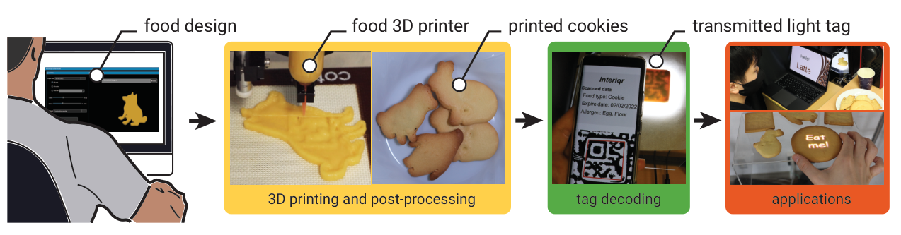<figcaption>図1．EateryTagは3Dプリント時の内部充填構造に情報を埋め込みます。タグは外から見えません。食品の設計から造形と調理を経て情報の読取りと応用につなぐ処理を示します。</figcaption></figure>

## 3．3Dプリントによる方法

食品の内部充填構造に情報を埋め込んで後から読み取る枠組みを示します（図2）。外形と体積を変えずに充填量を計算して内部構造を生成します。充填率が100%の場合は同じ味の異なる材料を切り替えてタグを作ります（3.4.2節）。同じ外観で材料量を減らす場合などは内部の空隙を使います。内部構造に応じたプリント経路を計算して押出機の制御用G-codeを生成します（3.4.1節）。

作製した食品を背面から照らして撮影します。画像処理で内部構造に対応する特徴を抽出して情報を読み取ります（3.5節）。

<figure>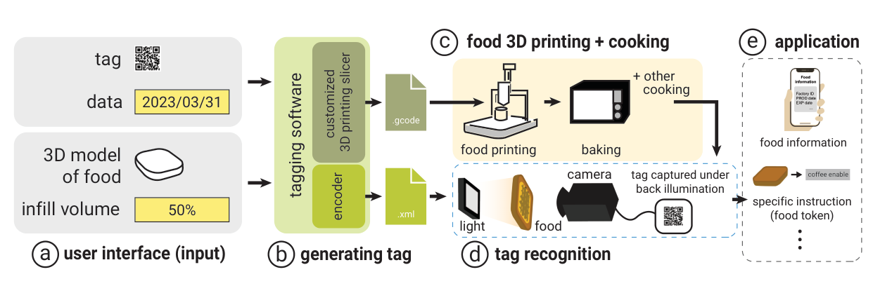<figcaption>図2．aではタグ情報と食品の3Dモデルと充填情報を入力します。bでは独自のスライサがタグとG-codeを生成します。cで食品をプリントして調理します。同時に生成した符号化情報のファイルをdの認識に使います。eでは食品情報の表示や食品をトークンとして使う応用につなげます。</figcaption></figure>

### 3.1．対象食品の選択

原理的にはノズルから押し出せる粘度と粒度を持つ食品に適用できます。造形後に形状を保持できることも条件となります。本研究ではクッキー生地を用います。食品3Dプリントや食品とのインタラクションの既存研究でも使われています（Lin et al., 2020; Narumi et al., 2010; Yamamoto et al., 2024）。共通の材料を用いることで既存の枠組みと結果を結び付けやすくなります。プリント後の形状や構造も制御しやすい材料です。他の材料でも予備実験を行いました（5節）。

### 3.2．作業の流れ

タグ付け用インタフェースと認識アプリケーションから構成します。造形前に各食品へ固有のQRコードを割り当てます。造形後に認識アプリケーションで読み取ります。同じ考え方は4節の型成形とスタンプにも適用できます。

#### 3.2.1．タグ付け用インタフェース

図3のインタフェースに埋め込む情報と充填率を入力します。充填率は例えば5〜100%から選びます。以下では充填率60%のクッキーに消費期限を埋め込む例を説明します。

1. **タグ生成用の充填構造を計算します。** 希望する充填率を60%に設定します。ソフトウェアが指定量の材料でタグを作れる経路を計算します。材料量が内部体積の約半分なので空隙を使います。スライス条件によって内部構造を配置します。
2. **情報を入力します。** 文章や画像やURLを指定できます。この例では食べる前に期限を確認できるよう消費期限を入力します。
3. **食品をプリントします。** パラメータを設定してGenerateボタンを押します。G-codeとタグ情報を持つXMLファイルを生成します。G-codeをプリンタに送ってタグ入りの食品を作製します。

<figure>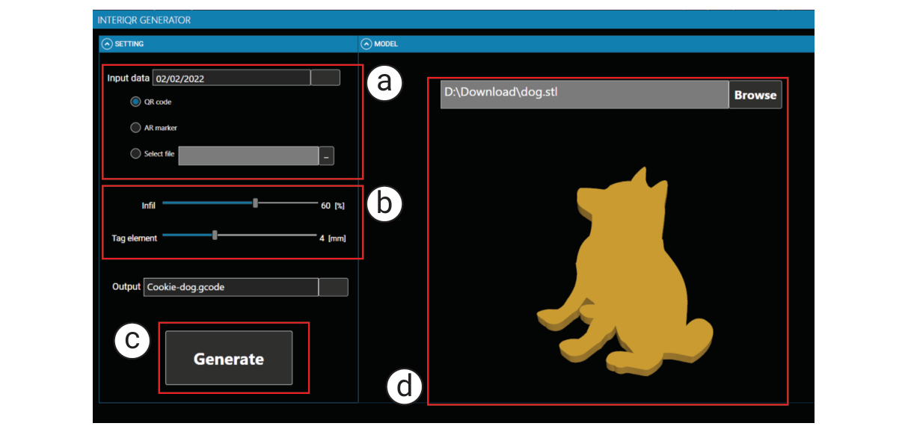<figcaption>図3．インタフェースに埋め込むデータと食品3Dモデルを入力します。充填量や任意のタグ寸法も指定します。Generateボタンを押すとモデル内部にタグを配置してG-codeを出力します。</figcaption></figure>

#### 3.2.2．タグの認識

背面照明とカメラを固定した装置を用います。利用者は下から照らされる台に食品を置きます。システムが上から撮影して画像処理を行います。読み取った情報を画面に表示します。この例ではクッキーの消費期限を提示します。

### 3.3．材料の準備

材料の粘度は造形後の構造に影響します。入力した3Dモデルと内部形状を保てるように配合を調べました。小麦粉・砂糖・卵・ショートニングの比率を経験的に調整しました。シリンジ式プリンタ（Nordson EFD Automated Dispensing System）では1.0:0.4:0.5:0.1が最も適していました（図4c）。一部の表面は崩れますが全体の形状を保てます。対策は3.6.2節で述べます。

混合後は冷蔵庫で1時間休ませます。Nordson Optimum Syringe 20CCに詰めてプリンタへ取り付けます。プリント前に粘度計（TGK TVB-10M）で測定して配合の安定性を確認しました。

<figure>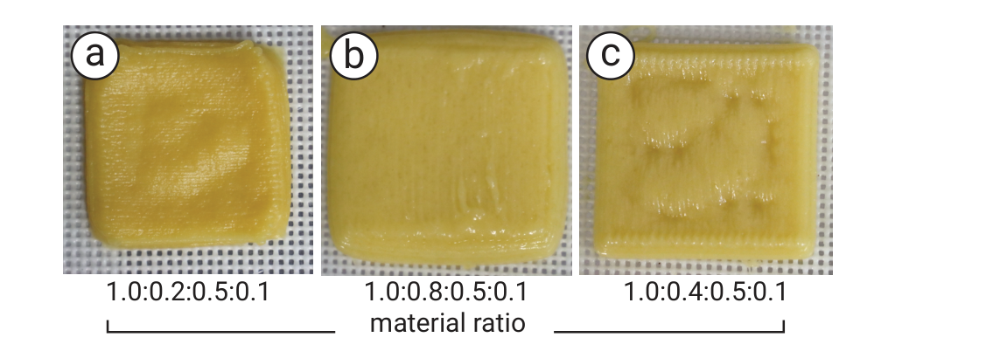<figcaption>図4．小麦粉・砂糖・卵・ショートニングの配合を比較しました。aの1.0:0.2:0.5:0.1とbの1.0:0.8:0.5:0.1では軟らかすぎて形状を保てません。cの1.0:0.4:0.5:0.1では形状が安定します。一部の表面は内部構造の影響で崩れます。</figcaption></figure>

### 3.4．タグの生成

充填率が70%未満では食品内部の空隙を用います。70%を超える場合は色の異なる材料を用います。食品の3Dモデルから通常のスライサと同様に経路を作ります。QRコードやARマーカの画像からタグ用の経路も別に作ります。食品の上面と下面の経路にタグ用の経路を組み合わせます。最後に指定した材料量に合うよう内部構造を調整します。

例として13×13モジュールのマイクロQRコードを用います。およそ英字6文字か数字10桁を記録できます（Densowave, 2019）。保存する情報量に応じてモジュール数を増やせます。

#### 3.4.1．充填構造と空隙の利用

充填率が70%未満の場合は材料がある部分を二進数の0に対応させます。空隙を1に対応させます。まず通常の直線状充填に必要な材料量を計算します。次にタグの作製に必要な量を求めます。

例えば5 cm×5 cm×0.8 cmのクッキーを充填率100%で作るために生地10 gが必要だとします。外殻に2 gを使う場合に内部充填率を70%とすると内部に使う生地は（10 g−2 g）×70%=5.6 gです。この量に合うよう内部構造の寸法を調整します。最後にタグと外殻を統合してG-codeを生成します。

#### 3.4.2．複数材料の利用

充填率が70%を超えるとタグに十分な空隙を確保しにくくなります。この場合は異なる材料で内部をプリントします。カメラから区別できて通常の材料で隠せる材料を選びます（3.6節）。第二の材料を1に対応させます。通常の材料を0に対応させます。本研究では黒い食用色素を混ぜた生地を使います。同じ味を保ちながらタグを作れます。着色した材料を用いても外から目立ちません（図5a）。

<figure>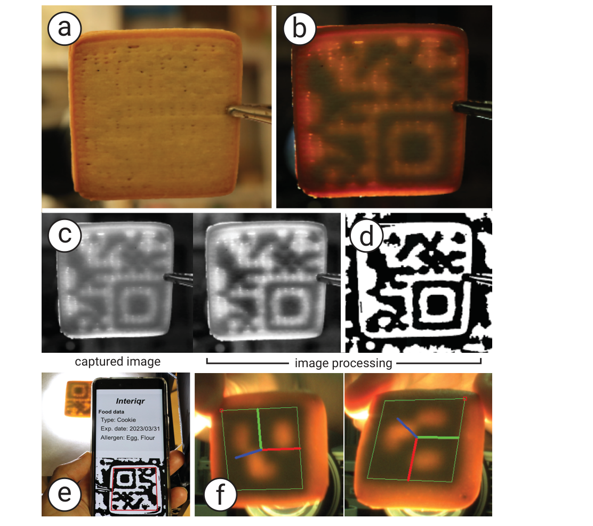<figcaption>図5．aでは通常の観察条件のクッキーを示します。bでは背面から照らします。cの画像処理からdの二値画像を得ます。eでは一般的なQRリーダで認識します。fでは読み取った情報を示します。</figcaption></figure>

### 3.5．タグの読取り

クッキーの下から照明を当てます。上に置いたカメラ（Ximea MQ013CG-ON）で撮影します（図6）。白色光などの可視光に加えて赤外線や空間的に符号化した照明も使えます。光の強度と色を制御しやすいようにプロジェクタ（RICOH PJ WXC1110）を使います。赤外線にはAdvanced Illuminationの880 nmバックライトを用います。

グレースケール画像にCLAHEを適用してコントラストを高めます。ガウシアンぼかしでノイズを減らします（図5c）。適応的なガウシアン閾値処理で二値化してタグの形を抽出します（図5d）。QRコードには市販の読取りソフトウェア（DENSO WAVE QRQRなど）を利用できます。ArUcoマーカの認識にはArUcoライブラリも用いました。図5eと図5fにQRの読取りとArUcoによる3D位置追跡の例を示します。

<figure>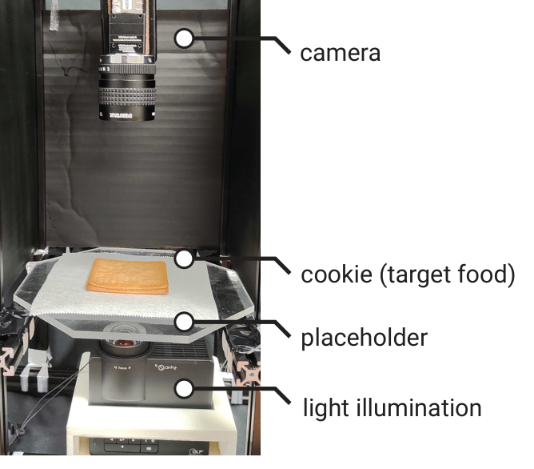<figcaption>図6．プロジェクタで下からクッキーを照らします。カメラで上から撮影します。</figcaption></figure>

### 3.6．実験

食用タグの読取りやすさを評価しました。手法の実現可能性と拡張性も調べました。

#### 3.6.1．タグの読取りやすさ

背面照明の条件と光の波長を変えて調べました。

**透過スペクトルを測定します。** 光はクッキーを通過してカメラに届きます。空隙は材料が詰まった部分より光を通します。食品中の透過率は波長にも依存します。適切な波長を選ぶと読取りやすくなります。

分光放射計（TOPCON SR LEDW）で空隙・通常の生地・黒い生地の透過スペクトルを測定しました。市松模様の左半分に黒い生地を配置しました。右半分には空隙を作りました（図7a）。内部層の高さは1.5 mmです。上下に被覆層を設けて背面から照らしました。正面から分光放射計で測定しました。被覆層の厚さについて原文本文には2 mmと記載されています。一方で原文の図7キャプションには1.5 mmと記載されています。

<figure>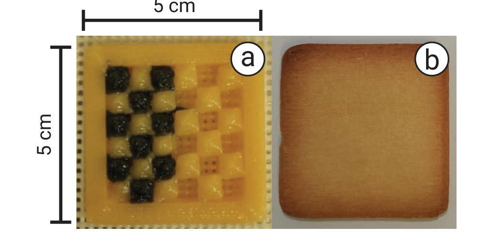<figcaption>図7．aでは黒い生地と空隙を市松模様に配置した実験試料を示します。bでは上下を覆って焼成した状態を示します。原図のキャプションでは被覆層を1.5 mmと記載しています。</figcaption></figure>

550〜780 nmでは空隙がある部分が通常の生地や黒い生地より明るく見えました（図8）。特に680 nmの赤色光で三つの領域のコントラストが増しました。カメラとの距離を15〜30 cmに変えて撮影しました。空隙によるタグは21 cmまで読めました。黒い生地によるタグは24 cmまで読めました。

<figure>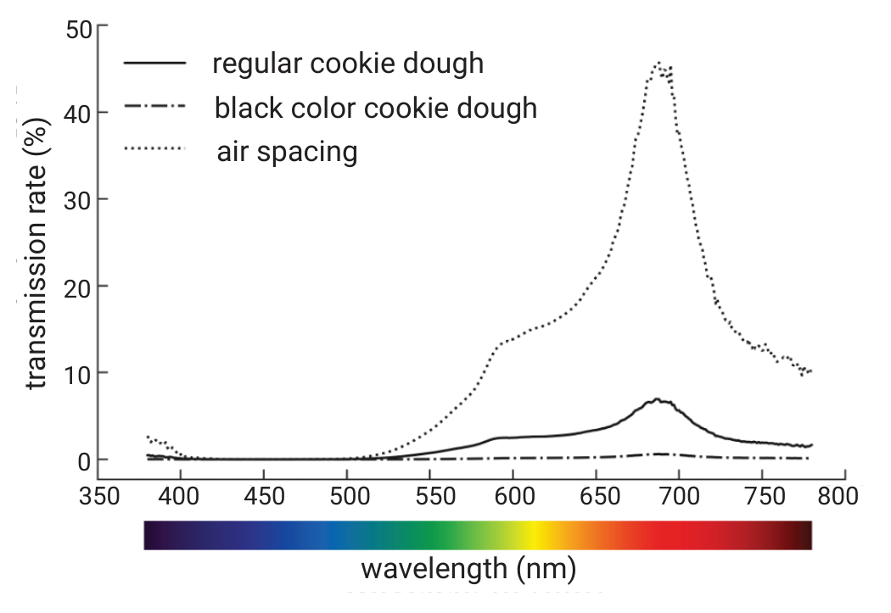<figcaption>図8．通常のクッキー生地・黒い生地・空隙の透過スペクトルを示します。</figcaption></figure>

880 nmの赤外線も試しました。空隙で作ったタグを赤外線バックライトで照らしました。可視光を遮るHWB800フィルタをXimea MQ013CG-ONに取り付けました。同じ画像処理でタグを認識できました（図9）。黒い生地は赤外線を吸収するため十分に透過しませんでした。今後はタンパク質・グルコース・スクロース・水などの吸収特性を検討します（Almeida et al., 2006）。内部材料の選択によって赤外線用タグを作れる可能性があります。

<figure>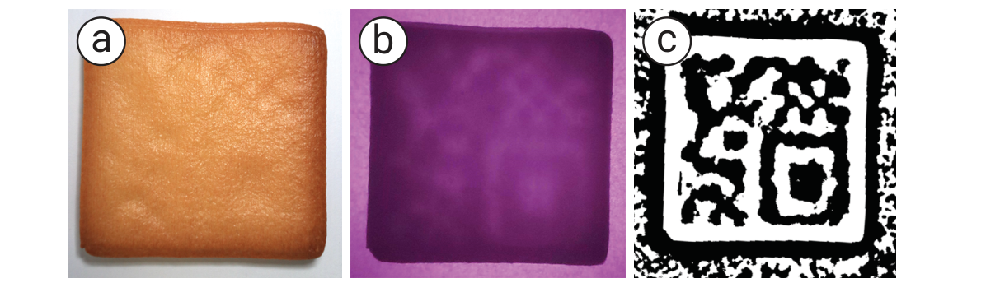<figcaption>図9．赤外線で背面から照らした結果を示します。aは肉眼での見え方です。bは赤外線カメラの画像です。cは認識用に画像処理した結果です。</figcaption></figure>

**透過光と散乱光を分離します。** 撮影画像には直接透過した光と散乱した光が含まれます。散乱光は内部構造の像をぼかして読取りを妨げます。特に空隙のないタグで影響します。高周波照明を用いる分離手法（Nayar et al., 2006）で透過光を取り出して読取りやすさを測定しました。

白色照明を市松模様の投影に置き換えます（図10）。模様の位相を変えながら複数枚を撮影します。各画素の最大値Lmaxと最小値Lminを求めます。透過光Ltと散乱光Lsを次式で分離します。cは画像中の画素です。

Lt[c] = Lmax[c] − Lmin[c]　（1）

Ls[c] = 2Lmin[c]　（2）

<figure>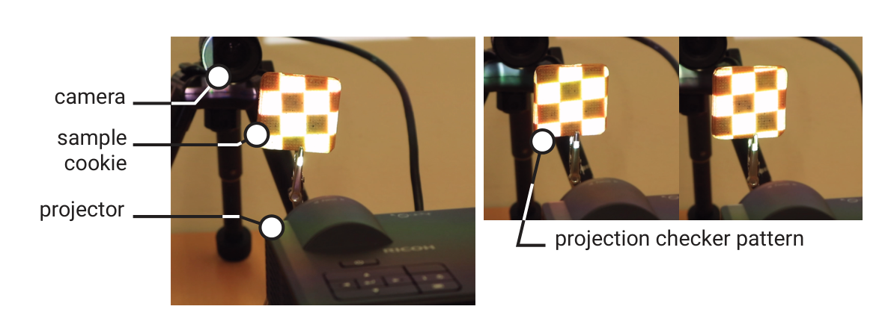<figcaption>図10．左に透過光と散乱光を分離するための装置を示します。右に投影する市松模様を示します。</figcaption></figure>

図11に結果を示します。前の実験と同様に距離を変えて撮影しました。散乱光を除くとタグが読みやすくなりました。空隙によるタグの読取り距離は21 cmから23 cmに伸びました。黒い生地によるタグでは24 cmから29 cmになりました。複数材料と1 mmの空隙を組み合わせた場合は35 cmから読み取れました。

<figure>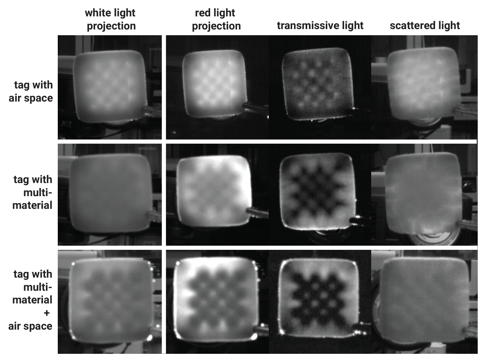<figcaption>図11．異なる充填方法について白色光と赤色光での画像と分離後の透過光と散乱光を比較します。空隙と複数材料と両者の組合せを示します。</figcaption></figure>

#### 3.6.2．タグの隠しやすさ

空隙を使う方法では焼成中に空気が膨張します。表面が持ち上がるとタグの形が見えます（図12a）。空隙の上に生地をプリントすると垂れ下がりによっても形が現れます。

メッシュ状の天板で造形して底面に小さな穴を設けると空気の膨張を抑えられます（図12b）。ただし一部では隆起や沈下が残ります。そこで空隙の上に幅0.6 mmの生地をプリントして支持します。すべての空隙に支持を設ける方法と大きな空隙だけを支持する方法と支持のない方法を比較しました。16 mm²を超える空隙だけを支持すると隆起と沈下を抑えながら読取りやすさを保てました（図12d）。全面的な支持は造形に時間がかかります。小さな穴だけではタグの形が現れます。

<figure>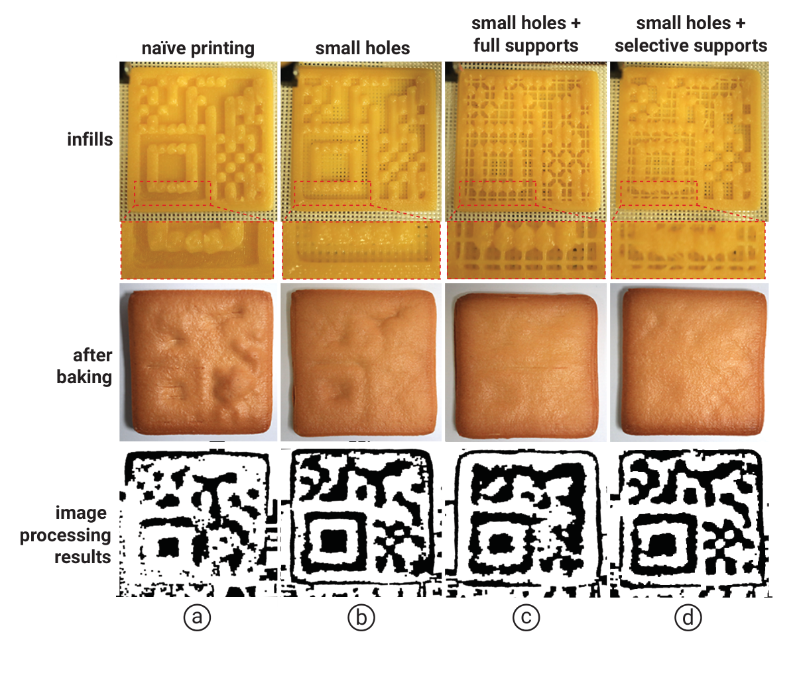<figcaption>図12．aの通常のプリントとbの底面に小孔を設ける方法とcの全面支持とdの選択的な支持を比較します。内部構造と焼成後の外観と画像処理結果を示します。</figcaption></figure>

#### 3.6.3．タグの最小寸法

タグは食品全体ではなく一部にも埋め込めます。このため作製できる寸法を調べました。15 cmの距離で100%読み取れる標準条件は1モジュールが4 mm角でした。13×13モジュールのマイクロQRコードでは52×52 mmです。6×6モジュールのArUcoでは24×24 mmです。

1モジュールを3 mm角と2 mm角にも縮小しました。マイクロQRはそれぞれ39×39 mmと26×26 mmになります。ArUcoは18×18 mmと12×12 mmになります。3 mm角では4 mm角と同じ距離から読めました。2 mm角では8 cmまで近づける必要がありました。また造形中に外殻とうまく接合せず作製が難しくなりました。0.6 mmノズルでは1モジュールを少なくとも3 mm角にすると作製と読取りを両立できました。

厚さも変えて調べました。2〜7 mmの範囲で作製できました。ただし7 mmでは読取りが不安定でした。2 mmでは造形が不安定でした。5 mmを標準とすると両方の問題を避けられました。

#### 3.6.4．安全性と食体験

安全にタグを食べながら食体験を楽しめることを目標とします。造形工程では食品専用の使い捨てシリンジを用います。オイルフリーのエアコンプレッサ（California Air Tools 10020C）も用います。造形中の細菌や異物の混入を減らすためです。作製実験は所属大学の規則に従いました。

食体験の予備評価には大学から募集した21〜35歳の9名が参加しました。空隙を使ったクッキーと複数材料を使ったクッキーを食べてもらいました。充填率100%のクッキーを基準としました。外観が似ているため参加者には内部構造の条件が分かりませんでした。

口当たりの評価項目は乾燥感・硬さ・滑らかさ・しなやかさ・甘さです（Mouritsen et al., 2017）。7段階リッカート尺度で評価しました。所属大学の倫理審査委員会の承認を受けました。全体として三つのクッキーの食体験は似ていました（図13）。充填率100%と空隙と複数材料の順に乾燥感の平均は5.5と5.4と5.1でした。滑らかさは3.1と2.8と3.3でした。しなやかさは3.3と3.2と3.25でした。甘さは4.3と4.0と4.1でした。一方で硬さには差がありました。充填率100%では6.5でした。空隙では4.35でした。複数材料では6.1でした。内部構造の違いが影響しています。

<figure>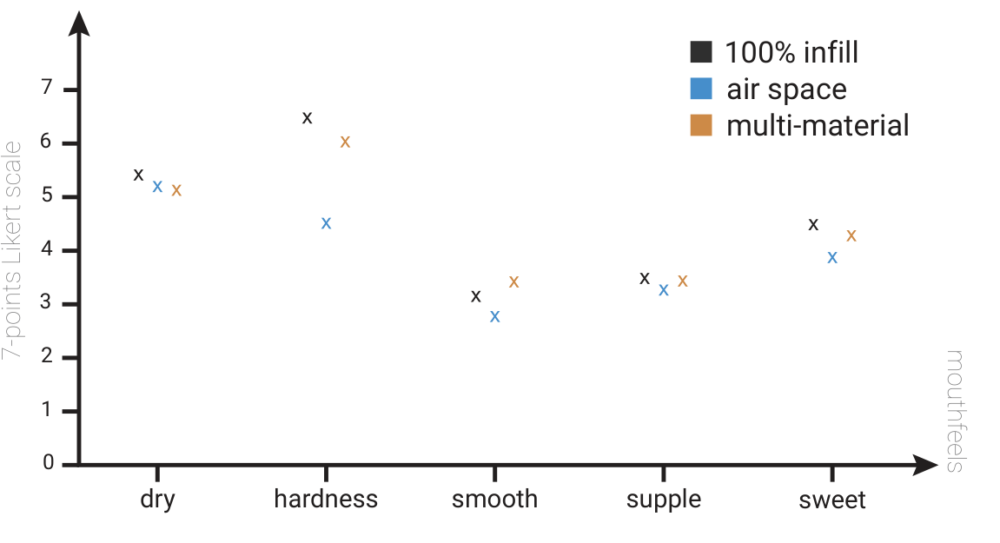<figcaption>図13．二つのタグ埋込み方法と充填率100%のクッキーについて食体験の評価を比較します。</figcaption></figure>

## 4．型成形とスタンプによる方法

食品3Dプリンタはタグを精密に作れます。しかし対応材料が限られます。家庭の台所にも普及していません。そこで通常の調理法に着想を得た型成形とスタンプを開発しました。食品3Dプリンタを必要とせず一般的な調理技能で利用できます。ノズルからの押出に依存しないため対応材料が広がります（図14）。家庭で料理をする参加者のワークショップで作製を試して誤り率を調べました。

<figure>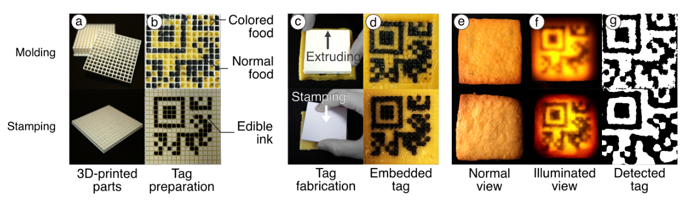<figcaption>図14．型成形とスタンプの概要を示します。aとbは3Dプリントした道具です。cとdは埋込み工程です。eとfは通常時と背面照明時の見え方です。gは画像処理で取り出したタグです。</figcaption></figure>

### 4.1．作業の流れ

認識には3Dプリントの方法と同じ装置を使えます。

#### 4.1.1．型成形

型に材料を詰める成形は食品産業や日常の調理で広く使われます。HFIでも計算によって食感を制御するために使われています（Lee et al., 2019, 2017; Zoran and Cohen, 2018）。

3Dプリントした型で食品内部にタグを埋め込みます。型はセル状の穴がある基部と各穴に合う突起を持つ押出部から構成します。通常の3Dプリンタで作製できます。3.4.1節と3.4.2節の方法に対応します。例えば複数材料の場合は0のセルに通常の生地を入れます。1のセルには黒い生地などを入れます。押出部でタグ構造を位置決めして食品に移します。最後に上層で覆います（図14上段）。

流し込める材料や押し込める材料を使用できます。このため硬い材料や粒子の大きい材料にも対応できます。一方で材料量の精密な制御が難しく充填率を自動調整できません。一つのタグには空隙か複数材料のどちらかを使います。両者を組み合わせることはできません。

#### 4.1.2．スタンプ

食品表面に食用インクで模様を描く方法は日常の調理でも使われます。アイシングクッキーへの細かな模様の転写などがあります（Kaminski, 2019）。

これに着想を得て食品の内側になる面へ情報を転写します。セルの配置を示すガイドを持つスタンプを3Dプリントします。1に対応するセルに黒い食用インクを塗ります。対象の面に押し当てて転写します。最後に上層で覆って隠します（図14下段）。

インクを転写できる材料であれば硬さや粒子径によらず利用できます。3Dプリントに不向きな食品にも適用できます。一方で内部構造を操作しないため充填率は制御できません。

### 4.2．評価

#### 4.2.1．タグの検出

型成形とスタンプで情報を埋め込んだ試料を作りました。通常の3Dプリンタ（Ultimaker S3）でプラスチック製の型とスタンプを作製しました。各セルは3.6 mmです。一辺に13セルを設けました。道具全体の寸法は55.2 mmです。

小麦粉・砂糖・卵黄・バターを1.0:0.5:0.2:0.5で混ぜました。この生地は硬いため経験的に食品3Dプリンタには不向きです。厚さ5 mmに延ばしてタグを埋め込みました。別の生地を厚さ1 mmで重ねて隠しました。オーブンで20分焼きました。

照明のない状態ではタグは肉眼で見えませんでした。背面から照らすと現れました（図14eとf）。上にカメラを置いて下から照らしました。ガウシアンぼかし・CLAHE・二値化を適用しました。市販のQRQRで読み取れることを確認しました（図14g）。

#### 4.2.2．タグの隠しやすさ

厚さ1 mmの上層で通常照明下のタグを隠せました。上層が薄すぎると照らさなくてもわずかに見えました。そこでタグと照明の色の組合せを調べました。通常時の表面コントラストを抑えながら照明時の読取りを保つためです。クッキーでは赤いタグと緑色の照明を組み合わせると両立できました（図15）。

<figure>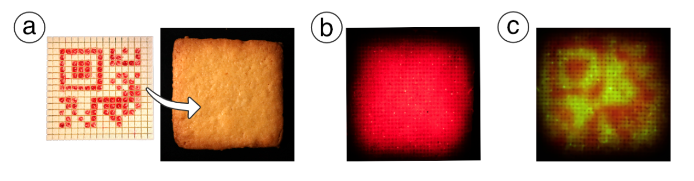<figcaption>図15．aでは赤い食用インクで埋め込んだタグを示します。通常時には見えません。bの赤色照明でも見えません。cの緑色照明で現れます。</figcaption></figure>

### 4.3．小規模ワークショップ：埋込みと読取りの安定性

技術に詳しくない作り手でも情報入りの食品を作れるかを評価しました。埋め込んだ情報を安定して読み取れるかも調べました。

#### 4.3.1．実施方法

家庭で料理をする3名が参加しました。型成形とスタンプのそれぞれでクッキーを3個ずつ作ってもらいました。最初に作製手順を実演しました。その後は各自のペースで作業しました。条件をそろえるために進行役が材料と生地を準備しました。焼成と冷却も担当しました。

4.2.1節の手順で通常の生地と黒い生地を準備しました。対象タグにはArUcoマーカを用いました（図16a）。

<figure>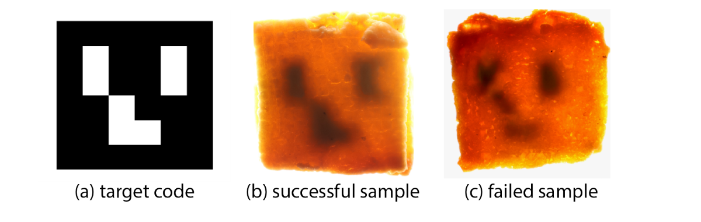<figcaption>図16．aは埋め込むタグです。bは焼成後も構造が保たれた成功例を背面照明で示します。cは変形や混合によって認識できなくなったと考えられる失敗例です。</figcaption></figure>

#### 4.3.2．読取り結果

図17に作業風景を示します。表1に読取り結果を示します。3.5節の画像処理によって約67%のタグを認識できました。参加者Aは両手法の全試料で成功しました。成功例では焼成後も構造が保たれていました（図16b）。

参加者BとCでは初期の試行で失敗が見られました。模様が変形したり不明瞭になったりしました（図16c）。Bの試料では成形時の意図しない変形によってセルがゆがんだりぼけたりしたと考えられます。Cの最初の試料では通常の生地と着色した生地が混ざりすぎて認識できませんでした。

1〜2個を作ると参加者は自信が増して結果が改善したと報告しました。最後の試料は全員が読取りに成功しました。参加者は3名に限られます。しかし初期試行後に一貫した改善が見られたことから最小限の説明で基本技能を習得できる可能性があります。今後は参加者数を増やして検討します。

<figure>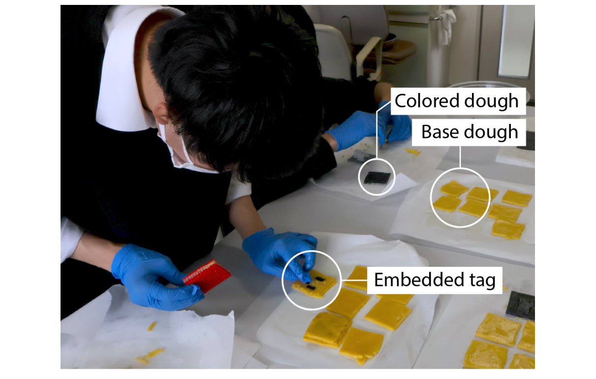<figcaption>図17．ワークショップ中の作業風景を示します。</figcaption></figure>

**表1．ワークショップの読取り結果を示します。**

| 方法 | 参加者 | 試料1 | 試料2 | 試料3 |
|---|---|---|---|---|
| 型成形 | A | 成功 | 成功 | 成功 |
| 型成形 | B | 失敗 | 失敗 | 成功 |
| 型成形 | C | 失敗 | 成功 | 成功 |
| スタンプ | A | 成功 | 成功 | 成功 |
| スタンプ | B | 失敗 | 失敗 | 成功 |
| スタンプ | C | 失敗 | 成功 | 成功 |

## 5．考察と制約

### クッキー以外の材料への適用

主にクッキー生地を用いました。ひき肉など押出可能な材料にも適用できます（図18）。押出できない材料には3Dプリントだけでは対応できません。型成形とスタンプによって対応範囲を広げました。ただし型に詰められることやインクを転写できることが依然として必要です。今後はレーザ加工で模様を切り出したり表面を焦がしたりする方法も検討します（Narumi et al., 2010; Fukuchi et al., 2012; Blutinger et al., 2021）。さらに幅広い食品へ情報を埋め込める可能性があります。

<figure>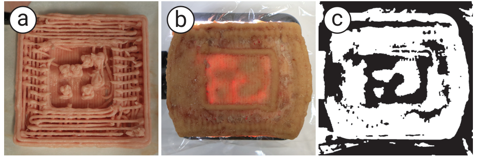<figcaption>図18．タグを埋め込んだ肉を示します。aはプリント中の様子です。bは背面照明時の画像です。cは画像処理結果です。</figcaption></figure>

### 情報容量

食品3Dプリントでは大きなタグにすると造形時間が延びます。その間に材料特性が変わって外殻が崩れるため情報量に制約があります。型成形とスタンプは積層しないため速く作れます。より大きなタグにも対応できる可能性があります。

現状の最小モジュールは3 mm角です。バージョン1のQRコードは21×21モジュールなので少なくとも63 mm角が必要です。主な要因は材料の光透過特性であり三つの作製方法に共通します。小型化にはタグと周囲の透過スペクトルの差が大きい材料が必要です。例えば透明なゼリーに紫外線で蛍光を発するキニーネを埋め込む方法が考えられます。透明材料は光を通しやすいため小型化に役立つ可能性があります。

### 背面照明の見え方

可視光と不可視光の両方に対応します。現状では空隙を持つタグで最も良好に機能します。複数材料の場合は通常は可視光を要します。このため動作中にタグが利用者にもわずかに見えます。今後は赤外線などで透過率の差が得られる材料の組合せを検討します。照明と撮影を高速に同期させると知覚しにくい短時間だけタグを露出できる可能性もあります（Miyatake et al., 2023）。文章や二進パターンなど自然に見える情報の埋込みも考えられます。

## 6．結論

3Dプリント・型成形・スタンプによって食品内部に食用タグを埋め込む方法を提案しました。3Dプリントでの情報埋込みの処理を示しました。型成形とスタンプを加えて対応材料を広げました。検出可能性・隠しやすさ・材料の適用範囲・読取りの安定性を評価しました。幅広い食品に適用できることと市販ツールで読み取れることを示しました。食品への情報埋込みを改善するための制約と今後の課題も述べました。

## 謝辞

本研究はJSPS科研費（23K11198・22H01447・JP20H05958）の支援を一部受けました。JSTさきがけ（JPMJPR19J2）とJST ACT-X（JPMJAX24CQ・JPMJAX20AK）の支援も受けました。

## 参考文献

書誌情報は原文の言語で掲載しています。

Ahmed, I., Lin, H., Zou, L., Li, Z., Brody, A. L., Qazi, I. M., et al. (2018). An overview of smart packaging technologies for monitoring safety and quality of meat and meat products. Packaging Technology and Science 31, 449–471. doi:10.1002/pts.2380

Almeida, M., Torrance, K., and Datta, A. (2006). Measurement of optical properties of foods in near- and mid-infrared radiation. International Journal of Food Properties 9, 651–664. doi:10.1080/10942910600853667

Blutinger, J. D., Tsai, A., Storvick, E., Seymour, G., Liu, E., Samarelli, N., et al. (2021). Precision cooking for printed foods via multiwavelength lasers. Npj Sci. Food 5, 24

[Dataset] Densowave (2019). Micro qr code. https://www.qrcode.com/en/codes/microqr. html

Dogan, M. D., Faruqi, F., Churchill, A. D., Friedman, K., Cheng, L., Subramanian, S., et al. (2020). G-id: Identifying 3d prints using slicing parameters. In Proceedings of the 2020 CHI Conference on Human Factors in Computing Systems (New York, NY, USA: Association for Computing Machinery), 1–13

Dogan, M. D., Garcia-Martin, R., Haertel, P. W., O’Keefe, J. J., Taka, A., Aurora, A., et al. (2023). BrightMarker: 3D printed fluorescent markers for object tracking. In Proceedings of the 36th Annual ACM Symposium on User Interface Software and Technology (New York, NY, USA: ACM), no. Article 55 in UIST ’23, 1–13

Dogan, M. D., Taka, A., Zhu, Y., Kumar, A., Gupta, A., and Mueller, S. (2022). Infraredtags: Embedding invisible ar markers and barcodes using low-cost, infrared-based 3d printing and imaging tools. In Proceedings of the 2022 CHI Conference on Human Factors in Computing Systems (New York, NY, USA: Association for Computing Machinery), 1–13

Fujiwara, M., Moriya, K., Sasaki, W., Fujimoto, M., Arakawa, Y., and Yasumoto, K. (2018). A smart fridge for efficient foodstuff management with weight sensor and voice interface. In Proceedings of the 47th International Conference on Parallel Processing Companion (New York, NY, USA: Association for Computing Machinery), ICPP ’18. doi:10.1145/3229710.3229727

Fukuchi, K., Jo, K., Tomiyama, A., and Takao, S. (2012). Laser cooking: A novel culinary technique for dry heating using a laser cutter and vision technology. In Proceedings of the ACM Multimedia 2012 Workshop on Multimedia for Cooking and Eating Activities (New York, NY, USA: Association for Computing Machinery), CEA ’12, 55–58. doi:10.1145/2390776.2390788

Gayler, T., Sas, C., and Kalnikaitundefined, V. (2022). Exploring the design space for human-food- technology interaction: An approach from the lens of eating experiences. ACM Trans. Comput.-Hum. Interact. 29. doi:10.1145/3484439

Getschmann, C. and Echtler, F. (2021). Seedmarkers: Embeddable markers for physical objects. In Proceedings of the Fifteenth International Conference on Tangible, Embedded, and Embodied Interaction (New York, NY, USA: Association for Computing Machinery), TEI ’21. doi:10.1145/3430524.3440645

Heller, F. (2021). Muffidgets: Detecting and identifying edible pastry tangibles on capacitive touchscreens. In Proceedings of the Fifteenth International Conference on Tangible, Embedded, and Embodied Interaction (New York, NY, USA: Association for Computing Machinery), TEI ’21. doi:10.1145/3430524.3442449

Henze, N., Olsson, T., Schneegass, S., Shirazi, A. S., and Väänänen-Vainio-Mattila, K. (2015). Augmenting food with information. In Proceedings of the 14th International Conference on Mobile and Ubiquitous Multimedia (New York, NY, USA: ACM). doi:10.1145/2836041.2836068

Ishii, A. (2024). Food printing with electrolysis bubbles for texture control. In Extended Abstracts of the CHI Conference on Human Factors in Computing Systems (New York, NY, USA: Association for Computing Machinery), CHI EA ’24. doi:10.1145/3613905.3650917

Ishii, A., Ikematsu, K., and Siio, I. (2020). Electrolysis ion display on wet surfaces. In Adjunct Publication of the 33rd Annual ACM Symposium on User Interface Software and Technology (New York, NY, USA: Association for Computing Machinery), UIST ’20 Adjunct, 19–21. doi:10.1145/3379350.3416172

Jiang, W., Wang, C., Sarsenbayeva, Z., Irlitti, A., Wei, J., Knibbe, J., et al. (2023). InfoPrint: Embedding interactive information in 3D prints using low-cost readily-available printers and materials. Proc. ACM Interact. Mob. Wearable Ubiquitous Technol. 7, 1–29

[Dataset] Juchem Food Ingredients GmbH (2011). Qkies. https://qkies.de/

Jung, G., Zarzycki, A., and Lee, J.-H. (2017). Mom’s tray: Real-time dietary monitoring system. In SIGGRAPH Asia 2017 Mobile Graphics &amp; Interactive Applications (New York, NY, USA: Association for Computing Machinery), SA ’17. doi:10.1145/3132787.3139196

[Dataset] Kaminski, L. (2019). This is the easiest way to decorate royal icing cookies. https: //www.tasteofhome.com/article/stamp-decoration-royal-icing-cookies/. Accessed: 2024-12-27

Khot, R. A., Aggarwal, D., Pennings, R., Hjorth, L., and Mueller, F. F. (2017). Edipulse: Investigating a playful approach to self-monitoring through 3d printed chocolate treats. In Proceedings of the 2017 CHI Conference on Human Factors in Computing Systems (New York, NY, USA: Association for Computing Machinery), CHI ’17, 6593–6607. doi:10.1145/3025453.3025980

Kubo, Y., Eguchi, K., and Aoki, R. (2020). 3d-printed object identification method using inner structure patterns configured by slicer software. In Extended Abstracts of the 2020 CHI Conference on Human Factors in Computing Systems (New York, NY, USA: Association for Computing Machinery), CHI EA ’20, 1–7. doi:10.1145/3334480.3382847

Lee, B., Hong, J., Surh, J., and Saakes, D. (2017). Ori-mandu: Korean dumpling into whatever shape you want. In Proceedings of the 2017 Conference on Designing Interactive Systems (New York, NY, USA: Association for Computing Machinery), DIS ’17, 929–941. doi:10.1145/3064663.3064790

Lee, Y., Yim, J. B., Kang, D., Yi, H., and Saakes, D. (2019). Designing internal structure of chocolate and its effect on food texture. In Companion Publication of the 2019 on Designing Interactive Systems Conference 2019 Companion (New York, NY, USA: Association for Computing Machinery), DIS ’19 Companion, 231–235. doi:10.1145/3301019.3323896

Leem, J. W., Kim, M. S., Choi, S. H., Kim, S.-R., Kim, S.-W., Song, Y. M., et al. (2020). Edible unclonable functions. Nature Communications 11, 328. doi:10.1038/s41467-019-14066-5

Li, D., Nair, A. S., Nayar, S. K., and Zheng, C. (2017). Aircode: Unobtrusive physical tags for digital fabrication. In Proceedings of the 30th Annual ACM Symposium on User Interface Software and Technology (New York, NY, USA: Association for Computing Machinery), UIST ’17, 449–460. doi:10.1145/3126594.3126635

Lin, Y.-J., Punpongsanon, P., Wen, X., Iwai, D., Sato, K., Obrist, M., et al. (2020). Foodfab: Creating food perception illusions using food 3d printing. In Proceedings of the 2020 CHI Conference on Human Factors in Computing Systems (New York, NY, USA: Association for Computing Machinery), CHI ’20, 1–13. doi:10.1145/3313831.3376421

Ma, Z., Zhou, H., and Zhang, W. (2023). AnisoTag: 3D printed tag on 2D surface via reflection anisotropy. In Proceedings of the 2023 CHI Conference on Human Factors in Computing Systems (New York, NY, USA: ACM), vol. 14 of CHI ’23, 1–15

Maia, H. T., Li, D., Yang, Y., and Zheng, C. (2019). Layercode: Optical barcodes for 3d printed shapes. ACM Trans. Graph. 38. doi:10.1145/3306346.3322960

Miyatake, M., Narumi, K., Sekiya, Y., and Kawahara, Y. (2021). Flower Jelly Printer: Slit Injection Printing for Parametrically Designed Flower Jelly (New York, NY, USA: Association for Computing Machinery)

Miyatake, M., Watanabe, A., and Kawahara, Y. (2020). Interactive cake decoration with whipped cream. In Proceedings of the 12th Workshop on Multimedia for Cooking and Eating Activities (New York, NY, USA: ACM). doi:10.1145/3379175.3391711

Miyatake, Y., Hiraki, T., Iwai, D., and Sato, K. (2023). HaptoMapping: Visuo-haptic augmented reality by embedding user-imperceptible tactile display control signals in a projected image. IEEE Trans. Vis. Comput. Graph. 29, 2005–2019. doi:10.1109/TVCG.2021.3136214

Miyatake, Y., Punpongsanon, P., Iwai, D., and Sato, K. (2022). interiqr: Unobtrusive edible tags using food 3D printing. In Proceedings of the 35th Annual ACM Symposium on User Interface Software and Technology (New York, NY, USA: ACM), 1–11. doi:10.1145/3526113.3545669

Mizrahi, M., Golan, A., Mizrahi, A. B., Gruber, R., Lachnise, A. Z., and Zoran, A. (2016). Digital gastronomy: Methods &amp; recipes for hybrid cooking. In Proceedings of the 29th Annual Symposium on User Interface Software and Technology (New York, NY, USA: ACM). doi:10.1145/2984511.2984528

Mouritsen, O., Styrbæk, K., and Johansen, M. (2017). Mouthfeel: How Texture Makes Taste. Arts and Traditions of the Table: Perspectives on Culinary History (Columbia University Press)

Narumi, T., Kajinami, T., Tanikawa, T., and Hirose, M. (2010). Meta cookie. In ACM SIGGRAPH 2010 Emerging Technologies (New York, NY, USA: Association for Computing Machinery), SIGGRAPH ’10. doi:10.1145/1836821.1836839

Nayar, S. K., Krishnan, G., Grossberg, M. D., and Raskar, R. (2006). Fast separation of direct and global components of a scene using high frequency illumination. ACM Trans. Graph. 25, 935–944. doi:10.1145/1141911.1141977

Nishihara, Y. and Kakehi, Y. (2021). Magashi: Fabrication of shape-changing edible structures by extrusion- based printing and baking. In Creativity and Cognition (New York, NY, USA: Association for Computing Machinery), C&amp;C ’21. doi:10.1145/3450741.3465388

Peng, H., Liu, P., Lu, L., Sharf, A., Liu, L., Lischinski, D., et al. (2020). Fabricable unobtrusive 3d-qr-codes with directional light. Computer Graphics Forum 39, 15–27. doi:https://doi.org/10.1111/cgf.14065

Punpongsanon, P. and Ishizuka, H. (2021). Edisensor: Facilitating food electricity for eating habits analysis. In 2021 IEEE 3rd Global Conference on Life Sciences and Technologies (LifeTech). 104–105. doi:10.1109/LifeTech52111.2021.9391948

Punpongsanon, P., Miyatake, Y., Iwai, D., and Sato, K. (2022). Demonstration of interiqr: Unobtrusive edible tags using food 3D printing. In Adjunct Proceedings of the 35th Annual ACM Symposium on User Interface Software and Technology (New York, NY, USA: ACM), no. Article 108 in UIST ’22 Adjunct, 1–3

Schoning, J., Rogers, Y., and Kruger, A. (2012). Digitally enhanced food. IEEE Pervasive Computing 11, 4–6. doi:10.1109/MPRV.2012.40

Sharova, A. S., Melloni, F., Lanzani, G., Bettinger, C. J., and Caironi, M. (2021). Edible electronics: The vision and the challenge. Advanced Materials Technologies 6, 2000757. doi:10.1002/admt.202000757

Spielberg, A., Sample, A., Hudson, S. E., Mankoff, J., and McCann, J. (2016). Rapid: A framework for fabricating low-latency interactive objects with rfid tags (New York, NY, USA: Association for Computing Machinery), CHI ’16, 5897–5908. doi:10.1145/2858036.2858243

Tao, Y., Do, Y., Yang, H., Lee, Y.-C., Wang, G., Mondoa, C., et al. (2019). Morphlour: Personalized flour-based morphing food induced by dehydration or hydration method. In Proceedings of the 32nd Annual ACM Symposium on User Interface Software and Technology (New York, NY, USA: Association for Computing Machinery), UIST ’19, 329–340. doi:10.1145/3332165.3347949

Uji, T., Zhang, Y., and Oku, H. (2017). Edible retroreflector. In Proceedings of the 23rd ACM Symposium on Virtual Reality Software and Technology (New York, NY, USA: Association for Computing Machinery), VRST ’17. doi:10.1145/3139131.3139148

Wang, W., Yao, L., Zhang, T., Cheng, C.-Y., Levine, D., and Ishii, H. (2017). Transformative appetite: Shape-changing food transforms from 2d to 3d by water interaction through cooking (New York, NY, USA: Association for Computing Machinery), CHI ’17, 6123–6132. doi:10.1145/3025453.3026019

Xie, L., Yin, Y., Lu, X., Sheng, B., and Lu, S. (2013). Ifridge: An intelligent fridge for food management based on rfid technology. In Proceedings of the 2013 ACM Conference on Pervasive and Ubiquitous Computing Adjunct Publication (New York, NY, USA: Association for Computing Machinery), UbiComp ’13 Adjunct, 291–294. doi:10.1145/2494091.2494181

Yamamoto, T., Amesaka, T., Withana, A., and Sugiura, Y. (2025). ShadoCookies: Creating user viewpoint- dependent information displays on edible cookies. Comput. Graph. 127, 104158. doi:10.1016/j.cag.2024.104158

Yamamoto, T., Fernando, B., Amesaka, T., Withana, A., and Sugiura, Y. (2024). Creating viewpoint- dependent display on edible cookies. In Proceedings of the Augmented Humans International Conference 2024 (New York, NY, USA: ACM), 286–289

Zoran, A. (2019). Cooking with computers: The vision of digital gastronomy [point of view]. Proceedings of the IEEE 107, 1467–1473. doi:10.1109/JPROC.2019.2925262

Zoran, A. and Cohen, D. (2018). Digital Konditorei: Programmable Taste Structures Using a Modular Mold (New York, NY, USA: Association for Computing Machinery). 1–9

