## 概要

HaptoMappingという投影型の視触覚拡張現実（Visuo-Haptic Augmented Reality：VHAR）システムを提案します。視覚情報と触覚情報を独立に生成します。実物の表面で両感覚を整合させて提示します。画素単位の可視光通信を用いて投影画像に制御信号を埋め込みます。この信号を利用者は知覚できません。この信号で装着型の触覚ディスプレイを制御します。

試作機は高速プロジェクタと指装着型・スタイラス型・腕装着型の触覚デバイスから構成します。指装着型とスタイラス型は指先に振動を提示します。腕装着型は並べたアクチュエータと手の映像の投影を同期させて前腕を撫でる感覚を提示します。原文の概要では視覚に対する触覚の最大遅延を93.4 msと報告しています。遅延知覚の実験では指装着型・スタイラス型・腕装着型の許容閾値をそれぞれ100 msと159 msと500 msとしました。

腕装着型の別の実験では基板間隔が20 mmでも連続感と快適さを保てました。触覚のみの提示に比べて手の映像を加えると80 mm/sと150 mm/sで両者が改善したと原文は述べています。最後に日常場面での四つの応用を示します。遅延や位置ずれへの懸念を減らして幅広いVHARを設計する方法を提示します。

## 1．はじめに

触覚は表面の素材特性を捉えたり人同士で感情を伝えたりするために重要です。表面を触ると粗さや硬さなどを区別できます。撫でる・握る・軽く叩くといった社会的接触で愛情や喜びや悲しみなどを伝えられます［1］。これらの触覚を提示することはARの現実感と没入感を高めます［2］。視覚情報と触覚情報を組み合わせるVHARが研究されています［3–7］。

テクスチャ提示では据置型触覚デバイスと視覚ディスプレイを組み合わせて仮想画像に触覚を与えます［3, 4, 8, 9］。ただしディスプレイが視野を覆います。触覚機能を平面ディスプレイに組み込む方法なら視野を覆わず時空間的な整合を保てます［10, 11］。一方で作業面が平面に限られます。

投影光で制御する装着型触覚ディスプレイは非平面にも触覚を提示できます［12, 13］。外部追跡を必要としないため視触覚の時空間的な整合を高められます。しかし既存手法では明るい部分でだけ振動するなど視覚と触覚が強く結び付いています。設計者が個別に内容を決められません。高い整合性と独立した設計を両立するテクスチャ用VHARはありませんでした。社会的接触のデバイスも従来は触覚の提示に集中していました［14–16］。

HaptoMappingは画素単位可視光通信（Pixel-level Visible Light Communication：PVLC）［17］を使います。高速な二値画像投影によって自然な画像表示と各画素へのデータ埋込みを両立します。触覚デバイスが光センサで信号を受けて振動を提示します。投影光から直接受信するため遅延を短くできます。投影に適した面なら形状を選びません。個別のヘッドマウントディスプレイが不要で複数人が同じ視覚表示を共有できます。スピーカなどを追加して制御信号を増やせば他の感覚にも拡張できます。

試作機にはPVLC投影系と3種類の触覚デバイスを用いました。原文の導入では静止画時に最大24 bitで動画時に最大8 bitの信号を埋め込めると述べています。3.2.1節の静止画仕様では最大32 bitと記載されています。指装着型とスタイラス型は単一アクチュエータで単純な手掛かりや複雑な質感を提示します。腕装着型は複数のアクチュエータと同期した手の投影で撫でる感覚を作ります。

最大遅延を測定しました。さらに視触覚の知覚を調べる実験基盤として利用しました。3種類のデバイスで視触覚の時間的なずれを許容できるかを調べました。腕装着型では撫でる感覚の連続感と快適さも評価しました。視覚情報の効果と最適な構成を調べて日常場面の応用例を示しました。

本論文では次の点を示します。

- 既存の指装着型に加えてテクスチャ用のスタイラス型と社会的接触用の腕装着型を開発しました。
- 静止画に加えて動画を投影できるようPVLC投影系を拡張しました。
- 各デバイスの遅延知覚を評価しました。腕装着型では撫でる感覚の連続感と快適さも調べました。
- 質感設計支援・視触聴覚地図・対話的な図鑑・遠隔接触の四つの応用を開発しました。

先行発表［18, 19］からの変更を2.4節で説明します。

## 2．関連研究

テクスチャと社会的接触のための触覚デバイスを概観します。VHARとPVLCの原理を説明します。撫でる感覚への視覚情報の効果と遅延知覚も扱います。

### 2.1．VHARの触覚デバイス

初期の方法ではPHANToMなどの据置型触覚ディスプレイを使います［20］。ハーフミラー［3, 8］やヘッドマウントディスプレイ［4, 9］と組み合わせて仮想画像に触覚を提示します。視野が覆われることと操作可能な範囲が狭いことが主な制約です。

平面ディスプレイへ触覚機能を統合すると視野を覆わず視触覚の整合を保てます［10, 11］。同じ画面で複数人が体験できます。ただし平面での利用に限られます。

指装着型［21］やスタイラス［22, 23］やアームバンド［24, 25］は広い作業範囲で使えます。仮想物体［26, 27］や実物を拡張した操作面［28, 29］にも対応します。ただし外部追跡に依存すると知覚できる時空間的な誤差が生じます。

投影光で装着型デバイスを制御する方法もあります。HALUX［12］は照度で振動を切り替えます。光が当たると振動します。しかし投影は制御専用で観察者向けの視覚内容は表示しません。SenseableRays［13］は構造化光を圧電アクチュエータの振動へ変換します。受光信号を増幅して直接駆動します。追跡が不要なため小型化と遅延削減が可能です。一方で投影と振動を直接対応させるため視覚と触覚を独立には設計できません。

本研究ではPVLCで画像表示と制御を行います。独立した設計と整合した提示を両立します。

#### 2.1.1．PVLC

PVLCは高速投影の時間的な点滅を変調する無線通信です［17］。各画素に人には知覚できないデジタル信号を埋め込みます（図1）。

DLPプロジェクタは微小鏡の配列（DMD）の傾きを制御します。入射光を黒色吸収体か投影レンズへ反射します。各鏡が1画素に対応します。DMDの状態を高速に切り替えて二値画像を投影します。人は速い点滅の輝度を時間的に積分して知覚します［30］。目的の輝度になるよう二値画像を連続表示します。

積分輝度は鏡の切替順序に依存しません。この性質を使って画像を見せながら受光位置ごとに異なる二進符号を送れます。まずデータを表す点滅画像を投影します。次にその輝度の影響を補償する画像を投影します。50 Hzを超える周期で実行すると人には目的の画像が見えます。その下のデバイスには画素ごとの信号が届きます。群ロボットの制御などにも使われています［31］。同じ画素に画像と情報を持たせるため原理的に両者の位置ずれがありません。その対応を合わせる幾何校正も不要です。

<figure>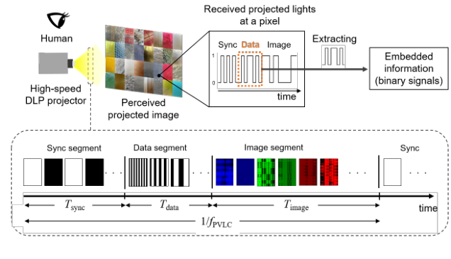<figcaption>図1．PVLCでは同期・データ・画像の三つの区間の二値画像を高速投影します。データ区間の点滅をフォトダイオードで復号します。人は点滅を積分して知覚するため画像区間で輝度を補償すると自然な画像に見えます。</figcaption></figure>

### 2.2．撫でる感覚を伝える社会的接触デバイス

媒介された社会的接触は通信を介して感情を伴う触れ合いを再現します。抱擁・握手・くすぐり・撫でる動作が研究されています［32–36］。撫でる動作は一般的で有効な接触です［37］。皮膚上を横に動く刺激で提示する方法があります［36, 38］。ただし実際の移動距離に制約があります。近年は前腕に複数のアクチュエータを離して並べて長い移動感を作る方法が注目されています。

Culbertson et al.［14］は前腕上のボイスコイルで順に圧力を加えました。駆動時間を長くして各コイル間の遅延を短くすると連続感と快適さが高まりました。Nunez et al.［15］は回転モータで皮膚を横にずらしました。接触間隔が広くても両者を保てました。Israr et al.［16］は一直線の振動ボイスコイルを使いました。比較的低い周波数と振幅で快適さが増しました。

これらは触覚だけを評価しています。視覚との組合せで軟らかさ［39］や形状［40］や抵抗力［41］や物体の存在感［42］が変わることは知られています。そこで同期した視覚情報が撫でる感覚の連続感と快適さへ与える影響を調べます。

### 2.3．視覚に対する触覚遅延の知覚

VHARの設計では視触覚を整合させるために遅延知覚の閾値が必要です。Miyasato et al.［43］は視触覚遠隔会議で約100 msの閾値を示しました。Silva et al.［44］はゲームで約100 msと報告しました。

これらは視覚と触覚を空間的に重ねない仮想現実系の評価です。重畳したVHARでの整合性の指針はありませんでした。本研究では試作機で両刺激を空間的に重ねて時間遅延を評価します。

### 2.4．既発表システムからの拡張

先行発表［18］では指装着型とPVLCの基本概念を示しました。静止画投影で26 bitの固定信号を埋め込みました。遅延と指装着型での遅延知覚を調べました。続く発表［19］では三つの応用を示しました。

本論文ではテクスチャ用のスタイラス型と社会的接触用の腕装着型を追加します。PVLCの動画モードと可変データ長を実装します。構成変更時の最大遅延を測ります。新しいデバイスの遅延知覚と腕装着型の連続感と快適さを評価します。遠隔接触の応用によって個人用の視触覚系から対人通信へ拡張します。

## 3．HaptoMapping

### 3.1．原理

視覚と触覚を独立に生成して平面に限らず実物上で両者を整合させて提示します（図2）。PVLCで画素ごとの点滅に制御信号を埋め込みます。触覚デバイスが直接受信するため時間的な整合を保てます。画素単位の制御信号をフォトダイオードで受けるため空間的な整合も保てます。

#### 3.1.1．投影系

高速DLPプロジェクタと投影面から構成します。各PVLCフレームを同期区間・データ区間・画像区間に分けます。

同期区間は一様な白と黒の二値画像で信号開始を知らせます。データ区間で振動パターンIDやオン・オフを送信します。プロジェクタのx座標とy座標や遅延値なども送れます。画像区間は観察者向けのフルカラー画像を表します。前の二区間による輝度の変化を補償します。結果として利用者には目標画像が見えます。デバイスには制御信号が届きます。

同期区間の時間はTsync=tsync×Nsyncです。データ区間はTdata=tdata×Ndataです。tは各二値画像の投影時間でNは画像枚数です。画像区間の時間Timageは目標更新周波数fPVLCから決まります。

1/fPVLC = Tsync + Tdata + Timage　（1）

#### 3.1.2．PVLCで制御する触覚デバイス

受信回路・マイクロコントローラ・音声モジュール・振動アクチュエータ・電池から構成します。振動波形はWAVEなどの音声形式で扱えます。音声モジュールを保存と再生の両方に使います。

フォトダイオードが投影光を受けます。増幅器と比較器で二値信号にします。マイクロコントローラが同期信号を検出して制御信号を読み取ります。単一周波数の振動は直接駆動します。複数周波数を含む質感の波形は音声モジュールを介して再生します。質感波形は事前にWAVEファイルとして保存します（図2）。

<figure>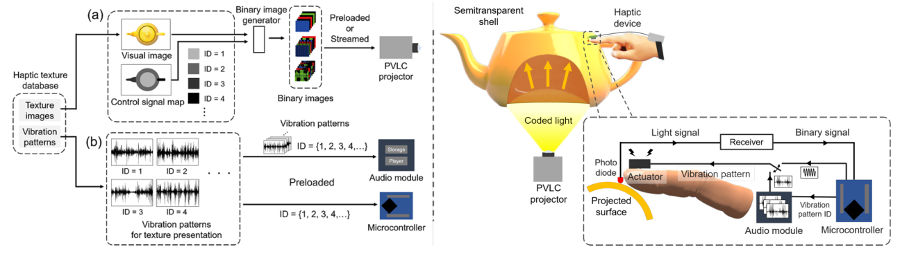<figcaption>図2．左は前処理を示します。aでは視覚画像と制御信号マップからPVLC用の二値画像を作ります。bではIDを付けた振動波形を音声モジュールへ保存します。右では投影面に触れたデバイスが点滅を受信します。マイクロコントローラが復号して対応する振動を再生します。</figcaption></figure>

遅延Tlateを制御信号のある領域にデバイスが入ってから振動が始まるまでと定義します［45］。

Tlate = Twait + Trecv + Tvib + τ　（2）

Twaitは次の同期開始までの待ち時間です。0から1フレーム時間まで変わります。Trecvは同期とデータの受信時間でTsync+Tdataです。Tvibは駆動指令から振動開始までです。直接駆動では機械特性によって決まります。音声モジュールを使う場合はその処理時間も加わります。τはマイクロコントローラの処理時間です。他の時間より3桁小さいため本論文の計算では無視します。

### 3.2．実装

投影系と触覚デバイスを試作しました。投影画像と振動波形の前処理も実装しました。

#### 3.2.1．投影系

Texas Instruments DLP LightCrafter 4500を使いました。PCから受けた二値画像を指定周期で表示します。開発キットのソフトウェアで時間を制御します。tsync=tdata=0.235 msとしました。fPVLC=50 Hzとしました。

同期区間には白黒を組み合わせた10枚を投影します。Tsync=2.35 msです。データは1 bitにつき1枚なのでTdata=0.235×Ndata msです。画像区間には各色5 bitのRGB画像として15枚を用います。時間は式（1）から求めます。

同期用の黒画像は白画像を反転して作れます。同じ画像を繰り返し使えるため保存する同期画像は1枚で足ります。**表1の同期枚数は保存する画像の数です。実際には10枚分を投影します。**

動画モードでは1フレームにつき最大24枚をPCから送れます。同期用1枚と画像用15枚を除くとデータ用に8枚を使えます。視覚表現を変えられますが触覚データ長に制約があります。

静止画モードでは48枚まで事前保存できます。動作中に更新できませんがデータ用に最大32枚を使えます。手の速度に応じた触覚など豊富な信号を扱えます。用途に応じて二つのモードを使い分けます。

**表1．各モードで用意する二値画像の枚数を示します。**

| モード | 同期 | データ | 画像 | 合計 |
|---|---|---|---|---|
| 動画 | 1 | 1〜8 | 15 | 17〜24 |
| 静止画 | 1 | 1〜32 | 15 | 17〜48 |

#### 3.2.2．触覚デバイス

3種類は共通の制御方式を使います（図3）。指装着型は爪を通じて指先へ振動を伝えます。スタイラス型は指腹へ振動を伝えます。腕装着型は前腕を撫でる感覚を作ります。

**指装着型**では受信回路とアクチュエータを指先に置きます。制御部・音声モジュール・電池を手首の120 cm³の箱に入れます。フォトダイオードを指先の前方に付けます。下部のクリップで固定します。爪の振動は指先へ伝わり指腹からの振動のように感じられます［46］。指腹で表面に直接触れられる構造です。

**スタイラス型**では長さ140 mmで最大径20 mmの筒に受信回路とアクチュエータを入れます。制御部などを120 cm³の箱に収めます。先端にフォトダイオードを置きます。握る位置の内側にアクチュエータを置いて本体を通じて振動を伝えます。ペン型のデータ駆動触覚レンダリング［47–51］にも適合します。記録済みの波形から各種の質感を合成できます。

**腕装着型**では一列に並べたアクチュエータを順に動かします。白いゴム板の投影面・6枚の基板・電池箱から構成します。各基板に受信回路・マイクロコントローラ・アクチュエータを載せます。個別に制御信号を受けます。バックルで前腕に固定します。

触覚の仮現運動［52］によって離れた刺激から連続した移動を感じさせます。従来の社会的接触デバイス［14–16, 53–55］は視覚情報を同期していませんでした。本機は投影する手に制御信号を埋め込みます。視覚の重畳によって連続感と快適さが高まると考えました。垂直画面の上半身映像から水平面へ腕の映像を延ばす遠隔通信［56, 57］への応用も想定します。

<figure>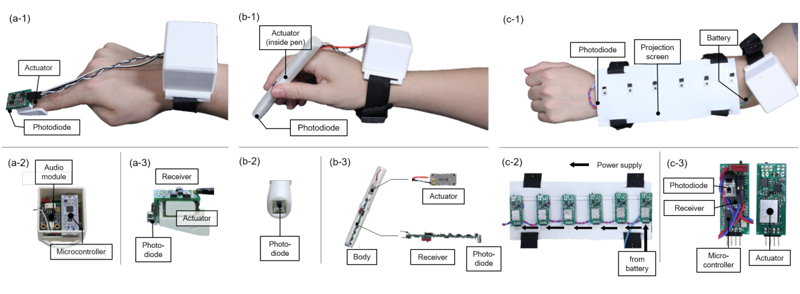<figcaption>図3．Aは指装着型の外観と手首側と指先側です。Bはスタイラス型の外観と先端センサと内部部品です。Cは腕装着型の外観と裏面と各基板です。各基板に光センサ・制御部・アクチュエータを搭載します。</figcaption></figure>

フォトダイオードには浜松ホトニクスS2506-02を使いました。指装着型とスタイラス型の制御部にはSTMicroelectronics Nucleo STM32F303K8を使いました。腕装着型にはNXP LPC1114FDH28/102を使いました。電源はLi-Po電池です。

振動には二つのリニア共振アクチュエータを使いました。Nidec Copal LD14-002は薄く小型です。約150 Hzに共振を持ち周波数が離れると出力が下がります。広帯域の複雑な波形には適しません。単一周波数の直接駆動に用います。ALPS ALPINE HAPTIC Reactorは大きく厚いものの50〜400 Hzで比較的一様な振幅応答を持ちます。DFRobot DFR0534音声モジュールと組み合わせて自然な質感などの複雑な波形を提示します。両者の応答は速いですが後者では音声処理の時間が加わります。

#### 3.2.3．投影画像と振動波形の前処理

二つの入力画像から二値画像を作る変換器を実装しました（図2a）。一つは目標の見た目です。もう一つは各画素の制御信号マップです。まず定めた同期信号に対応する白黒10枚を生成します。次に各bitに対応するデータ画像を作ります。4 bitなら4枚です。各画像の画素値をマップから決めます。最後にRGB各5 bitの15枚を作ります。前二区間の積分輝度と目標輝度の差を求めて補償します。

静止画では最大48枚と各画像の投影時間を保存します。PC接続なしで50 Hz表示できます。動画では設定だけを保存します。OpenGLで作った各フレームを50 HzでHDMIから送ります。

単一周波数はマイクロコントローラで直接生成するため波形の事前準備が不要です。質感提示では音声モジュールへ波形を保存します。画像と振動モデルを持つHaTT［49］やLMTデータベース［58］を用いました。HaTTには100種類の画像とモデルがあります。画像を視覚表示に使います。振動モデルは複数の手の速度で記録した波形から作った自己回帰移動平均（ARMA）モデルです。速度ごとの波形を合成して保存します。IDから選べる参照表をマイクロコントローラに用意します。

## 4．最大遅延

遅延はアクチュエータとデータ長で変わります。知覚可能性を評価するために最大値を調べました。

式（2）の各項の最悪条件を求めます。同期開始直後にデバイスが入るとTwaitは1フレーム分の20 msになります。32 bitを埋め込むとTrecvは9.8 msになります。音声モジュールとHAPTIC Reactorを使うとTvibが最大になります。

マイクロコントローラのタイマで指令から振動開始まで測りました。指先側に付けた加速度センサ（Kionix KXR94-2050）で振動開始を検出しました。100回測定しました。Tvibの平均は66.5 msで標準偏差は0.6 msでした。合計の最大遅延は96.3 msです（表2）。冒頭の概要の93.4 msとは一致しません。

**表2．各時間とその合計による最大遅延を示します。**

| Twait | Trecv | Tvib | Tlate max |
|---|---|---|---|
| 20 ms | 9.8 ms | 66.5 ms | 96.3 ms |

## 5．指装着型とスタイラス型の遅延知覚実験

利用者が視覚に対する触覚の遅れを感じるかを調べました。データ長などを増やした場合の許容範囲も調べました。先行研究の指装着型［18］に加えてスタイラス型を評価しました。大阪大学の倫理審査の承認（R3-2）を受けて全員の同意を得ました。

### 5.1．実験環境

投影系を組み込んだテーブルを使いました（図4）。表示面は0.77×0.48 mです。高さは0.92 mです。赤と緑の帯を交互に投影しました。応答の速いLD14-002を用いました。緑領域に入ると指定時間後に振動を開始します。赤では停止します。

26 bitを埋め込みました。x・y座標に21 bitを使います。オン・オフに1 bitを使います。遅延値に4 bitを使います。座標から手の速度を測ります。この構成で平均遅延は34.6 msでした［18］。マイクロコントローラの待ち時間を加えて34.6 ms以上の指定遅延を実現します。移動領域は182画素です。解像度が0.82 mm/画素なので約150 mmになります。

<figure>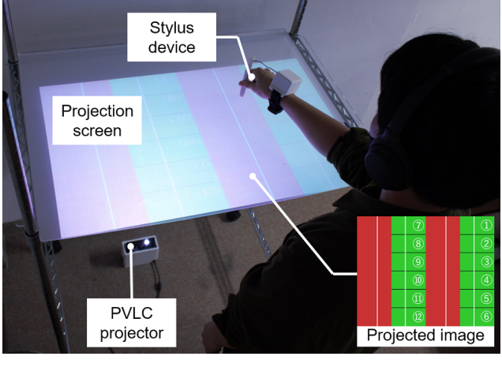<figcaption>図4．スタイラス型の遅延知覚実験の様子を示します。赤から緑へ移動して振動の遅れを判断します。</figcaption></figure>

### 5.2．参加者と方法

22〜25歳の10名が参加しました。男性9名と女性1名です。右利き9名と左利き1名です。7名は6節と7節と先行研究［18］にも参加しました。3名は新規参加者です。利き手でスタイラス中央を自然に握りました。

50〜270 msを20 ms刻みで12条件用意しました。赤から緑へ手を動かしました。先端が緑へ入ったのを見た時点に対して振動が遅れたかを答えました。別の垂直モニタに150 mm/sで動かす参考動画を示して速度をそろえました。12条件を10回繰り返して計120回評価しました。条件順は試行と参加者ごとに無作為化しました。指装着型でも同じ人数と手順を用いました［18］。

### 5.3．結果と考察

図5に遅れを感じた回答の割合を示します。青が指装着型［18］で緑がスタイラス型です。誤差棒は平均の標準誤差です。次のシグモイド関数を当てはめました。

y = 100 / {1 + exp[−k(x − x0)]}　（3）

指装着型ではk=0.04とx0=103を得ました。スタイラス型ではk=0.05とx0=159でした。50%の確率で遅れを感じる時間を閾値としました。指装着型のTfingerは約100 msです。スタイラス型のTstylusは約160 msです。

<figure>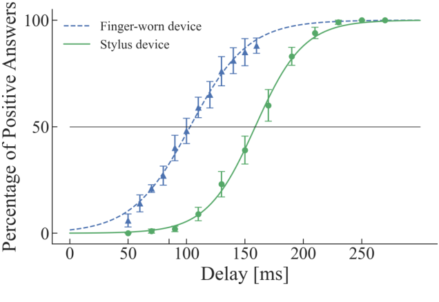<figcaption>図5．遅れを感じた回答の割合を示します。青は指装着型で緑はスタイラス型です。誤差棒は標準誤差です。曲線は各データに当てはめたシグモイド関数です。</figcaption></figure>

最大遅延96.3 msは両閾値を下回ります。そのため多くの利用者が遅れを感じない範囲で提示できます。他のアクチュエータや長い信号を使う設計でも閾値を参考にできます。

最大遅延96.3 msのとき指装着型では43%が遅れに気付くと推定されます。スタイラス型では4.6%です。最大遅延は音声モジュールで質感波形を出す場合に生じるため複雑な質感にはスタイラス型が適しています。閾値は指装着型より約60 ms長くなりました。直接触る場合に比べてスタイラスを介すと遅延への感度が下がると考えます。

経験者7名と新規3名の感度をt検定で比較しました。有意差はありませんでした（p&gt;.05）。実験間に数週間を設けました。正解を知らせず遅延を無作為に提示したことも影響すると考えます。これらの結果はVHARの設計指針となります。特にスタイラスでは時間誤差への許容が大きいことを示します。

## 6．腕装着型の遅延知覚実験

触覚の仮現運動で撫でる感覚を出す場合の遅延知覚を調べました。制御信号の増加などに備えて許容範囲も調べました。大阪大学の承認（R3-2）と全員の同意を得ました。

### 6.1．実験環境

右腕にデバイスを装着して肘掛けに置きました（図6）。左前方のタブレットで回答しました。複数アクチュエータの音が手掛かりにならないようSony WH-1000XM3を着用しました。天井のPVLCプロジェクタから手の映像を投影しました。動画モードで手首から肘へ動かして撫でているように見せました。

手の画像に遅延値を埋め込みました。手がフォトダイオードに到達すると指定時間を待ってLD14-002を150 Hzで駆動しました。手の動きに沿って離散的な刺激を順に出して仮現運動を生じさせます。手の映像の幅は90 mmで長さは190 mmです。成人男性の平均寸法［59］に合わせました。

<figure>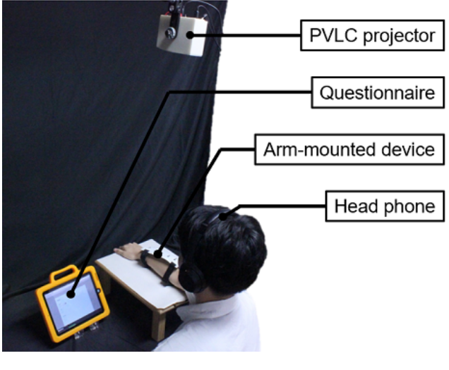<figcaption>図6．腕装着型の遅延知覚実験の様子を示します。投影された手の動きと振動の時間差を評価します。</figcaption></figure>

### 6.2．参加者と方法

21〜25歳の男性10名が参加しました。右利き9名と左利き1名です。7名は他の実験と共通です。100〜1000 msを100 ms刻みで10条件用意しました。右腕を肘掛けに置いて左手で回答しました。投影した手に対して触覚が遅れたかを尋ねました。手の速度は150 mm/sです。無作為順の10条件を10セット実施しました。1名あたり計100回評価しました。

### 6.3．結果と考察

図7に回答割合を示します。誤差棒は標準誤差です。式（3）の当てはめでk=0.008とx0=502を得ました。50%の知覚確率を閾値とするとTarmは約500 msでした。最大遅延96.3 msはこの値を下回ります。視触覚の時間的な整合を保てます。

<figure>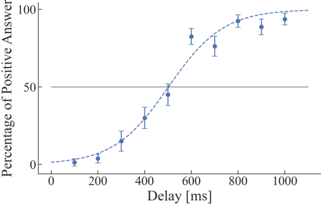<figcaption>図7．腕装着型で遅れを感じた回答の割合を示します。</figcaption></figure>

指装着型とスタイラス型より閾値が大きくなりました。課題の違いが影響すると考えます。前の実験では色と線で振動開始位置を明示しました。腕の実験には同じ明確な位置指示がありません。数値を単純には比較できません。ただし能動的な表面探索と受動的な社会的接触という想定用途に基づく設計基準として使えます。

## 7．撫でる感覚の連続感と快適さの実験

腕装着型で撫でる感覚の連続感と快適さを高める条件を調べました。速度と接触間隔は既存研究でも重要です［14–16］。手の映像が見えるかどうかも条件として設定しました。映像と触覚の同期が与える効果を調べました。大阪大学の承認（R3-2）と全員の同意を得ました。

### 7.1．実験環境

図6とほぼ同じ装置を使いました。200 mmの投影面上で手を往復させました。振動式の撫でる提示は低周波で低振幅の方が快適になりやすいため［16］50 Hzに設定しました。LD14-002の共振は約150 Hzですが50 Hzでも知覚できる振動を確認しました。

### 7.2．参加者と方法

21〜25歳の男性10名が参加しました。右利き9名と左利き1名です。7名は他の実験と共通です。事前説明と同意確認を行いました。速度4水準・間隔3水準・可視性2水準を組み合わせた計24条件を用意しました。無作為順で2回ずつ評価しました。計48回です。

連続感を1（離散的）から7（連続的）の7段階で評価しました。快適さを−7（非常に不快）から0（中立）を経て7（非常に快適）の15段階で評価しました。8回ごとにヘッドホンを外して2分休憩できました。

速度は10と80と150と210 mm/sです。先行研究では軽い押圧の最適値が135 mm/sでした［14］。皮膚の横ずれでは連続感が77 mm/sで快適さが55 mm/sでした［15］。振動式での最適速度は未検討でした。

基板間隔を0と10と20 mmにしました（図8）。密にすると振動の間隔が短くなって連続感が増す可能性があります。疎にしても感覚を保てるなら同じ長さを少ない基板で覆えて低コストになります。

手が見える条件では通常どおり体験しました。見えない条件ではアイマスクを着用しました（図9）。

<figure>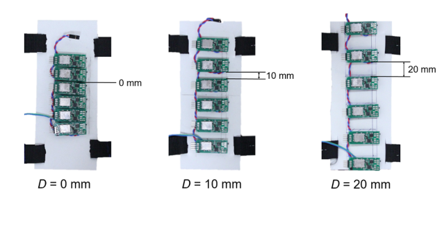<figcaption>図8．左は基板間隔0 mmの最も密な配置です。右は20 mmの最も疎な配置です。</figcaption></figure>

<figure>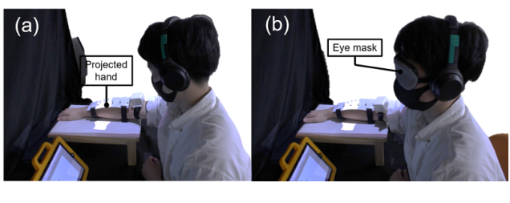<figcaption>図9．aでは投影した手が見えます。bではアイマスクで視覚刺激を遮ります。</figcaption></figure>

### 7.3．結果と考察

#### 7.3.1．分散分析

従属変数を連続感と快適さとしました。独立変数を手の可視性・速度・基板間隔としました。三要因の反復測定分散分析を各従属変数に行いました。主効果や交互作用が有意な場合はBonferroni検定を行いました。Mauchly検定で球面性を調べました。違反がある場合はGreenhouse–Geisser補正を行いました。以下では補正したFとpにアスタリスクを付けます。統計量は原文の値を保持しています。

<figure>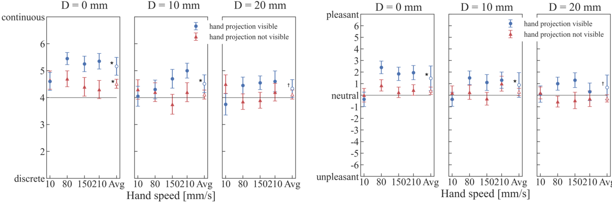<figcaption>図10．左は連続感で右は快適さの平均と標準誤差です。各グラフ右側の白抜き記号は基板間隔ごとの平均です。アスタリスクはp&lt;.05を示します。ダガーは.05&lt;p&lt;.1を示します。</figcaption></figure>

#### 7.3.2．連続感

平均が最大の条件は速度80 mm/sと間隔0 mmでした（図10左）。疎な配置でも連続感を保てるかを中立評点4との1標本t検定で調べました。0 mmでは手が見えるかによらず中立より有意に高くなりました（p&lt;.05）。10 mmでは手が見える場合にだけ有意に高くなりました（p&lt;.05）。20 mmでも見える場合に上昇傾向がありました（p&lt;.1）。

可視性の主効果は有意でした（F(1,19)=4.94・p=.035・η²=.019）。間隔も有意でした（F*(1.58,30.1)=6.41・p*=.0078・η²=.031）。速度の主効果は有意ではありませんでした。可視性と速度の交互作用は有意でした（F*(2.25,42.71)=4.80・p*=.011・η²=.023）。可視性と間隔および速度と間隔の交互作用は有意ではありませんでした。

事後比較では150 mm/sで可視性による差がありました（F(1,19)=7.15・p=.015・η²=.075）。210 mm/sでも差がありました（F(1,19)=5.76・p=.027・η²=.060）。80 mm/sでは差の傾向がありました（F(1,19)=3.55・p=.074・η²=.027）。この最後の値は5%水準の有意差ではありません。

#### 7.3.3．快適さ

平均が最大の条件は速度80 mm/sと間隔0 mmでした（図10右）。中立評点0との1標本t検定を行いました。手が見える場合にだけ0 mmと10 mmで有意に高くなりました（p&lt;.05）。20 mmでは上昇傾向がありました（p&lt;.1）。

可視性の主効果は有意でした（F(1,19)=11.22・p=.003・η²=.023）。速度と間隔の主効果は有意ではありませんでした。可視性と速度の交互作用は有意でした（F*(2.09,39.75)=4.54・p*=.0155・η²=.017）。他の二つの交互作用は有意ではありませんでした。

事後比較では80 mm/sで可視性の差がありました（F(1,19)=14.60・p=.001・η²=.074）。150 mm/sでも差がありました（F(1,19)=11.47・p=.003・η²=.074）。10 mm/sと210 mm/sでは有意差がありませんでした。

#### 7.3.4．考察

手が見える条件の80 mm/sと0 mmで両評価が最も高くなりました。80 mm/sは快適な撫で速度の既報範囲内です［60］。原文では10 mmや20 mmの配置でも映像を同期すると連続感と快適さを維持したと解釈しています。ただし20 mmの検定はp&lt;.1である点に注意が必要です。

疎な配置でも感覚を保てる可能性は低コスト化につながります。原文の考察では80 mm/sと150 mm/sで両評価が統計的に改善したと述べています。個別の検定値は7.3.2節と7.3.3節のとおりです。一般的な撫で速度で手の投影を重ねることが連続感の改善に役立つと結論付けています。

## 8．応用

四つの日常場面向けの応用を開発しました。初めの三つは指装着型またはスタイラス型と静止画モードを使います。最後は腕装着型と動画モードを使います。

### 8.1．質感設計支援

実物の表面の質感を設計します（図11）。質感画像へIDを埋め込みます。対応する波形を音声モジュールへ保存します。触れた位置に合う波形を選んで指へ提示します。3D曲面への厳密な位置合わせは行いませんでした。2Dホモグラフィでおおよその投影位置を調整しました。

両デバイスに対応します。特にペン型で収録したデータベース［49, 58］にはスタイラス型が適しています。HaTTなどを使う場合は各速度に合う波形も保存します。新製品の質感選びを想定します。投影画像と波形を変えるだけで別の候補を試せます。多数の実物サンプルを広げずに3D表面で質感を確認できます。

<figure>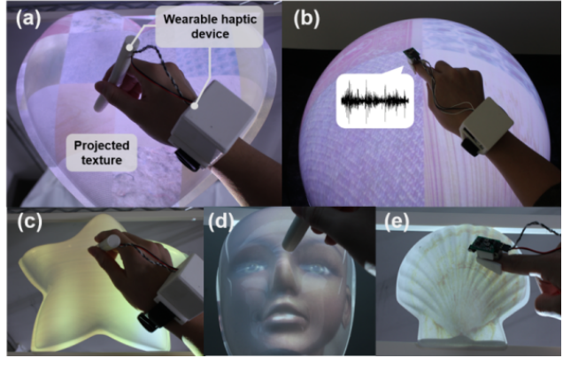<figcaption>図11．aとbではハートとドーム上の複数の質感をスタイラス型と指装着型で触ります。c〜eでは星と顔と貝殻の形状上で質感を視覚と触覚で確認します。</figcaption></figure>

### 8.2．複数感覚の対話的な地図

地図へ振動と音を加えます（図12）。商業施設の通路形状などを振動で伝えます。店舗名を音で伝えます。視覚障害のある利用者への支援にも可能性があります。手首にスピーカを追加しました。店の領域をなぞると振動して店の説明が流れます。視覚・音・触覚の内容を変更できます。

<figure>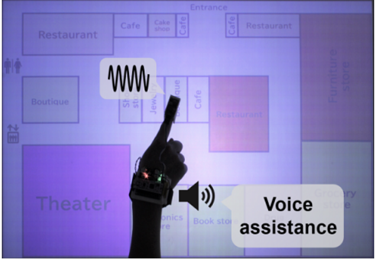<figcaption>図12．装着デバイスが地図情報を振動と音で伝えます。追加したスピーカも同じマイクロコントローラで制御します。</figcaption></figure>

### 8.3．対話的な図鑑

教育用途として動物図鑑を作りました（図13）。見た目に加えて様々な質感に触れられます。平面の本形式では動物の外観と触覚情報を別の場所に示します。多様な動物を扱えます。立体版では3Dプリントした動物に外観と触覚を重ねます。没入感を高められる可能性がありますが動物ごとの実物モデルが必要です。

各デバイスが独立して受信するため複数人が同時に体験できます。動物やその違いを学ぶための感覚的な手掛かりを増やせます。

<figure>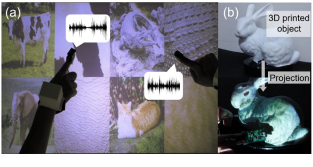<figcaption>図13．aは平面で動物の質感を提示する図鑑です。bは3Dプリントしたモデル上に提示する図鑑です。</figcaption></figure>

### 8.4．遠隔通信で撫でる感覚を伝えるシステム

遠隔地の利用者が投影する手を操作します。受け手は腕装着型を着用してその手を見ます（図14）。手に触れられている感覚を提示します。映像が前腕を撫でると対応するアクチュエータが順に動きます。動きに合う撫で感覚を作ります。日常の遠隔通信への応用を想定します。隔離などで直接会えない人同士が間接的に触れ合う用途も考えられます。

<figure>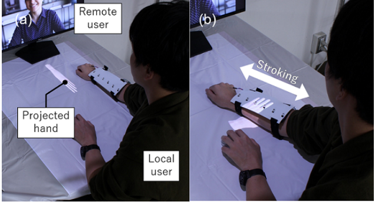<figcaption>図14．aでは遠隔地の利用者が手の映像を操作します。受け手はその映像を見ます。bでは腕装着型が手の動きに合う撫で感覚を提示します。</figcaption></figure>

## 9．制約と今後の課題

三つの制約があります。第一に投影に適した実物が必要です。対象がない場合や投影に不向きな場合は応用が限られます。3Dプリンタで対象を作る方法があります。二面コーナーリフレクタアレイ（DCRA）による空中像にPVLCを適用する可能性もあります。実物のない空中像へ触覚を与えられるかもしれません。

第二に触覚デバイスの装着が必要です。軽量でも長時間では負担になり得ます。物体側へ埋め込む方法が考えられます。その場合はアクチュエータの配置と接触位置に応じた波形変更が課題です。超音波［61］や赤外線［42］による非接触提示も考えられます。ただし皮膚上のアクチュエータより刺激が弱いため強度の確保が必要です。どちらも手の精密な追跡と許容範囲までの遅延削減が重要です。

第三にHaTTなどを用いる場合は波形を事前生成する必要があります。既存手法にはオンライン合成が可能なものがあります［47, 48］。デジタル信号処理装置などによる計算能力の強化を検討します。ただし処理能力とデバイス寸法にはトレードオフがあります。必要な波形がデータベースにない場合は現状では手作業で準備します。画像からニューラルネットワークで触覚波形を生成する方法［62］によって負担を減らせる可能性があります。

## 10．結論

HaptoMappingを提案しました。視覚と触覚を独立に生成しながら時空間的な整合を保つシステムです。試作機と最大遅延を示しました。指装着型・スタイラス型・腕装着型で遅延知覚を評価しました。50%の知覚確率で定義した許容閾値はそれぞれ約100 msと159 msと500 msでした。

腕装着型では撫でる感覚の連続感と快適さも調べました。原文は20 mm間隔でも両者を保ったと結論付けています。80 mm/sと150 mm/sで映像による改善があったと述べています。各検定の値と留保は7節に示しています。得られた値は同様のシステム設計に役立ちます。四つの応用例で幅広い適用可能性を示しました。

## 謝辞

本研究はJST ACT-X（JPMJAX190O）とJSTさきがけ（JPMJPR19J2）とJSPS科研費（JP15H05925・JP20H05958）の支援を受けました。

## 参考文献

書誌情報は原文の言語で掲載しています。

[1] C. Jewitt, S. Price, K. Leder Mackley, N. Yiannoutsou, and D. Atkinson, Interdisciplinary Insights for Digital Touch Communication. New York, NY, Springer, 2020.

[2] U. Eck, F. Pankratz, C. Sandor, G. Klinker, and H. Laga, “Precise haptic device co-location for visuo-haptic augmented reality,” IEEE Transactions on Visualization and Computer Graphics (TVCG), vol. 21, no. 12, pp. 1427–1441, 2015.

[3] M. Inami, N. Kawakami, D. Sekiguchi, Y. Yanagida, T. Maeda, and S. Tachi, “Visuo-haptic display using head-mounted projector,” in Proc. IEEE Virtual Reality (VR). IEEE, 2000, pp. 233–240.

[4] C. Sandor, S. Uchiyama, and H. Yamamoto, “Visuo-haptic systems: Half-mirrors considered harmful,” in Proc. WHC ’07, 2007, pp. 292–297.

[5] C. Sandor, T. Kuroki, S. Uchiyama, and H. Yamamoto, “Exploring visuo-haptic mixed reality,” PRMU, Tokyo, Japan, Tech. Rep. 106, 2007.

[6] D. Wang, Y. Zhang, W. Zhou, H. Zhao, and Z. Chen, “Collocation accuracy of visuo-haptic system: metrics and calibration,” IEEE Transactions on Haptics (ToH), vol. 4, no. 4, pp. 321–326, 2011.

[7] F. Cosco, C. Garre, F. Bruno, M. Muzzupappa, and M. A. Otaduy, “Visuo-haptic mixed reality with unobstructed tool-hand integration,” IEEE Transactions on Visualization and Computer Graphics (TVCG), vol. 19, no. 1, pp. 159–172, 2013.

[8] D. Wang, Y. Zhang, and Y. Wang, “Analysis of registration accuracy for collocated haptic-visual display system,” in Proc. IEEE Haptics Symposium (HAPTICS), 2008, pp. 303–310.

[9] M. Harders, G. Bianchi, B. Knoerlein, and G. Székely, “Calibration, registration, and synchronization for high precision augmented reality haptics,” IEEE Transactions on Visualization and Computer Graphics (TVCG), vol. 15, no. 1, pp. 138–149, 2008.

[10] C. Basdogan, F. Giraud, V. Levesque, and S. Choi, “A Review of Surface Haptics: Enabling Tactile Effects on Touch Surfaces,” IEEE Transactions on Haptics (ToH), vol. 13, no. 3, pp. 450–470, 2020.

[11] A. Costes, F. Danieau, F. Argelaguet, P. Guillotel, and A. Lécuyer, “Towards Haptic Images: A Survey on Touchscreen-Based Surface Haptics,” IEEE Transactions on Haptics (ToH), vol. 13, no. 3, pp. 530– 541, 2020.

[12] H. Uematsu, D. Ogawa, R. Okazaki, T. Hachisu, and H. Kajimoto, “HALUX: Projection-based interactive skin for digital sports,” in Proc. ACM SIGGRAPH Emerging Technologies, 2016, pp. 10:1–10:2.

[13] J. Rekimoto, “SenseableRays: Opto-haptic substitution for touchenhanced interactive spaces,” in EA. the SIGCHI Conference on Human Factors in Computing Systems, 2009, pp. 2519–2528.

[14] H. Culbertson, C. M. Nunez, A. Israr, F. Lau, F. Abnousi, and A. M. Okamura, “A social haptic device to create continuous lateral motion using sequential normal indentation,” in Proc. IEEE Haptics Symposium (HAPTICS), 2018, pp. 32–39.

[15] C. M. Nunez, S. R. Williams, A. M. Okamura, and H. Culbertson, “Understanding continuous and pleasant linear sensations on the forearm from a sequential discrete lateral skin-slip haptic device,” IEEE Transactions on Haptics (ToH), vol. 12, no. 4, pp. 414–427, 2019.

[16] A. Israr and F. Abnousi, “Towards pleasant touch: Vibrotactile grids for social touch interactions,” in EA. the SIGCHI Conference on Human Factors in Computing Systems, 2018, pp. 1–6.

[17] S. Kimura, R. Oguchi, H. Tanida, Y. Kakehi, K. Takahashi, and T. Naemura, “PVLC projector: Image projection with imperceptible pixel-level metadata,” in Proc. ACM SIGGRAPH Posters, 2008, p. 135:1.

[18] Y. Miyatake, T. Hiraki, T. Maeda, D. Iwai, and K. Sato, “Visuohaptic display by embedding imperceptible spatial haptic information into projected images,” in Proc. EuroHaptics, 2020, pp. 226– 234.

[19] ——, “HaptoMapping: Visuo-haptic AR system using projectionbased control of wearable haptic devices,” in SIGGRAPH Asia Emerging Technologies, 2020.

[20] D. Systems, ”Touch”[Sold as Phantom Omni at by SensAbleTechnologies], https://www.3dsystems.com/haptics-devices/touch (Accessed 08/11/2020).

[21] C. Pacchierotti, S. Sinclair, M. Solazzi, A. Frisoli, V. Hayward, and D. Prattichizzo, “Wearable Haptic Systems for the Fingertip and the Hand: Taxonomy, Review, and Perspectives,” IEEE Transactions on Haptics (ToH), vol. 10, no. 4, pp. 580–600, 2017.

[22] J. C. Lee, P. H. Dietz, D. Leigh, W. S. Yerazunis, and S. E. Hudson, “Haptic Pen: A Tactile Feedback Stylus for Touch Screens,” in Proc. ACM symposium on User Interface Software and Technology (UIST), 2004, pp. 291–294.

[23] K.-U. Kyung and J.-Y. Lee, “Ubi-Pen: A Haptic Interface with Texture and Vibrotactile Display,” IEEE Computer Graphics and Applications, vol. 29, no. 1, pp. 56–64, 2008.

[24] L. Rahal, J. Cha, and A. El Saddik, “Continuous tactile perception for vibrotactile displays,” in Proc. IEEE International Workshop on Robotic and Sensors Environments. IEEE, 2009, pp. 86–91.

[25] L. He, C. Xu, D. Xu, and R. Brill, “PneuHaptic: Delivering Haptic Cues with a Pneumatic Armband,” in Proc. ACM International Symposium on Wearable Computers, 2015, pp. 47–48.

[26] M. Maisto, C. Pacchierotti, F. Chinello, G. Salvietti, A. De Luca, and D. Prattichizzo, “Evaluation of Wearable Haptic Systems for the Fingers in Augmented Reality Applications,” IEEE Transactions on Haptics (ToH), vol. 10, no. 4, pp. 511–522, 2017.

[27] Y. Lee, S. Lee, and D. Lee, “Wearable Haptic Device for Stiffness Rendering of Virtual Objects in Augmented Reality,” Applied Sciences, vol. 11, no. 15, p. 6932, 2021.

[28] X. De Tinguy, C. Pacchierotti, M. Marchal, and A. Lécuyer, “Enhancing the Stiffness Perception of Tangible Objects in Mixed Reality Using Wearable Haptics,” in Proc. IEEE Conference on Virtual Reality and 3D User Interfaces (VR). IEEE, 2018, pp. 81– 90.

[29] O. Bau and I. Poupyrev, “REVEL: Tactile feedback technology for augmented reality,” ACM Transactions on Graphics, vol. 31, no. 4, pp. 89:1–89:11, 2012.

[30] H. F. Talbot, “XLIV. Experiments on light,” The London, Edinburgh, and Dublin Philosophical Magazine and Journal of Science, vol. 5, no. 29, pp. 321–334, 1834.

[31] T. Hiraki, S. Fukushima, Y. Kawahara, and T. Naemura, “Phygital field: An integrated field with physical robots and digital images using projection-based localization and control method,” SICE Journal of Control, Measurement, and System Integration, vol. 11, no. 4, pp. 302–311, 2018.

[32] C. DiSalvo, F. Gemperle, J. Forlizzi, and E. Montgomery, “The hug: An exploration of robotic form for intimate communication,” in Proc. IEEE International Workshop on Robot and Human Interactive Communication (RO-MAN). IEEE, 2003, pp. 403–408.

[33] R. Wang, F. Quek, D. Tatar, K. S. Teh, and A. Cheok, “Keep in touch: Channel, expectation and experience,” in Proc. SIGCHI Conference on Human Factors in Computing Systems, 2012, pp. 139– 148.

[34] M. O. Alhalabi and S. Horiguchi, “Tele-handshake: A cooperative shared haptic virtual environment,” in Proc. Eurohaptics, 2001, pp. 60–64.

[35] M. Furukawa, H. Kajimoto, and S. Tachi, “KUSUGURI: A shared tactile interface for bidirectional tickling,” in Proc. Augmented Human International Conference, 2012, pp. 1–8.

[36] E. Eichhorn, R. Wettach, and E. Hornecker, “A stroking device for spatially separated couples,” in Proc. International Conference on Human Computer Interaction with Mobile Devices and Services, 2008, pp. 303–306.

[37] C. M. Nunez, B. N. Huerta, A. M. Okamura, and H. Culbertson, “Investigating social haptic illusions for tactile stroking (SHIFTS),” in Proc. IEEE Haptics Symposium (HAPTICS), 2020, pp. 629–636.

[38] E. Knoop and J. Rossiter, “The tickler: A compliant wearable tactile display for stroking and tickling,” in EA. the SIGCHI Conference on Human Factors in Computing Systems, 2015, pp. 1133–1138.

[39] P. Punpongsanon, D. Iwai, and K. Sato, “SoftAR: Visually manipulating haptic softness perception in spatial augmented reality,” IEEE Transactions on Visualization and Computer Graphics (TVCG), vol. 21, no. 11, pp. 1279–1288, 2015.

[40] T. Kanamori, D. Iwai, and K. Sato, “Pseudo-shape sensation by stereoscopic projection mapping,” IEEE Access, vol. 6, pp. 40 649– 40 655, 2018.

[41] S. Aoyama, D. Iwai, and K. Sato, “Altering resistive force perception by modulating velocity of dot pattern projected onto hand,” in Proc. Workshop on Multimodal Virtual and Augmented Reality, 2016, pp. 1–4.

[42] D. Iwai, M. Aoki, and K. Sato, “Non-contact thermo-visual augmentation by IR-RGB projection,” IEEE Transactions on Visualization and Computer Graphics (TVCG), vol. 25, no. 4, pp. 1707–1716, 2018.

[43] T. Miyasato, H. Noma, and F. Kishino, “Subjective evaluation of perception of delay time between visual information and tactile information,” The Journal of the Institute of Television Engineers of Japan, vol. 49, no. 10, pp. 1353–1356, 1995.

[44] J. M. Silva, M. Orozco, J. Cha, A. E. Saddik, and E. M. Petriu, “Human perception of haptic-to-video and haptic-to-audio skew in multimedia applications,” ACM Transactions on Multimedia Computing, Communications, and Applications (TOMM), vol. 9, no. 2, pp. 9:1–9:16, 2013.

[45] T. Hiraki, S. Fukushima, and T. Naemura, “Sensible shadow: Tactile feedback from your own shadow,” in Proc. Augmented Human International Conference, 2016, pp. 1–4.

[46] H. Ando, E. Kusachi, and J. Watanabe, “Nail-mounted tactile display for boundary/texture augmentation,” in Proc. International Conference on Advances in Computer Entertainment Technology, 2007, pp. 292–293.

[47] H. Culbertson, J. Unwin, and K. J. Kuchenbecker, “Modeling and rendering realistic textures from unconstrained tool-surface interactions,” IEEE Transactions on Haptics (ToH), vol. 7, no. 3, pp. 381–393, 2014.

[48] J. M. Romano and K. J. Kuchenbecker, “Creating realistic virtual textures from contact acceleration data,” IEEE Transactions on Haptics (ToH), vol. 5, no. 2, pp. 109–119, 2011.

[49] H. Culbertson, J. J. L. Delgado, and K. J. Kuchenbecker, “One hundred data-driven haptic texture models and open-source methods for rendering on 3D objects,” in Proc. IEEE Haptics Symposium (HAPTICS), 2014, pp. 319–325.

[50] S. Lu, Y. Chen, and H. Culbertson, “Towards multisensory perception: modeling and rendering sounds of tool-surface interactions,” IEEE Transactions on Haptics (ToH), vol. 13, no. 1, pp. 94–101, 2020.

[51] R. H. Osgouei, J. R. Kim, and S. Choi, “Data-driven texture modeling and rendering on electrovibration display,” IEEE Transactions on Haptics (ToH), 2019.

[52] A. Israr and I. Poupyrev, “Tactile brush: Drawing on skin with a tactile grid display,” in Proc. SIGCHI Conference on Human Factors in Computing Systems, 2011, pp. 2019–2028.

[53] W. Wu and H. Culbertson, “Wearable haptic pneumatic device for creating the illusion of lateral motion on the arm,” in Proc. IEEE World Haptics Conference (WHC), 2019, pp. 193–198.

[54] G. Huisman, A. D. Frederiks, B. Van Dijk, D. Hevlen, and B. Kröse, “The TaSST: Tactile sleeve for social touch,” in Proc. IEEE World Haptics Conference (WHC), 2013, pp. 211–216.

[55] S. Muthukumarana, D. S. Elvitigala, J. P. Forero Cortes, D. J. Matthies, and S. Nanayakkara, “Touch me Gently: Recreating the Perception of Touch using a Shape-Memory Alloy Matrix,” in Proc. SIGCHI Conference on Human Factors in Computing Systems, 2020, pp. 1–12.

[56] D. Iwai, R. Matsukage, S. Aoyama, T. Kikukawa, and K. Sato, “Geometrically consistent projection-based tabletop sharing for remote collaboration,” IEEE Access, vol. 6, pp. 6293–6302, 2017.

[57] N. Tanabe, Y. Sato, K. Morita, M. Inagaki, Y. Fujino, P. Punpongsanon, H. Matsukura, D. Iwai, and K. Sato, “fARFEEL: Providing haptic sensation of touched objects using visuo-haptic feedback,” in Proc. IEEE Conference on Virtual Reality and 3D User Interfaces (VR), 2019, pp. 1355–1356.

[58] M. Strese, J.-Y. Lee, C. Schuwerk, Q. Han, H.-G. Kim, and E. Steinbach, “A haptic texture database for tool-mediated texture recognition and classification,” in Proc. Haptic, Audio and Visual Environments and Games (HAVE), 2014, pp. 118–123.

[59] NASA, “Man-systems integration standards,” NASA-STD-3000, Tech. Rep. Volume I, Revision B, 1995.

[60] R. Ackerley, I. Carlsson, H. Wester, H. Olausson, and H. Backlund Wasling, “Touch perceptions across skin sites: Differences between sensitivity, direction discrimination and pleasantness,” Frontiers in Behavioral Neuroscience, vol. 8, p. 54, 2014.

[61] Y. Monnai, K. Hasegawa, M. Fujiwara, K. Yoshino, S. Inoue, and H. Shinoda, “HaptoMime: Mid-air haptic interaction with a floating virtual screen,” in Proc. ACM Symposium on User Interface Software and Technology (UIST), 2014, pp. 663–667.

[62] Y. Ban and Y. Ujitoko, “TactGAN: Vibrotactile designing driven by GAN-based automatic generation,” in ACM SIGGRAPH Asia Emerging Technologies, 2018, pp. 13:1–13:2.

## 著者紹介

以下はプレプリントに掲載された当時の紹介を訳しています。現在の所属や職位を示すものではありません。

**Yamato Miyatake**は2020年に大阪大学で学士号を取得しました。原稿執筆時は大阪大学大学院基礎工学研究科の修士課程に在籍していました。研究分野は拡張現実と触覚とヒューマンコンピュータインタラクションです。

**Takefumi Hiraki**は東京大学で2014年に学士号を取得しました。2016年に修士号を取得しました。2019年に博士号を取得しました。同年にMicrosoft Research Chinaの客員研究員を務めました。執筆時は筑波大学図書館情報メディア系の助教でした。研究分野は拡張現実と触覚ディスプレイとソフトロボティクスとヒューマンコンピュータインタラクションです。ACM会員です。

**Daisuke Iwai**は大阪大学で2003年に学士号を取得しました。2005年に修士号を取得しました。2007年に博士号を取得しました。2007〜2008年にバウハウス大学ワイマールの客員研究員を務めました。2011年にETHの客員准教授を務めました。執筆時は大阪大学大学院基礎工学研究科の准教授でした。研究分野は空間拡張現実とプロジェクタ・カメラ系です。

**Kosuke Sato**は大阪大学で1983年に学士号を取得しました。1985年に修士号を取得しました。1988年に博士号を取得しました。1988〜1990年にカーネギーメロン大学ロボティクス研究所の客員研究員を務めました。執筆時は大阪大学大学院基礎工学研究科の教授でした。研究分野は画像センシングと仮想現実とヒューマンインタフェースです。
