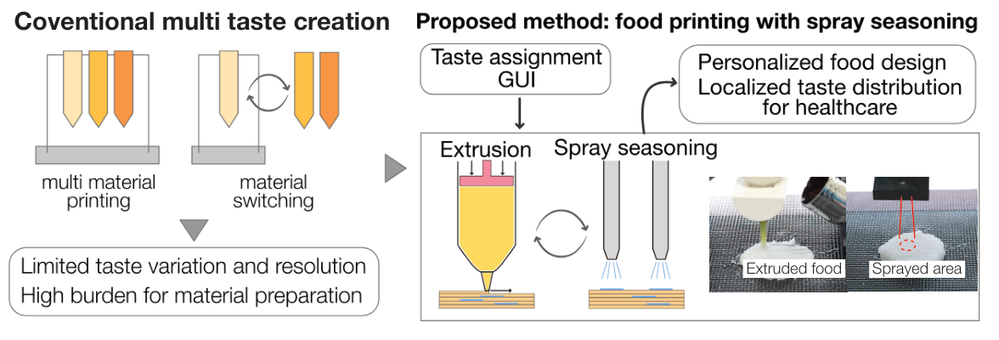
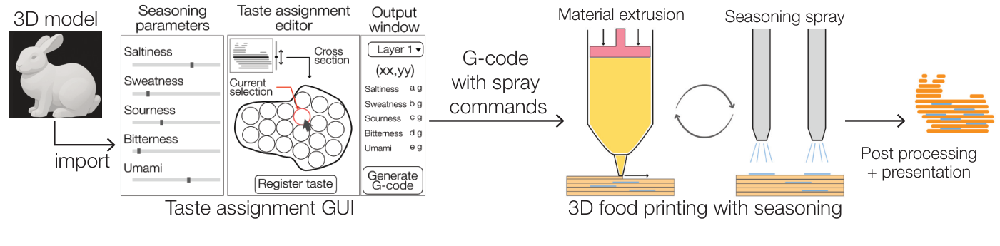
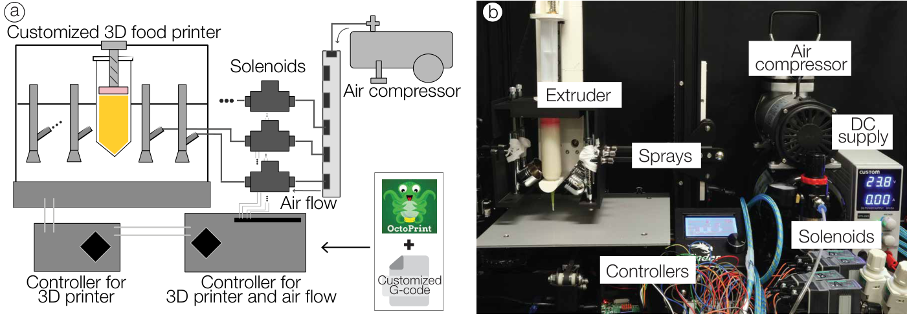
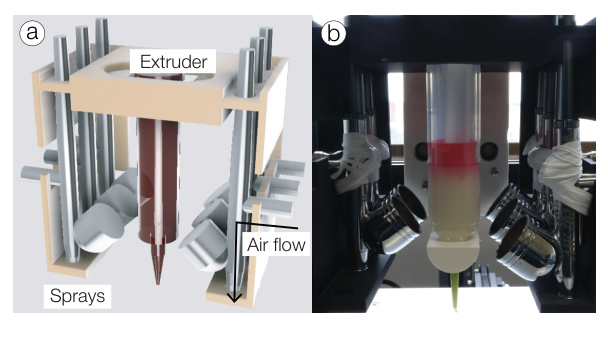
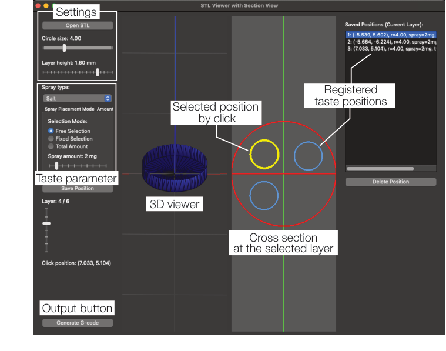
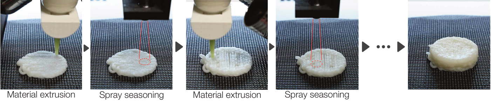
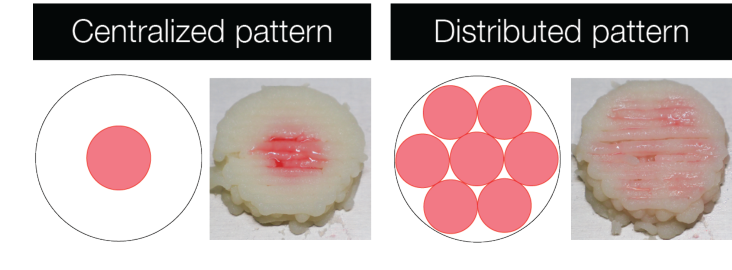
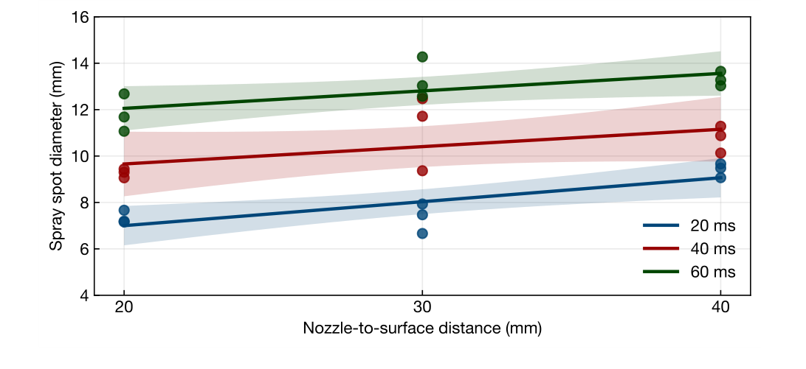
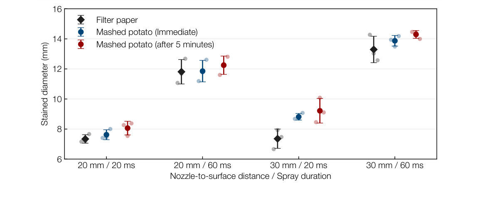
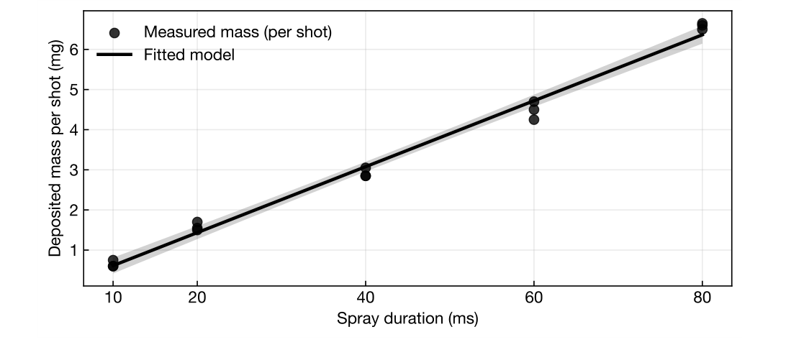

## グラフィカルアブストラクト

<figure><figcaption>複数の味を作る従来手法とTastePrintを比較しています。TastePrintは材料押出で形状を作ります。調味料の噴霧で味を加えます。</figcaption></figure>

## ハイライト

- エアブラシを用いて層ごとに味を制御する食品3Dプリンティングシステムを開発しました。
- GUIで食品内部の味分布を層ごとに設計できます。
- 噴霧分解能と付着量の実験で技術的な実現可能性を確認しました。小規模な官能実験では味の空間配置を知覚できることを示す初期的な結果を得ました。

## 要旨

食品3Dプリンティングで食品の形状や食感を個別に調整できます。一方で印刷可能な材料の種類には制約があります。そのため味は通常一様になります。そこで本論文ではTastePrintを提案します。エアブラシをプログラムで制御して造形中に液体調味料を噴霧します。これにより層ごとの空間的な味分布を作ります。

システムには二つの要素があります。一つは3Dモデルの読み込みと層への分割を行うGUIです。調味料のチャンネルと噴霧する位置・強度も指定できます。もう一つは複数の噴霧ノズルを備えた改造食品3Dプリンタです。評価では噴霧分解能と付着精度を測る技術実験を行いました。味の局在に関する小規模な官能弁別実験も実施しました。さらに家庭で調理する3名から設計改善に向けた探索的なフィードバックを得ました。

噴霧分解能モデルの決定係数はR² = 0.86でした。噴霧量モデルではR² = 0.99でした。ろ紙上での校正結果は食用マッシュポテト試料での測定結果とおおむね一致しました。官能弁別実験では40試行中27試行で中央集中型の調味パターンがより局所的な味として選ばれました。その割合は67.5%でした。これらの結果は調味料の配置と量をハードウェア上で再現性よく制御できることを示します。また造形後も味の空間配置が知覚上の意味を持ち得ることを示す初期的な証拠を得ました。

## 1. はじめに

付加製造すなわち3Dプリンティングは複雑な形状や個別の構造の製作を可能にしました。これにより製品設計の可能性が広がっています（Praveena et al., 2022; Bhatia and Sehgal, 2023）。食品3Dプリンティングはこの能力を調理に応用します。個人に合わせた食事に向けて食品の形状・大きさ・内部構造を精密に制御できます（Sun et al., 2018; Demei et al., 2022）。主要な方式には押出方式・バインダージェッティング方式・インクジェット方式があります。押出方式はノズルから食品ペーストを堆積させます（Liu et al., 2018; Hussain et al., 2022）。バインダージェッティング方式は粉末床に液体の結合剤を与えます（Vadodaria and Mills, 2020; Zhu et al., 2022）。インクジェット方式は食用材料の液滴を吐出します（Suzuki et al., 2019; Burkard et al., 2023）。特に押出方式が広く使われています。多様な食品インクに対応できるうえに複雑な3D形状を層ごとに形成できるためです（Voon et al., 2019）。

<figure><figcaption>図1：TastePrintの概要を示します。GUIで3Dモデルを読み込んで層に分割します。各層に味分布を割り当てて専用G-codeを生成します。造形中に液体調味料を噴霧することで空間的な味分布を持つ食品を作ります。造形した食品はそのまま食べるか焼く・揚げるなどの後処理を施します。</figcaption></figure>

形状の個別調整に関する研究は進んでいますが味の制御には制限があります。味は食品の品質を決める主要因です（Wang et al., 2022）。それでも現在の造形工程で作る食品は味が一様になる傾向があります。味の知覚には香り・食感・視覚的な手掛かりも関与します（Zampini and Spence, 2005; Vi et al., 2020; Weidner et al., 2023）。その中でも調味料の空間分布と濃度が主要な要因になります。従来の調理では段階的な調味や組み合わせによって多様性を生みます（Lee, 2022; Gustafsson, 2004）。食品科学では材料の配合比や呈味物質の添加によって印刷用インクに味を組み込んできました（Hussain et al., 2022; Cheng et al., 2022; Hakim et al., 2024; Domżalska and Jakubczyk, 2025）。しかし多くの場合は味が均一になります。これが3Dプリント食品の表現力と感覚的な多様性を制約します。そのため層ごとに味を変える方法や局所的に味を加える方法が必要です。これは個人に合わせた多感覚的な食体験を進めるうえで重要です（Mosca et al., 2010; Noort et al., 2010; Burkard et al., 2023; Fahmy et al., 2021）。

複数材料を用いる食品3Dプリンティングでもこの課題が検討されています（Liu et al., 2018; Fahmy et al., 2021; Fujiwara et al., 2025; Mendoza-Bautista et al., 2025; Pan et al., 2025）。複数ヘッドのプリンタは異なる呈味物質を含む食品インクを配置します。これにより味の異なる領域を作れます。Fahmy et al.（2021）は甘いインクと塩味のインクを使う2ヘッドの装置で味の空間的な変化を実現しました。Fujiwara et al.（2025）は4本のスクリューを持つノズルで4チャンネルの味制御を示しました。ただし二つの主要な制約があります。第一に味の複雑さがヘッドとインク容器の数に制限されます。第二に味ごとのインクの準備に多くの作業が必要です。材料の廃棄が増えてレシピ設計の柔軟性も低下します。これらの制約が普及を妨げています。より柔軟に拡張できる動的な味制御に向けて押出後に調味する方法が求められます。

TastePrintは造形中に液体調味料を動的に噴霧して味を空間的に個別調整します。形状の形成と味の調整を分離するため単一の基材から複雑で拡張可能な味パターンを作れます。プログラム可能な味の調整を積層造形の工程へ組み込みます（Brooks et al., 2023; Miyashita, 2021, 2022）。

試作システムは噴霧機構付きの押出型食品3Dプリンタと専用G-codeを生成するGUIで構成します。一つの造形物の各層と各位置に味の種類と強度を割り当てます。噴霧分解能と付着質量の技術実験に加えて味パターンの小規模な官能弁別実験を行います。GUIについても設計改善に向けた探索的なフィードバックを収集します。本論文では層ごとに味の空間分布を設計する手法を検証します。主な目的はこの工程の技術的な実現可能性を示すことです。

## 2. 材料と方法

### 2.1. TastePrintのシステム概要

システムは噴霧機構付きの押出型食品3DプリンタとGUIで構成しました。GUIで層ごとの味を設計してG-codeを生成します。以下では全体の工程とハードウェア構成を説明します。インタフェースと同期した造形手順も示します。

#### 2.1.1. TastePrintの工程

図1に示す造形工程は次のとおりです。

1. 目的とする食品形状の3DモデルをSTLやOBJなどの標準形式で用意します。
2. GUIにモデルを読み込んで層に分割します。各層に味分布を割り当てます。
3. 入力に基づいてノズルの位置と噴霧する時間・強度を自動計算します。
4. 押出命令と噴霧命令を統合したG-codeを書き出します。
5. 造形中にシリンジから基材となる食品インクを押し出します。指定位置には食塩水などの液体調味料を噴霧します。
6. 造形後に食品を取り出します。そのまま食べるか必要に応じて焼く・揚げるなどの後処理を行います。

#### 2.1.2. 食品3Dプリンタの改造

市販のFDM方式3DプリンタであるEnder 3（Creality製・中国）を食品造形用に改造しました（図2）。熱可塑性樹脂用の押出機をシリンジ式の押出ユニットに交換しました。容量は30 mLでノズル径は1.6 mmです。ノズルの横に調味用のエアブラシホルダーを設置しました。ファームウェアもMarlinを基にした専用版へ変更しました。この版はシリンジの制御とエアブラシを動作させる拡張G-codeに対応します。OctoPrintを実行するRaspberry Pi 4と通信して押出と噴霧を同期します。食品に接触する部品と衛生管理の手順は2.3節に示します。

<figure><figcaption>図2：噴霧機構付き食品3Dプリンタを示します。（a）空気による噴霧と押出を統合した構成図です。直流電源で駆動する電磁弁を専用G-codeとOctoPrintで制御します。エアコンプレッサーからの圧縮空気を電磁弁で切り替えてプリンタと同期します。（b）実機の押出機・噴霧ユニット・電磁弁・エアコンプレッサー・直流電源・制御モジュールを示します。</figcaption></figure>

<figure><figcaption>図3：プリンタヘッドの設計を示します。（a）一つの材料押出機と六つの噴霧ホルダーで構成します。（b）製作したヘッドを食品3Dプリンタに取り付けています。</figcaption></figure>

機器の情報は[Raspberry Pi 4](https://www.raspberrypi.com/products/raspberry-pi-4-model-b/)と[OctoPrint](https://octoprint.org/)を参照してください。

#### 2.1.3. エアブラシ機構

ヘッドの横に取り付けたエアブラシで造形中の液体調味料の位置を制御します（図3）。試作機には独立制御できる6本のエアブラシを放射状に配置しました。機種はAirbrush Works製AW-102で公称ノズル径は0.2 mmです。各エアブラシをCKD製の小型電磁弁FFBM-2106Aに接続しました。Ausuc製エアコンプレッサーとCKD製レギュレーターRB500から空気を供給します。電磁弁にはCUSTOM製DPS-3005から24 Vの直流電源を与えます。Raspberry Pi 4のGPIOで切り替えます。

噴霧時間とタイミングをソフトウェアでプログラムできます。これにより味の強度を細かく調整します。専用G-codeで電磁弁の作動を制御します。押出経路や層の切り替えに合わせて噴霧します。形状の形成と調味料の付着を位置に合わせて行います。

#### 2.1.4. グラフィカルユーザインタフェース

GUIをPython 3.11とPyQt5（Qt 5.15）で実装しました（図4）。層ごとの空間的な味分布を対話的に設計します。STLまたはOBJの食品3Dモデルを読み込んだ後に積層高さとノズル径などを指定します。必要に応じて内部の充填パターンも設定できます。システムが設定に従ってモデルを層に分割します。その後に各層の調味料チャンネルと噴霧位置や強度を指定します。一つの食品に複数の調味料と濃度水準を組み合わせられます。次の三つのモードを用意しました。

- **自由選択モード：** 各層の噴霧位置と強度を手動で指定します。
- **パターン選択モード：** 密な配置などの既定の空間テンプレートでパターンをすばやく作ります。
- **総量指定モード：** モデル全体に含める各味の総量を指定します。形状と利用者の制約に従って噴霧量を各層へ自動配分します。

これらのモードで異なる利用目的に対応します。料理人は細部の直接制御を選べます。日常的な利用者は自動配分を使えます。最後に押出と噴霧を統合した専用G-codeを書き出します。食品のデジタルモデルとハードウェア制御をつなぐことで設計した味分布を再現する造形ファイルを得られます。

<figure><figcaption>図4：噴霧位置を編集するインタフェースを示します。左側でモデルの読み込みと出力を設定します。積層高さや噴霧条件も指定します。中央に3Dモデルと選択した層の断面を表示します。クリックで味の位置を登録します。登録位置は断面上の色付きマーカーと右側の一覧に表示します。</figcaption></figure>

#### 2.1.5. 調味料の噴霧を伴う食品3Dプリンティング

変更したG-codeに従って層ごとに造形します（図5）。最初にその層の形状に沿って基材を押し出します。層の造形が終わるとヘッドを指定した噴霧位置へ移動します。選択した調味料チャンネルを指定時間だけ作動させます。一つの層の複数位置で異なる調味料を噴霧できます。

専用G-codeで押出と噴霧を同期します。これにより各層に合わせて調味します。完成までこの処理を繰り返します。得られた食品には制御された空間的な味分布があります。そのまま食べることも焼く・揚げるなどの後処理も可能です。

<figure><figcaption>図5：TastePrintの造形手順を示します。材料押出と調味料噴霧を層ごとに繰り返します。</figcaption></figure>

### 2.2. 実験材料

**食品の基材。** 押出型造形に適した流動特性を持つマッシュポテトを選びました。市販の乾燥マッシュポテト（Nichiga製・日本）と湯を使いました。湯：乾燥フレークの重量比を4：1として均一になるまで混ぜました。この混合物は安定して押し出せるうえに滑らかな層を形成しました。Nordson製の30 mL使い捨てシリンジに詰めて造形しました。本研究では再現性を確保するためにマッシュポテトを用いました。

**液体調味料。** 最大6本のうち5本のエアブラシを使用しました。甘味・塩味・酸味・苦味・うま味の基本五味に対応します。残る1本は将来の拡張用としました。調味成分にはそれぞれショ糖・塩化ナトリウム・クエン酸・カフェイン・グルタミン酸ナトリウムを使いました。予備実験で各調味液の濃度を選びました。基材上で味を知覚できることと味の強度のバランスを基準としました。用途に合わせて濃度を変更できます。

霧化を改善して液だれを防ぐために各溶液へ0.5 wt%のキサンタンガムを加えました。検証した条件では液だれがなく噴霧跡も再現しました。この観察から全チャンネルで均一で安定した噴霧が得られたと判断しました。噴霧分布の可視化と定量分析だけを目的として食用色素も加えました。

### 2.3. 衛生管理の手順

衛生的な造形と官能実験に向けて標準化した手順を用いました。再使用する食品接触面を毎回洗剤で洗ってすすぎました。その後に70%エタノールで拭きました。食品接触への適合性がない部品は食品から隔離しました。エアブラシのタンクと調味料の配管も実験の間にエタノールで洗浄しました。残留物の除去と微生物増殖の抑制を目的としました。

シリンジと押出ノズルは使い捨てとし造形ごとに廃棄しました。交差汚染を防ぐために調味料ごとに専用容器と配管を用意しました。同日中に再使用するときは滅菌水とエタノールで順に洗浄して自然乾燥させました。準備と造形の全工程で手袋とマスクを着用しました。異なる配合を扱う間に手袋を交換しました。

調製した食品材料を10°C未満で保管するか室温で2時間以内に使用しました。残った材料は廃棄しました。これらの手順で衛生的な運用と造形・試食実験の再現性を確保しました。微生物リスクと交差汚染を低減する手順です。

### 2.4. 評価

二つの技術実験と二つの参加者実験を実施しました。技術実験では噴霧分解能と1回当たりの噴霧量を測定しました。さらに味の局在に関する小規模な官能弁別実験を行いました。設計から造形までを体験した利用者から設計改善に向けた探索的なフィードバックも得ました。技術実験で噴霧機構の精度と制御性を定量化しました。参加者実験では味パターンの知覚と非専門家による層ごとの味設計の理解を予備的に観察しました。

#### 2.4.1. 噴霧分解能

ノズルから対象面までの距離と噴霧時間が付着の空間精度に与える影響を測定しました。

**実験構成。** プリンタ台に固定したろ紙へ着色した調味液を噴霧しました。画像に基づいて噴霧跡を再現性よく校正するためです。周囲に20 mmのArUcoマーカーを配置しました。画素と実寸の換算とカメラ姿勢の推定に用いました。

**条件。** 距離は20・30・40 mmとしました。噴霧時間は20・40・60 msとしました。配管圧力を0.10 MPaに固定し各条件を3回繰り返しました。合計27回です。一定の照明下で上方のカメラから撮影しました。

**画像処理と指標。** 推定したホモグラフィ行列で画像を補正しました。赤色チャンネルに大津の二値化を適用して噴霧領域を分離しました。24 × 24 mmの関心領域で最大の連結成分を取り出しました。その面積から噴霧跡の等価円直径を求めました。

**モデルの当てはめ。** 次式の線形回帰モデルを当てはめました。

**噴霧直径（mm）= β₀ + β₁√距離（mm）+ β₂√噴霧時間（ms）　（1）**

β₀は切片です。β₁とβ₂は距離と時間の項の係数です。予備実験で観察した非線形の広がりを平方根項で扱いました。原文の係数説明には「squared」とありますが式と直後の説明に合わせて平方根で表記しています。

**食品基材への適用確認。** ろ紙で得た校正の傾向が食品でも成り立つかを調べました。代表的な噴霧条件をマッシュポテト試料で繰り返しました。主実験と同じ配合と造形設定で直径30 mm・高さ4.8 mmの円形試料を作りました。距離を20または30 mmとし噴霧時間を20または60 msとしました。圧力は0.10 MPaで各条件を3回繰り返しました。着色した調味液を各試料の中央へ1回噴霧しました。一定の照明と校正マーカーを使い直後と5分後に上から撮影しました。ろ紙と同じ補正・分割処理で着色領域の等価円直径を求めました。5分間の直径増加を短時間の横方向の広がりとしました。

#### 2.4.2. 1回当たりの噴霧量

1回の作動で付着する調味料の量と噴霧時間の関係を測定しました。

**実験構成と手順。** Fincy Palmoo製のデジタル微量秤をプリンタ台に置きました。分解能は0.001 gです。距離20 mmと圧力0.10 MPaに固定して秤へ直接噴霧しました。噴霧時間は10・20・40・60・80 msとしました。各条件を3回繰り返しました。合計15回です。

**分析。** 各作動後に表示が安定してから質量の変化を記録しました。噴霧時間と付着質量の関係を次式で表しました。

**噴霧量（mg）= α₀ + α₁ × 噴霧時間（ms）　（2）**

α₀は切片です。α₁は噴霧時間の係数です。回帰係数と決定係数で線形性を評価しました。

#### 2.4.3. 官能弁別実験

局所的に集中させた調味と広く分散させた調味を知覚的に区別できるかを小規模な実験で調べました。統制した試食条件下で造形試料の味の局在を初期評価しました。

<figure><figcaption>図6：官能弁別実験の調味パターンを示します。左が中央集中型で右が分散型です。各条件の模式図と可視化用の着色試料を示しています。実際の官能実験では無色の調味液を使いました。試料を見た目で区別できないようにしました。</figcaption></figure>

**参加者と刺激。** 女性2名と男性8名の計10名が参加しました。各試行で同じ形状と公称の調味料総量を持つ2個のマッシュポテト試料を用意しました。中央集中条件では塩味の調味料を中央に集めました。分散条件では試料全体へ広く配置しました。基材と調味料チャンネルは共通です。無色の溶液を使ったため外観では区別できません。図6には意図した分布を示す模式図と着色試料を掲載しました。

**手順。** 参加者内計画による二肢強制選択法を用いました。各参加者が4試行を行いました。各試行で中央集中試料と分散試料を左右ランダムに提示しました。味をより局所的に感じる試料を選んでもらいました。疲労を抑えて感度を維持するため試食の間に水で口をすすぐよう指示しました。所属機関の倫理審査委員会の承認を得ました（R6-E-51）。全参加者からインフォームドコンセントを取得しました。

**分析。** 中央集中試料が選ばれた試行の割合を求めました。二肢強制選択課題の偶然水準である50%と比較しました。

#### 2.4.4. 設計改善に向けた探索的なユーザフィードバック

初めて使う人がTastePrintをどう理解して使うかを調べました。食品3Dプリンティングの経験がない家庭調理者3名が参加しました。女性1名と男性2名です。GUIで空間的に異なる味を持つ食品を設計して造形しました。約30分のセッションを1回行った後に半構造化インタビューを実施しました。質問項目は使いやすさ・層ごとの味設計の分かりやすさ・想定用途としました。

## 3. 結果と考察

噴霧の安定性と付着精度の結果を報告します。予備的な知覚弁別と探索的なフィードバックも示します。結果と解釈を併記することで今回のデータが支持する層ごとの味制御の範囲を明らかにします。

### 3.1. 液体調味料

0.5 wt%のキサンタンガムを含む全ての調味水溶液を安定して噴霧できました。各溶液30試行で詰まりや不安定な噴霧は生じませんでした。添加により噴霧が安定して均一に霧化しました。キサンタンガムを加えない溶液では待機時に液だれが生じました。噴霧パターンも不規則でした。

現在の装置ではエアブラシのノズルを機械的に開いたままにしています。噴霧時間は上流側の電磁弁で制御しています。この構成が液だれの原因と考えられます。低粘度液体ほど待機中に先端から垂れやすくなります。キサンタンガムで粘度を上げることは液だれの抑制と噴霧の安定化に有効でした。この上流弁構成では材料の配合も制御設計の一部です。噴霧の安定性が流体の粘度とノズル状態の管理の両方に依存するためです。

### 3.2. 積層高さが噴霧に与える影響

公称積層高さ1.6 mmでマッシュポテトを滑らかに押し出せました。この工程では積層高さに比例して噴霧時間を調整できます。これにより単位高さ当たりの公称調味量を保てます。異なる垂直分解能に対する調整をGUIで自動化できます。

### 3.3. 噴霧分解能

図7に噴霧直径と距離および噴霧時間の関係を示します。距離と時間の増加に伴って直径が増加しました。これは流体力学的な予想と一致します。回帰モデルの決定係数はR² = 0.86でした。良好な予測精度が得られました。繰り返し測定の標準偏差の平均は0.79 mmでした。再現性が確認できました。係数はβ₀ = −3.525・β₁ = 1.450・β₂ = 0.918でした。距離と噴霧時間を調整することで必要な空間分解能を設定できます。これは細かな味配置を設計するための重要な条件です。

<figure><figcaption>図7：噴霧分解能実験の結果を示します。横軸にノズルから表面までの距離を取っています。噴霧時間20・40・60 msごとに直径を示します。点は個別の測定値です。実線は各時間の回帰モデルです。帯は推定平均の95%信頼区間です。</figcaption></figure>

食品への適用確認では噴霧直後のマッシュポテトの着色直径が対応するろ紙の値とおおむね一致しました（図8）。距離30 mm・時間20 msの条件では明確なずれがありました。ろ紙は初期校正に役立ちますが最終調整では対象食品での測定が有用です。噴霧後5分間でマッシュポテトの着色直径は平均約4%増加しました。食品上での横方向の広がりは小さい範囲にとどまりました。初期直径に対して増加が小さいため検証した短時間では空間的な局在がほぼ保たれました。

<figure><figcaption>図8：代表条件で測ったろ紙とマッシュポテトの着色直径を比較します。黒はろ紙です。青はマッシュポテトの噴霧直後で赤は5分後です。大きなマーカーと誤差棒は平均±標準偏差を示します。薄い点は個別の繰り返し測定です。</figcaption></figure>

### 3.4. 1回当たりの噴霧量

付着質量は噴霧時間に対して線形に増加しました。決定係数はR² = 0.99でした。標準偏差の平均は0.2 mgでした（図9）。係数はα₀ = −0.206・α₁ = 0.082でした。GUIで指定する時間と実際の調味量を直接対応させられます。これによりハードウェア上で調味料の量を精密に制御できます。噴霧時間から付着量を直接推定する基盤になります。

<figure><figcaption>図9：1回当たりの噴霧量を示します。点は測定した質量です。実線は線形回帰モデルで帯は95%信頼区間です。</figcaption></figure>

### 3.5. 調味の制御性

分解能と付着量の測定結果に基づいて調味料の位置と公称の投与量を個別に指定できます。これらを装置の動作に対応付けられます。付着質量を噴霧時間と溶液濃度から推定できるためです。造形中の調味パターンを形状と量の両面から指定する実用的な基盤になります。今後の食品基材と知覚に関する検証を支える技術的な結果です。

### 3.6. 官能弁別実験

40試行中27試行で中央集中試料がより局所的な味として選ばれました。割合は67.5%でした。参加者別の反応は一様ではありませんでした。中央集中試料を一貫して選ぶ人がいた一方で4試行に明確な傾向がない人もいました。検証条件では中央集中型の調味が空間的に局所的な味として知覚される傾向が示されました。ただし全参加者に同じ効果が現れたわけではありません。味の空間配置が意味のある設計変数になり得ることを示す初期的な結果です。

### 3.7. 探索的な使いやすさのフィードバック

3名全員が設計と造形の課題を完了しました。空間的に異なる味配置を持つ食品を作れました。平均課題時間は約15分でした。インタビューでは初心者にもGUIを理解できたことが示唆されました。層ごとの断面表示が食品内部の味の配置を考える助けになりました。参加者は個人向けの食事や美的な食品設計と味の組み合わせを試す用途を挙げました。

改善案として味のチャンネル数の追加が求められました。より現実的な食品表示と造形前の最終味分布のプレビューも挙がりました。今後のソフトウェア改善の優先事項になります。今回の探索的な結果は初期段階の利用者向けインタラクション設計を支えます。参加者は案内付きの味設計課題を完了して具体的な改善点を述べられました。

### 3.8. 限界

TastePrintで層ごとの味調整の実現可能性を示しましたが複数の限界があります。

**工程とチャンネル数の制約。** 現在は各層の造形後に順次調味します。そのため押出だけの工程より造形時間が増えます。試作機は6チャンネルに対応し各チャンネルに一つの調味液を割り当てます。この数が味の組み合わせの複雑さを制限します。

**材料・流動特性・噴霧安定性。** 検証対象は一つのマッシュポテト配合です。吸収と表面の性質が噴霧に適しています。肉系の食品インクなど空隙の少ない材料では付着性が下がる可能性があります。横方向への広がりが増す可能性もあります。キサンタンガムは今回の配合で噴霧を安定させました。しかし粘度そのものや多様な配合に対する流動特性の動作範囲は定量化していません。現在の装置ではキサンタンガムを0.7 wt%にすると詰まりが生じました。動作範囲は配合の流動特性に加えてノズル径と作動条件にも依存します。待機時の液だれを防ぐには粘度調整が必要でした。広範な配合への対応も系統的には調べていません。

**形状安定性と時間的な広がり。** 噴霧分解能モデルはろ紙で校正しました。マッシュポテトの噴霧直後の値とはおおむね一致しました。それでも現在の装置に対する経験的な動作モデルとして解釈する必要があります。材料に依存しない一般法則ではありません。食品での確認では5分後に直径がわずかに増加しました。したがって長期保存中の味パターンの安定性を今回の結果だけから推定できません。

調味を層ごとに指定するため理論上は積層高さを小さくすると垂直方向の味制御が細かくなります。今回の造形では繰り返し噴霧した後も試料の全体形状が保たれました。例えば高さ5 mm・直径25 mmの円柱は20 msの噴霧を50回行っても形状を保ちました。検証条件で大きな崩れは見られませんでした。ただし薄い層ほど気流や液体で乱れる可能性があります。変形や破壊の閾値を直接定量化していません。積層高さは垂直方向の味分解能と造形性や形状安定性のバランスから選ぶ必要があります。

**知覚と対象範囲の制約。** 知覚に関する証拠は今回の小規模な弁別実験に限られます。今後は食品・濃度・食べる順序・参加者集団を変えて検証する必要があります。異なる条件でも味パターンを知覚できるかを調べます。付着質量をそのまま知覚強度とみなすこともできません。知覚には溶解・局所濃度・口腔内での混合・個人の感度が関与します。現在の対象は甘味・塩味・酸味・苦味・うま味の味覚刺激です。総合的な食品知覚に重要な香りや口から鼻へ抜ける香りは扱っていません。

## 4. 結論

液体調味料のエアブラシ噴霧をプログラムして層ごとの味を空間的に制御するTastePrintを提案しました。専用GUIと同期したハードウェア制御を統合しました。単一の基材から複雑な内部の味配置を作れます。

技術評価で高い空間精度と予測可能な付着量の制御を示しました。ろ紙による校正とマッシュポテト上の測定もおおむね一致しました。小規模な官能弁別実験では造形後の味の空間配置に知覚的な意味があることを示す初期的な結果を得ました。設計改善に向けた探索的なフィードバックでは案内付きの課題を完了できることが示されました。具体的な改善要望も得ました。これらの結果は形状造形と味調整を分離するデジタル食品設計の技術的実現可能性を支持します。

TastePrintは今回のマッシュポテト配合と噴霧工程の範囲で味と形状を計算的に共同設計する基盤になります。他の食品材料や官能評価条件での検証が必要です。複雑な3D味配置にも対応できるかを調べる必要があります。それが現在の試作機を超えて手法を拡張するための課題です。

## 謝辞

本研究はJST ACT-X（JPMJAX24CQ）とJSPS科研費（23K11198）の支援を受けました。

## 著者の貢献（CRediT）

Yamato Miyatakeは構想・方法論・ソフトウェア・ハードウェア統合・調査・形式的分析・可視化・初稿執筆を担当しました。Parinya Punpongsanonは監督・資金獲得・プロジェクト管理・原稿の確認と編集を担当しました。

## 原稿作成での生成AI利用に関する原文の声明

原著者は文章の明瞭さと一貫性を改善するためにChatGPTを使用しました。使用後に必要な確認と編集を行いました。公表論文の内容について原著者が全責任を負うと記しています。この声明は原著の執筆過程に関するものです。本ページの日本語版の作成方法は冒頭の注記に示しています。

## 参考文献

Bhatia, A., Sehgal, A.K., 2023. Additive manufacturing materials, methods and applications: A review. Mater. Today 81, 1060–1067. doi:10.1016/j.matpr.2021.04.379.

Brooks, J., Amin, N., Lopes, P., 2023. Taste retargeting via chemical taste modulators, in: Proceedings of the 36th Annual ACM Symposium on User Interface Software and Technology, ACM. pp. 1–15. doi:10.1145/3586183.3606818.

Burkard, J., Kohler, L., Berger, T., Logean, M., Mishra, K., Windhab, E.J., Denkel, C., 2023. Inkjet-based surface structuring: amplifying sweetness perception through additive manufacturing in foods. Npj Sci. Food 7, 42. doi:10.1038/s41538-023-00218-x.

Cheng, Y., Fu, Y., Ma, L., Yap, P.L., Losic, D., Wang, H., Zhang, Y., 2022. Rheology of edible food inks from 2D/3D/4D printing, and its role in future 5D/6D printing. Food Hydrocoll. 132, 107855. doi:10.1016/j.foodhyd.2022.107855.

Demei, K., Zhang, M., Phuhongsung, P., Mujumdar, A.S., 2022. 3D food printing: Controlling characteristics and improving technological effect during food processing. Food Res. Int. 156, 111120. doi:10.1016/j.foodres.2022.111120.

Domżalska, Z., Jakubczyk, E., 2025. Characteristics of food printing inks and their impact on selected product properties. Foods 14, 393. doi:10.3390/foods14030393.

Fahmy, A.R., Amann, L.S., Dunkel, A., Frank, O., Dawid, C., Hofmann, T., Becker, T., Jekle, M., 2021. Sensory design in food 3D printing – structuring, texture modulation, taste localization, and thermal stabilization. Innov. Food Sci. Emerg. Technol. 72, 102743. doi:10.1016/j.ifset.2021.102743.

Fujiwara, K., Suzuki, Y., Toba, K., Ogawa, J., Furukawa, H., Hashizume, M., Noji, T., Teratani, K., Ito, N., 2025. Multifunctional 3D food printer with quad-screw nozzle for four-color printing and dual ink mixing. J. Food Eng. 388, 112384. doi:10.1016/j.jfoodeng.2024.112384.

Gustafsson, I.B., 2004. Culinary arts and meal science – a new scientific research discipline. Food Serv. Technol. 4, 9–20. doi:10.1111/j.1471-5740.2003.00083.x.

Hakim, L., Deshmukh, R.K., Lee, Y.S., Gaikwad, K.K., 2024. Edible ink for food printing and packaging applications: a review. Sustain. Food Technol. 2, 876–892. doi:10.1039/d4fb00036f.

Hussain, S., Malakar, S., Arora, V.K., 2022. Extrusion-based 3D food printing: Technological approaches, ma- terial characteristics, printing stability, and post-processing.   Food Eng. Rev. 14, 100–119.      doi:10.1007/s12393-021-09293-w.

Lee, K.S., 2022. Culinary aesthetics: World-traveling with culinary arts. Ann. Tour. Res. 97, 103487. doi:10.1016/j.annals.2022.103487.

Liu, Z., Zhang, M., Yang, C.H., 2018. Dual extrusion 3D printing of mashed potatoes/strawberry juice gel. Lebenson. Wiss. Technol. 96, 589–596. doi:10.1016/j.lwt.2018.06.014.

Mendoza-Bautista, K.J., Flores-Jimenez, M.S., Vázquez Tejeda Serrano, L.D., Trujillo de Santiago, G., Alvarez, M.M., Molina, A., Alfaro-Ponce, M., Chairez, I., 2025. Collaborative heterogeneous mini-robotic 3D printer for manufacturing complex food structures with multiple inks and curved deposition surfaces. Micromachines (Basel) 16, 264. doi:10.3390/mi16030264.

Miyashita, H., 2021. TTTV (taste the TV): Taste presentation display for “licking the screen” using a rolling trans- parent sheet and a mixture of liquid sprays, in: The Adjunct Publication of the 34th Annual ACM Symposium on User Interface Software and Technology, ACM. pp. 37–40. doi:10.1145/3474349.3480223.

Miyashita, H., 2022. TTTV2 (transform the taste and visual appearance):tele-eat virtually with a seasoning home appliance that changes the taste and appearance of food or beverages, in: Proceedings of the 28th ACM Symposium on Virtual Reality Software and Technology, ACM. pp. 1–2. doi:10.1145/3562939.3565663.

Mosca, A.C., Velde, F.v.d., Bult, J.H.F., van Boekel, M.A.J.S., Stieger, M., 2010. Enhancement of sweetness intensity in gels by inhomogeneous distribution of sucrose. Food Qual. Prefer. 21, 837–842. doi:10.1016/j.foodqual.2010.04.010.

Noort, M.W.J., Bult, J.H.F., Stieger, M., Hamer, R.J., 2010. Saltiness enhancement in bread by inhomogeneous spatial distribution of sodium chloride. J. Cereal Sci. 52, 378–386. doi:10.1016/j.jcs.2010.06.018.

Pan, J., Chen, X., Liu, J., Wang, Z., Aziz, T., Alhomrani, M., Alsanie, W.F., Alamri, A.S., Cui, H., Lin, L., 2025. Scalability potential of a pneumatic extrusion-based 3D printing system for food products. Innov. Food Sci. Emerg. Technol. 106, 104257. doi:10.1016/j.ifset.2025.104257.

Praveena, Lokesh, Buradi, A., Santhosh, Praveena, Vignesh, 2022. A comprehensive review of emerging additive manufacturing (3D printing technology): Methods, materials, applications, challenges, trends and future potential. Mater. Today 52, 1309–1313. doi:10.1016/j.matpr.2021.11.059.

Sun, J., Zhou, W., Yan, L., Huang, D., Lin, L.Y., 2018. Extrusion-based food printing for digitalized food design and nutrition control. J. Food Eng. 220, 1–11. doi:10.1016/j.jfoodeng.2017.02.028.

Suzuki, Y., Takagishi, K., Umezu, S., 2019. Development of a high-precision viscous chocolate printer utilizing electrostatic inkjet printing. J. Food Process Eng. 42, e12934. doi:10.1111/jfpe.12934.

Vadodaria, S., Mills, T., 2020. Jetting-based 3D printing of edible materials. Food Hydrocoll. 106, 105857. doi:10.1016/j.foodhyd.2020.105857.

Vi, C.T., Marzo, A., Memoli, G., Maggioni, E., Ablart, D., Yeomans, M., Obrist, M., 2020. LeviSense: A platform for the multisensory integration in levitating food and insights into its effect on flavour perception. Int. J. Hum. Comput. Stud. 139, 102428. doi:10.1016/j.ijhcs.2020.102428.

Voon, S.L., An, J., Wong, G., Zhang, Y., Chua, C.K., 2019. 3D food printing: a categorised review of inks and their development. Virtual Phys. Prototyp. 14, 203–218. doi:10.1080/17452759.2019.1603508.

Wang, Y., Tuccillo, F., Lampi, A.M., Knaapila, A., Pulkkinen, M., Kariluoto, S., Coda, R., Edelmann, M., Jouppila, K., Sandell, M., Piironen, V., Katina, K., 2022. Flavor challenges in extruded plant-based meat alternatives: A review. Compr. Rev. Food Sci. Food Saf. 21, 2898–2929. doi:10.1111/1541-4337.12964.

Weidner, F., Maier, J.E., Broll, W., 2023. Eating, smelling, and seeing: Investigating multisensory integration and (in)congruent stimuli while eating in VR. IEEE Transactions on Visualization and Computer Graphics 29, 2423– 2433. doi:10.1109/tvcg.2023.3247099.

Zampini, M., Spence, C., 2005. Modifying the multisensory perception of a carbonated beverage using auditory cues. Food Qual. Prefer. 16, 632–641. doi:10.1016/j.foodqual.2004.11.004.

Zhu, S., Vazquez Ramos, P., Heckert, O.R., Stieger, M., van der Goot, A.J., Schutyser, M., 2022. Creating protein-rich snack foods using binder jet 3D printing. J. Food Eng. 332, 111124. doi:10.1016/j.jfoodeng.2022.111124.

