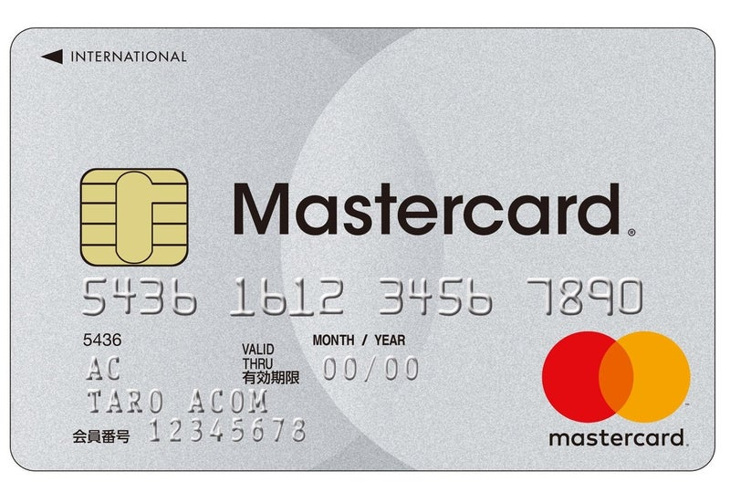

# 現地通貨の取得方法と手数料
1. 銀行や両替商で円と両替（事務手数料 4 %～10 %）
2. 海外ATMでクレジットカードを使用（海外利用料 0 % ～ 4 % + 利息 0.49 % × 支払いまでの日数）
3. 海外ATMでデビットカードを使用（海外利用料 4 ～ 5 %）

もちろんこの他にもプリペイドカードやFX両替、そもそも現金を使わずカードのみで決済する方法があります。

# 手数料をできるだけ抑える方法
この記事では，クレジットカードでATMから現地通貨を引き出す際に手数料を 1 %以下にする方法を紹介します。このとき使用するカードはアコムACマスターカードです。




このカードはキャッシング専用のカードなのでクレジットカードではないのですが、ATMから引き出すときの操作は他のクレジットカードと同じです。

なぜアコムカードがよいかというと、

1. 海外ATMの利用手数料が <b>0 %</b>
2.  借入額がインターネット上ですぐに反映され、Pay-easy（ペイジー）を利用して<b>即時返済が可能</b>

というメリットがあるからです。1は単純にATMの使用に関する諸手数料がかからないということです。2は、通常のクレジットカードだと規定の支払日にまとめて返済するためその日までについた利息を払うのに対し、アコムカードでは即時返済ができるためほぼ利息がつかずに返済できるということです。

アコムカードの一日あたりの利息は約0.5%であることを踏まえると、アコムカードでのキャッシングの手数料は
```
（手数料）＝　0 （ATM利用料）＋ 元金 × 0.0049（一日以内に返済した場合）
　　　　　＝　元金 × 0.0049
```
となります。これは例えば1万円分の現地通貨を引き出した場合だと
```
（手数料） = 10000 * 0.0049 = 49（円）
```
です。手数料が50円で済みます！

# 実践
上にあげた方法を実際にエジプトで数回やってみたところ、問題なく借入、返済を行うことができました。引き出し額，返済額，手数料をまとめたものの一部が下の表です。
```
引き出し額(egp)	引き出し額(jpy)	返済額(jpy)	手数料(jpy)	手数料(%)
        1000	 6,992.45	    7028	    35.55	    0.51
        500	     3519.47	    3512	    -7.47	   -0.21
        500	     3533.83	    3528	    -5.83	   -0.16
        300	     2151.67	    2161	     9.33	    0.43
```
引き出し額（jpy）は返済時のレートを参考にして計算しているためか、手数料がマイナスになっているところがあります。

# まとめ
この記事では現地通貨を取得するときに発生する手数料をできるだけ少なくする方法として、アコムACマスターカードとPay-easyを取り上げました。そして実際にやってみたところ、確かに手数料が 0.5 %程度に抑えられていることが確認できました。Pay-easyを用いて即時返済を行うためにはインターネットバンキングの準備などを事前にやっておく必要がありますが（今回は説明を省きました）、現場ではスマホで簡単に返済できるため，本当におすすめできる方法です。